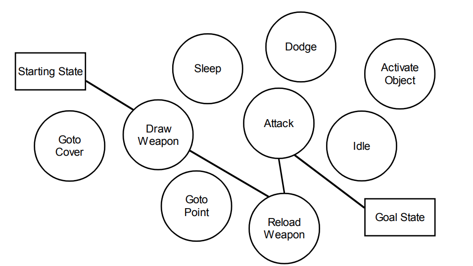
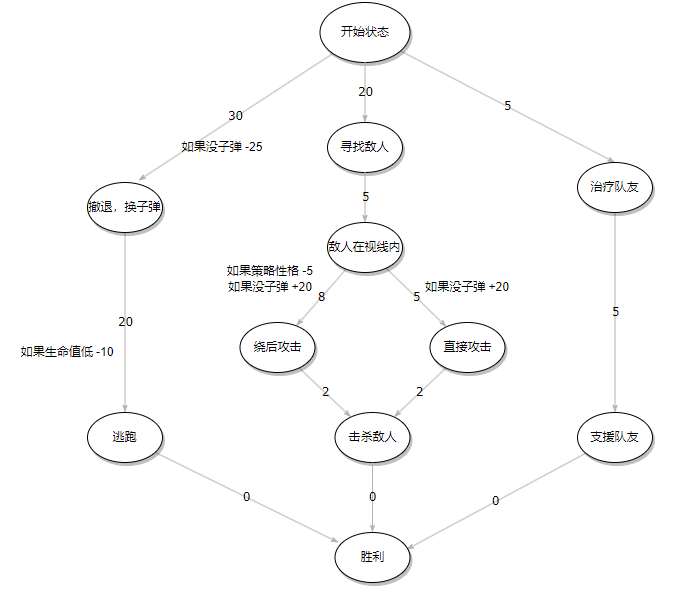

# GOAP-目标导向型行为规划

为每个`行为`设计`条件`和`权值`，执行`行为`会改变`状态`，**目标**是一个特殊的状态`状态`，agent需要规划一系列`行为`，到达**目标**`状态`。
> 规划一系列`行为`的过程可以具象为求图中两点（目前`状态`和目标`状态`）的最短路径过程

以上的解释对于不熟悉GOAP的人来说可能看起来非常抽象（毕竟只是我比较浅薄的理解），可以搜索`GOAP AI`或者利用gpt问答获得更具体的解释。在理解GOAP的概念之后，可以搜索一些实现方案，通过它们的api定义了解实际应用中是如何确定一些细则的。
> 推荐理论文章：[游戏AI行为决策——GOAP（目标导向型行动规划）- cnblog](https://www.cnblogs.com/OwlCat/p/17936809)。推荐实现方案：[Goap - asset store](https://assetstore.unity.com/packages/tools/behavior-ai/goap-252687)

当然，可能这些仍然比较初级（包括我之后要演示的Demo），具体到生产项目中可能涉及更多的机制策略以及优化方案，这些请自行探索吧。
> 对于机制策略以及优化方案，文章 [游戏AI——GOAP技术要点 - FlyingZiming cnblog](https://www.cnblogs.com/FlyingZiming/p/17274602.html) 应该提供了一些宏观的观点。

结合这些概念，GOAP的**特点**如下：
- 相比行为树/状态机相对固定的逻辑，GOAP更动态一点，可以根据目标状态规划出行为列表。
    - 动态意味着少量的代码就可以带来不错的效果，尤其是`行为`很多的时候
    - 动态也同样意味着**难以预测**，debug会相对困难
- 更容易在已有逻辑上添加`行为`，只要设计合理的权值就可以了
- 要设计一个特殊演出会比较困难，很难在GOAP规划内部进行条件判断
    - 例如在目标角色为某个指定角色时安排一些额外`行为`

以上特点使得GOAP更适用于战斗场景。

下面将以一个具体的实现解释其特点：

## Demo-俯视平面的战斗AI决策

[My-TDS](https://github.com/Unarimit/my-topdown-shooting-game/tree/dev/Assets/Scripts/CombatLogic/GOAPs)中，在战斗场景实现了基于GOAP的行为决策，具体实现了以下内容：
- 实现了GOAP类，用于计算"最短路径"
- 使用工厂模式构建GOAP图
- 根据场景内容，定义了16个"bool类型"的世界状态，并做了位运算优化
- 具体的行为逻辑使用行为树插件实现

其中一个Agent的GOAP决策图为：

通过上述决策图就可以构建一个使用枪械，主动发现敌人，没子弹会撤退换弹，换完子弹继续冲的AI。等价的代码定义在[BuildHelper.cs](https://github.com/Unarimit/my-topdown-shooting-game/blob/1036f1da9989df0aa24b79d95f4aee7dc8c4e2e7/Assets/Scripts/CombatLogic/GOAPs/Builders/BuildHelper.cs)中。

进一步的，可以融合"攻击技能"和"躲避技能"行为

WIP（由于行为实现和测试很麻烦，虽然状态定义好了，还没有实现）

## 参考
- 理论-轮子：[游戏AI行为决策——GOAP（目标导向型行动规划）- OwlCat cnblog](https://www.cnblogs.com/OwlCat/p/17936809)
- 理论-概览：[游戏AI——GOAP技术要点 - FlyingZiming cnblog](https://www.cnblogs.com/FlyingZiming/p/17274602.html)
- 开源Unity Asset实现：[Goap - asset store](https://assetstore.unity.com/packages/tools/behavior-ai/goap-252687)
- [《游戏人工智能》 4.行为选择算法一览](https://book.douban.com/subject/27154117/)
    - 考虑到中文版已不再版，只有图书馆能借到，可以看在线英文版（对应第一版内容）：[Game AI Pro](http://www.gameaipro.com/)