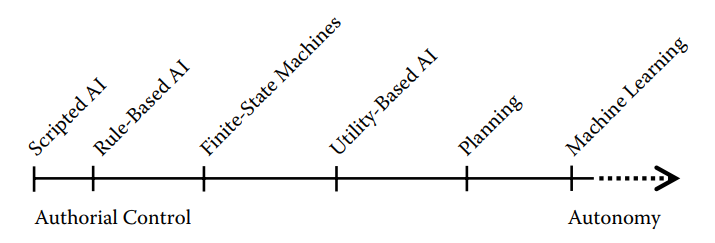
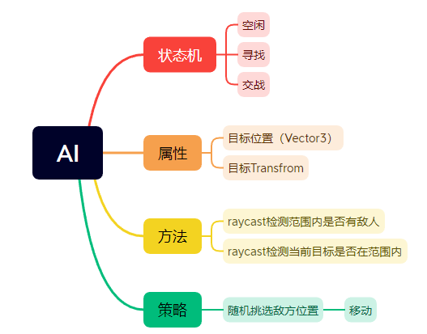

# AI (NPC&人机&Boot)

AI是战斗游戏中比较重要的部分，好的AI能增加玩家的沉浸感。在“[什么组成了优秀的AI | 游戏制作工具箱 - Youtube](https://www.youtube.com/watch?v=9bbhJi0NBkk)”这个视频里，介绍了不同的策略。包括
- 模拟行为（如真的用眼睛去看，模拟真实遮挡等）
- 给AI增加特定目标
- 通过语言或动作暴露AI动机
- 给AI增加固定的行为（如关门，拉电闸）

而我的博客中会包括：
- 对一些现有游戏AI的研究
- 游戏AI的通用实现方式
- 我的方案

## 实现方案

 

图中描述了几种方案在“作者控制度”上的区别

- 状态机
    - 入门简单，维护复杂。游戏AI中一般和其他技术结合使用。
    - 维护复杂指：多个状态和状态迁移逻辑混杂在一起，难以理解和修改。
- 行为树
    - 入门相对简单（教程和实现丰富），容易可视化，应该是主流选择。
    - 程序用完（写基础功能），策划也能用（组合功能）。
    - Unity有个很不错的库[Behavior Designer](https://assetstore.unity.com/packages/tools/visual-scripting/behavior-designer-behavior-trees-for-everyone-15277)，配合他的一些行为实现（队形包、策略包），可以作为一个不错的了解行为树的途径。
- HTN: Hierarchical Task Network, 分层任务网络
    - 暂时没有理解他的核心思想，应该是用于处理复杂AI的
- GOAP：Goal Oriented Action Planner, 目标导向型行为规划
    - 基于图的行为规划，把每次规划抽象为求最小路径。相对复杂。
    - 难点在于如何把世界状态抽象为边的权值。

## 例子

我在[上帝视角射击游戏](../Projects/TopShooting.md)第二版中，设计了一个简单的AI状态机，有三个状态，大概如下图所示。

这样的设计是比较简单的，agent没有除了杀敌之外的目标。

## 参考
### 书籍
> 特别感谢[狐王驾虎(OwlCat)](https://home.cnblogs.com/u/OwlCat/)提供的书单
- [Game AI Pro](http://www.gameaipro.com/)，有中文版《游戏人工智能》但网上好像买不到了，学校图书馆倒是有
- [人工智能：一种现代的方法（第三版）](https://book.douban.com/subject/25796281/)

### 概念和思想
- 启发思想：[什么组成了优秀的AI | 游戏制作工具箱 - Youtube](https://www.youtube.com/watch?v=9bbhJi0NBkk)
- 休息一下：[斯坦福大学AI小镇论文《Generative Agents :interactive simulacra of human behavior》（全文翻译） - 知乎](https://zhuanlan.zhihu.com/p/662730929)
- [游戏AI行为决策方法——HTN 教程（附代码）- Unity开发者社区](https://developer.unity.cn/projects/657fcd52edbc2a002654a6b4)

### 行为树
- 理论向-轮子：[游戏AI行为决策——行为树 - OwlCat cnblog](https://www.cnblogs.com/OwlCat/p/17871494.html)
- 理论向-虚幻行为树：[AI行为树在游戏引擎中の原理与应用 - Bilibili](https://www.bilibili.com/video/BV1Bm4y1r79W)
- 进阶理论向：[[UOD2022]从行为树到状态树 | Epic 周澄清 - Bilibili](https://www.bilibili.com/video/BV1ed4y1b7Zk)
- UE行为树术语介绍：[UE4学习笔记——AI（行为树 ；EQS；感知系统；调试）- Bilibili CV](https://www.bilibili.com/read/cv8219823)
- UE实现：[How to Make a Simple Behavior Tree in Unreal Engine 5 - Advanced AI - Youtube](https://www.youtube.com/watch?v=QJuaB2V79mU)
    - b站机翻搬运：[虚幻引擎5AI深度行为树教程](https://www.bilibili.com/video/BV1f8411C7sk)
