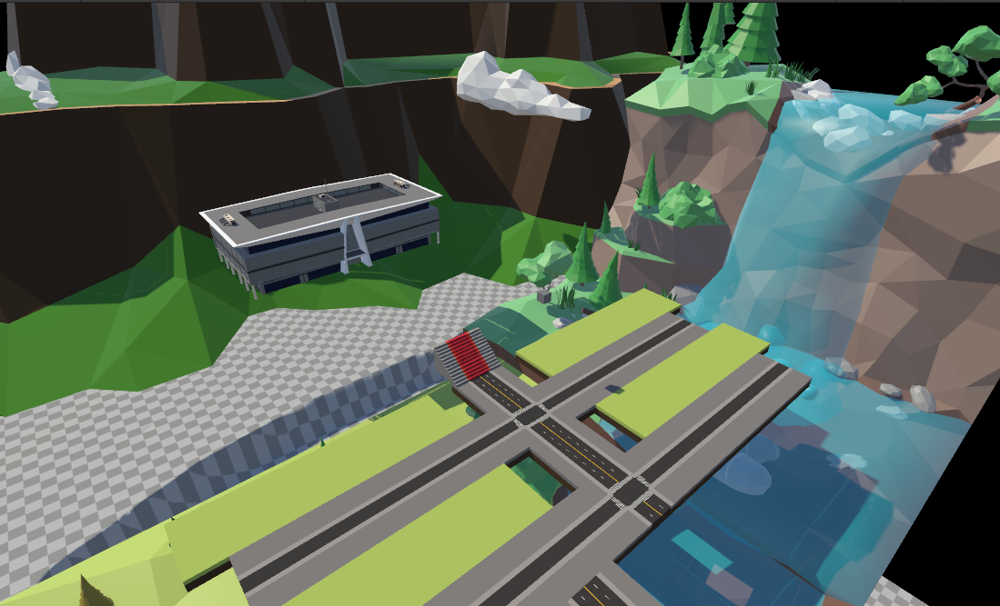
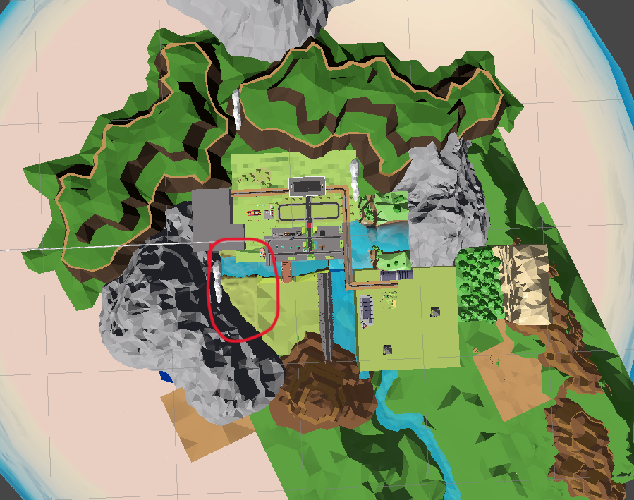
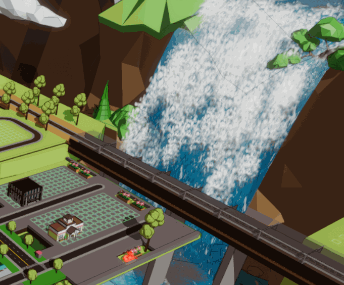
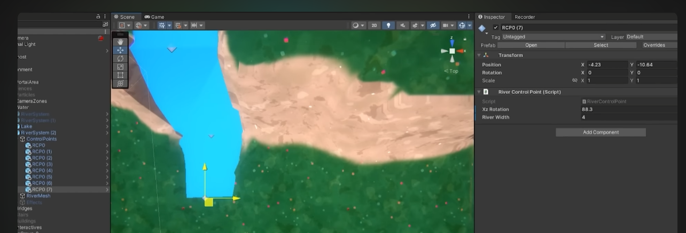
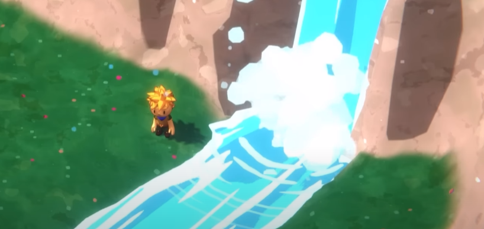

# 记一次场景搭建
::: tip
这里没有什么代码成分
:::

主要计划使用各种素材拼一个场景出来(设计参考了NIKKI的家园)，也是比较简单和迅速的选择。但是还是有些东西需要自己建模的（主要是原型），分为地形之间的过渡和主要设施的层次结构（如果只是制作平面场景并使用tile prefab去拼可能避免这些问题，这也是我在战斗场景尝试过的内容）两大内容，我们对这些问题分类讨论：
- 地形之间的过渡
    - 可以尝试用Unity自带的Terrain实现，虽然它对于风格渲染并不友好（需要写专门的shader），但用默认的shader也不是不能用。
- 有层次结构的地形
    - 方法1-Terrain：Terrain地形只有高低差之分，不能悬空（不能实现类似悬崖的结构）
    - 方法2-简单建模：原型阶段可以不用贴图不是吗
        - 使用可以在unity编辑器内部完成的ProBuilder（对不会建模的人很不友好）
        - 使用其他建模软件

下面介绍关于`ProBuilder`和`Terrain`使用
> 最终使用`Blender`做的场景的结构，`Terrain`做了拼接素材之间的过渡。

## ProBuilder

我找到一篇对其功能很详细的描述文档：[【游戏开发建模】教你使用Unity ProBuilder制作基础模型，搭建场景原型（ 保姆级教程 | Unity 2021最新版） - CSDN](https://blog.csdn.net/linxinfa/article/details/124413351)

下面是我的使用体验
::: tip 环境
ProBuilder版本 Version 5.0.7 - April 12, 2023，Unity版本2021.3

*需要通过`PackageManager`导入该资源
:::

我只能说这个东西应该叫做`ShitBuilder`，理由如下：
- 他的一些功能容错度很低（如果不按照预期使用会产生报错和预期之外的效果）
- 缺乏一些必要功能（如删除顶点，尽管他提供合并顶点的方法，但根本想不到他的合成逻辑是什么）
- 一旦你使用他的clip方法，灾难就开始了，等着删除重建吧。
- 基于上述缺点，`ShitBuilder`要求你懂一些基本的建模思想（例如建模异形体要留够足够的面数用于拓展，中途拆分面操作不当的话就烂了）

作为专门的原型工具，他的使用流畅度甚至不如一些建模软件（如Blender）
> 我感觉建模软件在制作原型时的主要问题是功能太多，而且在世界坐标系下的移动和拖拽逻辑都不一样，存在学习成本(如果只是拖个原型出来应该也还好)。

当然，如果你不需要建一个大的异形物体的模型（如地形）的话，还是可以使用的。具体而言，满足下列条件的任意一个就行：
- 能接受“中途发现之前的操作有问题导致报错，需要删了重建”的成本。
- 或者你是个懂一点建模的人，不需要在原型设计中频繁的拆`顶点`和`面`。

## Terrain

用的不是很深，只用来做拼接不同素材时的过渡效果。

作为一个自带的组件，确实挺易用的。唯一不足的是他对lowpoly风格不是很兼容。

## 制作流程

### 使用Blender建模突起的平台结构

使用前：

使用后：

### 使用Terrain过渡拼接的素材

使用前：

使用后（红框部分为Terrain拼接部分）：

## 下一步，制作“动”效

为右边的瀑布实现流水效果。这是后边补充的内容：

- 使用[Stylized Water 2](https://assetstore.unity.com/packages/vfx/shaders/stylized-water-2-170386)插件完成。
- 在blender里面按照插件设定配置水流表面和UV，在unity中使用`PolyBrush(unity registry asset)`按照插件设定着色。

不得不说要实现水流冲击效果，特效还是很重要的。如果卡通风格其实可以考虑不用特效，但相关资源比较难找。

### 一种卡通水的实现

[Making My First Open World Game | Devlog #1 - Youtube](https://www.youtube.com/watch?v=WnnaI_OXeEA)视频中，就实现了相当方便，视觉也还可以的卡通水效果（感觉不如....）。视频中显示了可以在Unity中方便的编辑（如下图所示），和使用Shader Graph实现水流渲染。

他也实现了简单的特效。

可惜没有指南的话实现这套对我来说要花好长时间。

## 参考
- 素材：
    - [低聚物终极包 - Unity Assets](https://assetstore.unity.com/packages/3d/props/low-poly-ultimate-pack-54733)
    - [Land 1 - Unity Assets](https://assetstore.unity.com/packages/3d/props/exterior/land-1-225713)
    - [Cute Cartoon Town - Unity Assets](https://assetstore.unity.com/packages/3d/environments/urban/cute-cartoon-town-206100)
    - [City Adventure - Unity Assets](https://assetstore.unity.com/packages/3d/environments/city-adventure-65307)
    - [Stylized Water 2](https://assetstore.unity.com/packages/vfx/shaders/stylized-water-2-170386)
- [Unity | Stylized Waterfall Shader - Youtube](https://www.youtube.com/watch?v=DIE3qfCGXl8)
    - 尝试了一下，他代码是开源的，但没有特效无法满足我的要求