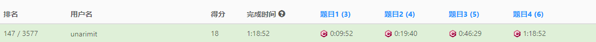
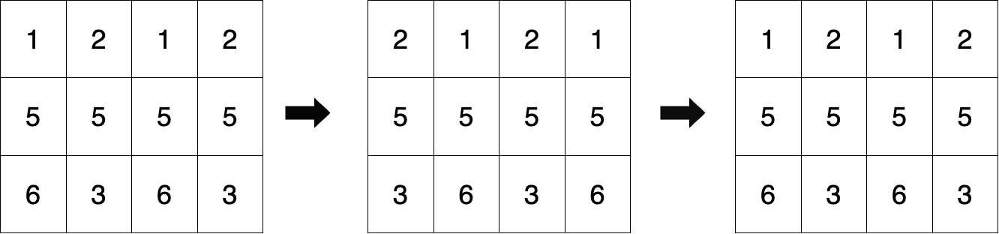
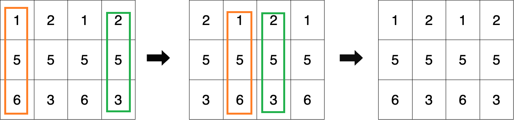

# 记Leetcode第373次周赛

记录这次周赛的主要原因，是因为凭运气全部AC了，并且拿到了147的名次（我的历史最优）。
> 凭运气是指：在理解错一道题+第四道题关键推论证明不出来的情况下，依然做对了。

怀着激动的心情，记录一下我周赛编程中遇到的一些问题，以及可以改进的地方

竞赛链接：[Leetcode第373次周赛链接](https://leetcode.cn/contest/weekly-contest-373/)

## 第一道题

用时10分钟，在理解错题意的情况下AC

原站链接：[100139. 循环移位后的矩阵相似检查](https://leetcode.cn/problems/matrix-similarity-after-cyclic-shifts/)

### 题目：循环移位后的矩阵相似检查

> 给你一个大小为`m x n`的整数矩阵`mat`和一个整数`k`。请你将矩阵中的**奇数**行循环**右**移`k`次，**偶数**行循环**左**移`k`次。</br>
如果初始矩阵和最终矩阵完全相同，则返回 true ，否则返回 false 。

<center></center>
<center>示例图</center>

</br>

### 题目分析

先说结论，判断上述矩阵相似**无需注意**题目中提到的**奇数行**、**偶数行**、**左循环**和**右循环**。直接判断整个数组循环左移（或循环右移）k次是否和原数组相同就就行。
> 矩阵运算中，若A\*B=A，那么也有A\*(B^-1)=A。左移的^-1就是右移。（只是大概解释一下，可能不一定对(∠・ω< )⌒★）

### 我的错误理解

当我在做这道题时，先开始思考“什么是**奇数**行循环**右**移，**偶数**行循环**左**移”，然后我看了看示例图和它的描述，得出结论：

奇数**列**在右移，偶数**列**在右移。可这不是列吗，题目描述为什么是行呢？
> 这里还有一个问题，没有考虑从0开始计数，最左边那一列属于偶数列

<center></center>
<center>大聪明结论示意图，橙框（"奇"数列）右移，绿框（"偶"数列）左移</center>

可能是我和官方其中有一个对**行**和**列**的理解有偏差，我直接不管，开始做题。</br>
然后就通过了，因为这道题中，判断左移k位还是右移k位都不重要，只要移了k位就行。

**总结环节：** 为什么会造成这样的理解错误呢？

1. 没有搞懂`行循环右移`这个概念
2. 没有搞懂`奇数行`、`偶数行`的指的是哪些行
3. 在满足1，2的同时，看示例，根据“俺寻思”先入为主

从自身当时的想法出发，可能是因为标的简单题，就没想仔细分析。这种做题习惯是不好的，如果没能AC还需要反复看题，产生额外的时间开销和负面情绪反馈。</br>
建议做一些简单题提高阅读理解水平。

### 代码展示
``` cpp
// 我的错误理解，但是通过的代码
bool areSimilar(vector<vector<int>>& mat, int k) {
    k %= mat[0].size();
    for(int i = 0; i < mat[0].size(); i++){
        for(int j = 0; j < mat.size(); j++){
            if(i % 2 == 1){
                if(mat[j][(i+k)%mat[0].size()] != mat[j][i]) return false;
            }else{
                if(mat[j][(i-k+mat[0].size())%mat[0].size()] != mat[j][i]) return false;
            }
        }
    }
    return true;
}
// 后面修正的完全按照题意，也通过的代码
bool areSimilar(vector<vector<int>>& mat, int k) {
    k %= mat[0].size();
    for(int i = 0; i < mat.size(); i++){
        for(int j = 0; j < mat[0].size(); j++){
            if(i % 2 == 1){ // 实际上这个if是完全不需要的
                if(mat[i][(j+k)%mat[0].size()] != mat[i][j]) return false;
            }else{
                if(mat[i][(j-k+mat[0].size())%mat[0].size()] != mat[i][j]) return false;
            }
        }
    }
    return true;
}
```
## 第四道题

用时36分钟，在关键推论证明不出来的情况下AC

原站链接：[100132. 统计美丽子字符串 II](https://leetcode.cn/problems/count-beautiful-substrings-ii/)

### 题目：统计美丽子字符串 II
给你一个字符串`s`和一个正整数`k`。

用`vowels`和`consonants`分别表示字符串中元音字母和辅音字母的数量。

如果某个字符串满足以下条件，则称其为`美丽字符串`：

`vowels == consonants`，即元音字母和辅音字母的数量相等。
`(vowels * consonants) % k ==0`，即元音字母和辅音字母的数量的乘积能被`k`整除。
返回字符串`s`中`非空美丽子字符串`的数量。

子字符串是字符串中的一个连续字符序列。

英语中的`元音字母`为`'a'、'e'、'i'、'o'`和`'u'`。

英语中的`辅音字母`为除了元音字母之外的所有字母。

提示：
- `1 <= s.length <= 5 * 10^4`
- `1 <= k <= 1000`
- `s`仅由小写英文字母组成。

### 题目分析

&emsp;&emsp;首先，这次周赛的第二题名为`统计美丽子字符串 I`，和`统计美丽子字符串 II`相比，除了数据范围都一模一样。而`统计美丽子字符串 I`我是用两个前缀和+枚举所有范围的方式做的，但显然当数据扩大到`5 * 10^4`时，就不能再用时间复杂度`O(n^2)`的枚举了。

&emsp;&emsp;这时考虑面对**子序列**（子串、子数组）问题的一般思路：顺序遍历数组，当遍历到某个下标`i`时，在`O(1)`的时间复杂度下统计以当前下标`i`为结尾的所有满足情况的子序列个数。
> 如示例`"abba"`，当我们遍历到`i=3`，即最后一个`a`时，在`O(1)`的时间复杂度下统计`"abba"`、`"bba"`、`"ba"`、`"a"`满足情况的个数。

&emsp;&emsp;显然，在忽略第二个条件`(vowels * consonants) % k == 0`时，利用**前缀状态和+map**就可以在`O(1)`的时间复杂度下统计下标`i`为结尾的所有满足情况的子序列个数。
> 前缀状态和: 遇到元音`+1`，遇到辅音`-1`，当遍历到下标`i`的前缀状态和为`q`，去找前面前缀状态和**同为**`q`的下标`pre_i`，组成的`[pre_i, i]`子串，一定满足`vowels == consonants`。

&emsp;&emsp;需要在满足第二个条件的同时，保持`O(n)`的算法复杂度，考虑分组遍历。是否可以根据k的大小，按照某一固定`步长`遍历，再改变开始点遍历`步长`次（共计遍历整个数组一次），得到同时满足两个条件的子序列数呢？</br>
&emsp;&emsp;当`k=1`时，可以取`步长`为1；当`k=2`时，可以取`步长`为2；当`k=3`时，可以取`步长`为3；当`k=4`时，可以取`步长`为？... 可以取`步长`为2。可以看出步长不能简单的根据`k`来取，可能需要考虑`vowels * consonants`是k的最小倍数？那么先定义`(interval * interval) % k == 0`，`步长 = interval * 2`，求`步长`改为求`interval`。</br>
&emsp;&emsp;如何保证所求`interval`正确呢，例如`interval=4`和`interval=6`都在`k=4`时必要（不充分）满足题意，如何保证不会求到错误的`interval`？但因为时间不够，直接找最先满足条件的`interval`试试，最后通过，下方是求最先满足条件的`interval`的代码。
``` cpp
long long interval = 1;
while((interval * interval) % k != 0) interval += 1;
```

### 没能证明的推论

根据程序通过这一结论，可以判断出从小到大遍历，最先满足的步长，一定是解，但为什么呢？
> 如果这里判断的不是`interval * interval % k == 0` 而是`interval % k == 0`，那我一定能得出后面再满足情况的`interval'`一定是第一个满足条件的`interval`的数倍，此时`interval`就包括了`interval'`的结果。

查看对题解的讨论，有通过分解质因子的方式求出了步长：[分解质因子+前缀和+哈希表 - 灵茶山艾府 leetcode](https://leetcode.cn/problems/count-beautiful-substrings-ii/solutions/2542274/fen-jie-zhi-yin-zi-qian-zhui-he-ha-xi-bi-ceil/)
> 使`interval * interval % k == 0`，他把k分成了三种情况讨论：
> 1. `k`为质数：interval的分解必须包含`k`
> 2. `k`不为质数，分解后存在偶次幂，如 k = 3^4：interval的分解必须包含`3^2`
> 3. `k`不为质数，分解后存在奇次幂，如 k = 2*3^5：interval的分解必须包含`2*3^3`

通过对分解质因子求步长方式的研究，就不难理解为什么`从小到大遍历，最先满足的步长，一定是解`了。因为下一个满足条件的`interval'`也需要包含指定因子，那就一定是第一个满足条件的`interval`的数倍。

结合上文我对`k=4`时，遍历取`interval`，"可能"首先取4、6的疑问。`k=4`，interval的分解必须包含`2`，取2就可以了，不存在首先取到`4=2^2`、`6=2*3`的可能。

### 代码展示
```cpp
long long beautifulSubstrings(string s, int k) {
    long long interval = 1;
    while((interval * interval) % k != 0) interval += 1;
    interval *= 2;

    auto set = unordered_set<char>{ 'a','e','i','o','u' };
    auto balance = vector<int>(s.length()+1, 0);
    for(int i = 0; i < s.length(); i++){
        if(set.count(s[i]) == 1) balance[i+1] = balance[i] + 1;
        else balance[i+1] = balance[i] - 1;
    }

    long long res = 0;
    for(int b = 0; b < interval; b++){
        auto pre_cnt = unordered_map<int, int>();
        auto pre = 0;
        for(int i = b; i < balance.size(); i+=(int)interval){
            pre = balance[i];
            if(pre_cnt.find(pre) != pre_cnt.end()){
                res += pre_cnt[pre];
            }
            pre_cnt[pre] += 1;
        }
    }
    return res;
}
```
