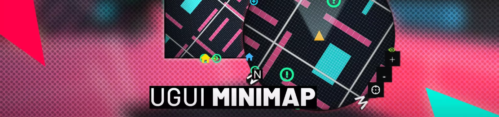

# 小地图组件使用感想

最近使用`UGUI Minimap`插件实现游戏中的`小地图`和`战略地图`功能，记录下使用他的感想。
- `小地图`: 展示玩家操控角色附近的物体和地形。
- `战略地图`: 展示场景范围的物体和地形。玩家可以和地图中的角色图标互动，实现切换操作目标的功能。

## 简单介绍优缺点

`UGUI Minimap`确实是一个使用起来非常简单的插件，并且指导也丰富，体现在：
- 在editor菜单栏中提供帮助文档。
- 配备的实例场景描述了控制方法。
- 可以通过帮助菜单的按键，一键配置小地图需要的渲染层。
    > (虽然配置这个并不复杂，可能找到它的相机和配置选项在哪里比较费事)
- 提供两种各有特点的渲染方式：
    - 配置`Layer`通过相机剔除实现地图纹理的渲染，并可以`Bake`成贴图，减少渲染运算开销
    - 通过`MonoBehaviour`将坐标的位置映射到地图上，渲染指定`Icon`，并提供了一些常用设计（如会放大图标代表它在目前的地图框外、FadeIn动画效果等）。

下面是缺点：
- 使用旧的输入方式（提供按键映射配置）。若项目使用InputSystem，得自行配置，或设置unity输入模式为`Both`（即同时支持新旧输入系统）。
- `player`的`Icon`和其他`Icon`逻辑独立，目前我不知道有什么好处，但这样做影响到了切换地图时的动画表现（`player`的`Icon`和其他`Icon`表现不一致）。
- 没有明显的对外公开方法的标致，如控制`Icon`的显隐，能在外部通过好几个`public`的方法实现，如果在`Icon`未初始化完成的时候调用，还会出一个`Log`提示，需要自行在调用方法前做状态判断。
- *时有时无的namespace，是因为后面补了一些功能不影响之前的代码，还是另有深意？

## 谈谈代码设计

`UGUI Minimap`作为一个优秀的小地图插件，其类型的设计方式值得参考。

`UGUI Minimap`有两个核心类，`bl_MiniMap`和`bl_MiniMapEntity`。
- `bl_MiniMap`：控制整体地图的表现，控制地图里`Icon`的渲染和空中相机的位置。
- `bl_MiniMapEntity`: 用于把这个脚本挂给具体的游戏角色，使其在地图上显示`Icon`。

还存在一些类辅助实现，如`MiniMapIcon`是显示在地图上的`Icon`附带的脚本。这些辅助实现还拥有基类，使功能可以被拓展。例如`bl_MiniMapInputBase`是输入控制的基类（好像少了Drag方法），体现了他的**拓展性**，对于可拓展功能，有一点面向抽象类编程的感觉。

还将从下列角度考察
- 访问控制
- 外部控制流（如将一些实例转移到新的容器中）
- WIP

**访问控制:** 存在大量没有注释的`public`方法，让人很迷惑。

**外部控制流:** 对于一些控制地图数据的操作，存在公共方法，例如`bl_MiniMap::SetAsActiveMiniMap()`通过把`Icon`绘制数据全转移到新的`bl_MiniMap`对象实现地图风格的替换，这个方法在示例场景也有体现。

::: tip

`UGUI Minimap`除主要功能之外的实现也是很有参考价值的：菜单帮助功能，`bl_MiniMap`重写`Inspector`中的配置UI等。

:::

## 参考
- 小地图插件：[UGUI Minimap - Assets Store](https://assetstore.unity.com/packages/tools/gui/ugui-minimap-32874)