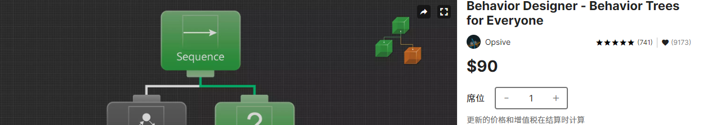
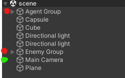
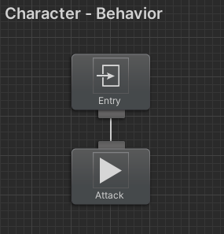
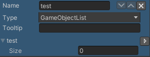
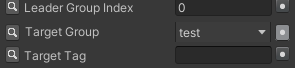

# 记初次使用行为树插件-Behavior Designer

最近在尝试AI模块的开发，小记一下
> 可以先提前学习一下行为树的理论知识，推荐这篇文章：[游戏AI行为决策——行为树 - cnblog](https://www.cnblogs.com/OwlCat/p/17871494.html)

目标是实现：
- `Behavior Designer`的基础用法
- 使用代码控制`Behavior Designer`的状态

插件商店页面：[Behavior Designer - Behavior Trees for Everyone - Asset Store](https://assetstore.unity.com/packages/tools/visual-scripting/behavior-designer-behavior-trees-for-everyone-15277)

## 从一个拓展库的Demo出发

接触`Behavior Designer`，是因为我对他的[Tactical Pack](https://opsive.com/assets/behavior-designer-tactical-pack/)很感兴趣，如果能接入到我的项目中（[MyTDS](../Projects/TopShooting)）就能大大提高我的开发效率。不多说了，我们直接开始。

"Behavior Designer Tactical Pack"示例场景的`Hierarchy`如下：



标红的部分中存储了agent和插件中的行为树组件`BehaviorTree`，标绿的名为`Main Camera`的gameobject（以下简称go）中挂载了对行为树的配置脚本`BehaviorSelection`（怪阴间的，怕别人能找到是吧）

对于`BehaviorTree`：
- 这些行为树（有很多不同的Tactical），都只有两个节点（树根和叶子节点），居然把整个策略用一个节点表示...
    - 好在我们可以查看叶子节点的脚本，看看他的策略是怎么写的
- 他依赖go中挂载的`NavMeshAgent`组件和实现了`IAttackAgent`的组件
- 在叶子节点中，配置了攻击目标为带`Player TAG`go，若场景不存在带`Player TAG`的go，还会报错...（可能是需要在到达这个节点前先判断敌人是否存在）、
- [BehaviorTree的文档描述](https://opsive.com/support/documentation/behavior-designer/behavior-tree-component/)

对于`BehaviorSelection`:
- 字如其名的负责选择`Tactical Pack`中的策略（负责响应UI，选择对应的策略），即切换Agent go中`BehaviorTree`的激活状态

这样一来我们便了解了`Tactical Pack`中策略的工作原理，策略节点封装了完整的策略流程（移动+攻击），部分实现依赖于角色go上挂载的相关组件。若要配置策略节点的参数，例如攻击目标、队长等属性，可以在`Behavior Designer`的编辑器中修改，也可以通过代码的方式，找到指定`Task`，调用他的相关属性。

通过代码的方式设定树中的某个`Task`属性：例如需要改`Tactical Pack`中`Attack`的攻击目标，可以通过:
```cs
GetComponent<BehaviorTree>().FindTask<Attack>().targetGroup = new List<GameObject>();
```
`new List<GameObject>()`可以替换为实际的目标数组

## 到项目中来

那么，我们如何把行为树应用到项目中呢？具体有以下步骤：
- 为物体创建`BehaviorTree`组件，和具体的Task
- 确保物体上挂载了需要的组件和实现了某接口的组件，如`NavMeshAgent`,`IAttackAgent`,`IDamageable`等
    > 这一点做的不好也没关系，它会报错给你的
- *运行时为物体配置`Task`的参数

这里我基于[MyTDS](../Projects/TopShooting)做一个简单的实现，目标为实现战斗场景中敌人的移动和攻击

### 为物体创建`BehaviorTree`组件

用`Tactical Pack`中的`Attack`Task创建了一个简单的，如下图所示



> `Attack`会控制角色移动到可以攻击目标的位置，然后攻击

### 实现必要接口

`Tactical Pack`的`Attack`需要挂载物体有实现`IAttackAgent`接口的组件，同时`Attack`的目标要有实现`IDamageable`接口的组件。

由于我的目标和挂载物体都是同一类物体，所以专门整一个组件实现这两个接口

放代码在这里太占字数了，有需要可以参考[MyTDS实现这个功能的commit](https://github.com/Unarimit/my-topdown-shooting-game/commit/0c8211d835bb9da73bcb7c623858bcb1105fdd91)

### *运行时为物体配置`Task`的参数

有两种方式，一种是直接找到`Task`的参数，修改它；另一种是为`BehaviorTree`添加`Variable`，让`Task`引用它。显然是后者更好一些，在有多个`Task`都需要这个数据的时候，就不用反复传入了。

方法一：
```cs
GetComponent<BehaviorTree>().FindTask<Attack>().targetGroup = new List<GameObject>();
```

方法二：

 

```cs
GetComponent<BehaviorTree>().SetVariable("test", (SharedGameObjectList)new List<GameObject>());
```

## 小结

以上介绍了`BehaviorTree`的使用方法，但如果要实现一个不错的角色行为树，还需要了解行为树组件之间的链接模式和常用功能的实现方式，
[Behavior Designer官网](https://opsive.com/assets/behavior-designer)应该会有一些不错的示例。

`BehaviorTree`还设想了多线程去处理行为树的情况，如果要用到这些可以参考[文档中](https://opsive.com/support/documentation/behavior-designer/behavior-tree-component/)对`Asynchronous Load`和`shared variables`的说明。
> 如果不特意在非主线程中调用，其功能应该是在主线程中运行。

除此之外，`BehaviorTree`提供丰富的`Task`支持`UnityEvent`和如`Aniamtor`之类的关键组件，使用这些应该能使开发更迅速，但应该不是一种好的方式。

## 参考
- 商店页面：[Behavior Designer - Behavior Trees for Everyone - Asset Store](https://assetstore.unity.com/packages/tools/visual-scripting/behavior-designer-behavior-trees-for-everyone-15277)
- [游戏AI行为决策——行为树 - cnblog](https://www.cnblogs.com/OwlCat/p/17871494.html)
- [Behavior Designer Tactical Pack - official](https://opsive.com/assets/behavior-designer-tactical-pack/)
- [Behavior Designer插件文档 - official](https://opsive.com/support/documentation/behavior-designer/overview/)