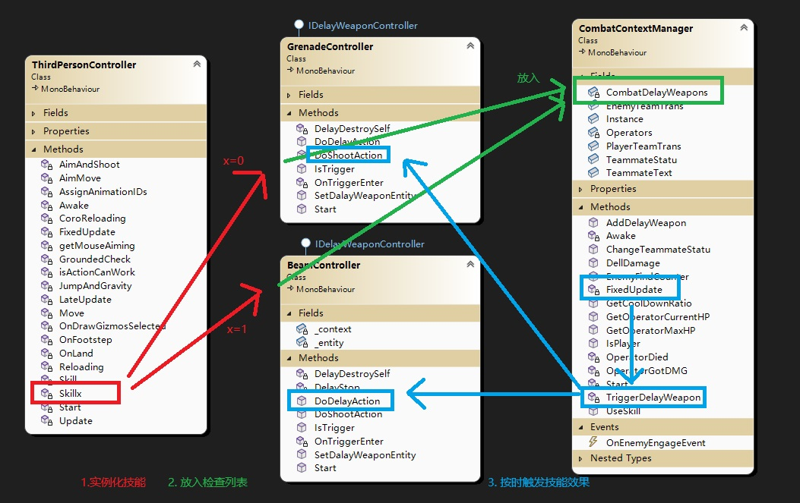
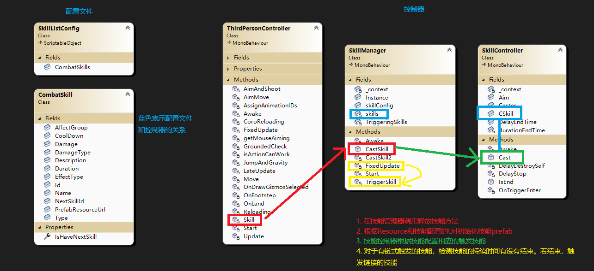
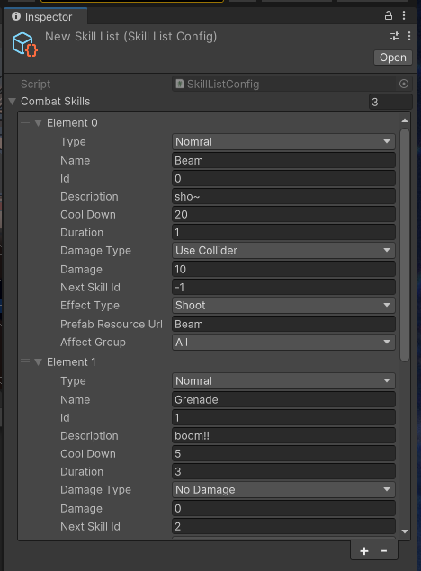
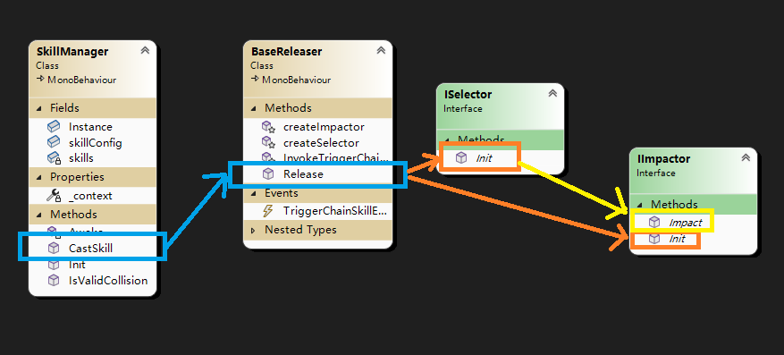
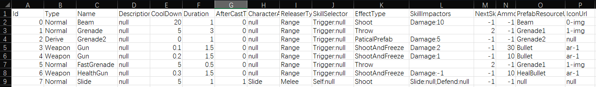

# 技能系统

技能系统的目的是为了减少后续开发难度，和**热更新**的可能，采用数据驱动方法设计。要求在一开始时就考虑到各种效果的表现方式。并使用继承、封装等编程思想建立统一标准。

## 如何设计技能系统

统计所有技能的需求，把其中技能与技能之间不同的逻辑抽离出来。
- 技能的释放方式可能不同，包括原地释放、抛射释放、从天而降释放等，可以抽离出来设计
- 技能产生的影响可能不同，包括眩晕、减速、减防等，可以抽离出来设计
- 技能肯定都有释放者、冷却、造成伤害，这部分就可以统一设计

对于被抽离出来的类，通过继承关系，写到基础的技能类里面，方便调用。

::: tip 需要注意的是：
没有什么设计模式是可以一劳永逸的，都要随着需求变更不断迭代。利用设计模式的意义在于提供一定的可拓展性；并且重复的逻辑不需再写，减少了出现bug的可能性。
:::

## 详细案例

### 先介绍一个错误实现的例子

在我的[上帝视角射击游戏](../Projects/TopShooting.md)里，我的一个拥有两个技能的角色是这样设置技能触发机制的：

哦，对了，两个技能分别是：**投掷手雷**和**发射激光**，顺便附上[当时的代码目录 - github](https://github.com/Unarimit/my-topdown-shooting-game/tree/e250ab2cdbcd69eb90f07269da4d92570c8065d1/Assets/Scripts/CombatLogic)

其中上面那条绿线的目的地标错了，不要介意

这里将技能释放分为三个步骤
1. 实例化技能
    - 根据按键不同实例化不同的技能prefab
    - 这里省略了表示技能属性（伤害，延时，取对象）的类，采用随用随new的设计模式（
2. 放入检查列表
3. 在游戏系统中触发技能的后续效果
    - 投掷物爆炸效果、伤害计算等

这样一个技能系统，显然是不合理的。
1. 每加一个技能，就要加一个类， 每改动一个实现方式，就要改技能类里的代码。
2. 不同的技能要添加不同的控制类。
    - 因为每个技能的逻辑不一样，特效也不一样。
3. 要在角色控制类中修改对应的释放技能。
4. ...

当然这里的触发延时逻辑的接口化还是不错的。

 

### 更好的实现1

先看看方案比较吧：

| 上文方法                       | 这个方法                 |  
| -------------                 |-------------              | 
| 每加一个技能，就要加一个控制类。😡     | 每加一个技能，添加一段json。😁 |
| 技能的控制类之间差异很大，不便维护。😡  | 共用一个控制类。😁        | 
| 要在角色控制类中修改对应的释放技能。😡| 不需关注角色控制类。😁      | 
| 不管什么需求都添加类。            | 需求超出一开始的预期需要改技能系统。😨|

然后再来着手设计方案：

1. 设计技能类（纯数据类）
2. 新建ScriptableObject存储技能类 
    - “添加一段json”是一种形容添加简单的形容词
3. 给角色绑定指定下标的技能 
4. 设计释放器
    - 释放器按照技能类的指导来释放

通过一番折腾，设计出了如下图所示的技能系统（当然技能的属性还不是很全，很多东西都没考虑到）。顺便附上[当时的代码目录 - github](https://github.com/Unarimit/my-topdown-shooting-game/tree/25ddf6847c97e6af37b52c625af3415f8f33a9d2/Assets/Scripts/CombatLogic)

看不清楚可以右键图片在新标签页中打开哦

然后**投掷手雷**就变成了`技能1：抛出一个圆球Prefab，持续时间3秒` + `技能2：爆炸造成范围伤害`的组合。**发射激光**则变成了`技能0：射出一个圆球Prefab并造成伤害`。

对技能的配置

**但是，他现在的可玩性也很低，因为只能在投、抛、检测并伤害中组合。**

这时候就需要在技能控制器中引入`Buffs`或更多效果类型，增加组合种类。
- 如眩晕，中毒，回血等效果，甚至可以做一个闪现技能，因为技能控制器中有释放者的Transform！
- 这时候利用lua等热更新技术，可以方便的完善技能的多样性。

### 更好的实现2

承接上文，为了避免在“投、抛、检测并伤害”上完善新方式的时候重复修改类型内的代码，将技能的释放过程拆解为三个部分（释放、选择目标、影响目标），解耦控制。下图是我按照上述方法拆解后的调用关系。（附上[当时的代码目录](https://github.com/Unarimit/my-topdown-shooting-game/tree/6b7f94746778638dcb6b510d402f715ba4ab42d5/Assets/Scripts/CombatLogic/Skill)）

- 技能管理器`SkillManager`调用`CastSkill`时，会初始化技能释放器`Releaser`，并将技能信息传递给`Releaser`。
- `Releaser`根据技能信息，使用**反射**生成对应的选择器`Selector`和影响器`Impactor`，并将信息传入。
- `Selector`根据算法选择到目标后，调用`Impactor`的`Impact`，完成对目标的影响。

这样一来，添加技能的方式就变为：

1. 如果现有的`Releaser`、`Selector`和`Impactor`能组合出技能，就通过配置表组合。
2. 如果不能，完成`Releaser`、`Selector`和`Impactor`中的一个或多个，满足1的条件后，通过配置表组合。

相比上一个实现方式，这种实现方式减少了“超出预期需要改技能系统”时的复杂度，并且耦合性更低了。
> 但考虑到有些技能逻辑特殊到不需要复用，这样实现就有些太复杂了，可以考虑“可编程技能系统的实现”，将会在`更好的实现3`中介绍。

最后还可以通过csv文件+`Editor Menu`脚本的方式完成配置表的搭建，配置表如下图所示：

`Editor Menu`脚本的代码：[GenerateSkillInfoByCsvFile.cs](https://github.com/Unarimit/my-topdown-shooting-game/blob/6b7f94746778638dcb6b510d402f715ba4ab42d5/Assets/Scripts/Editor/GenerateSkillInfoByCsvFile.cs)，它的功能为将csv配置表转化为`更好的实现1`中的`ScriptableObject`。

### 更好的实现3

使用lua WIP

## 参考
- [第三部分:Unity技能系统](https://www.bilibili.com/video/BV1WJ411T7YQ)
