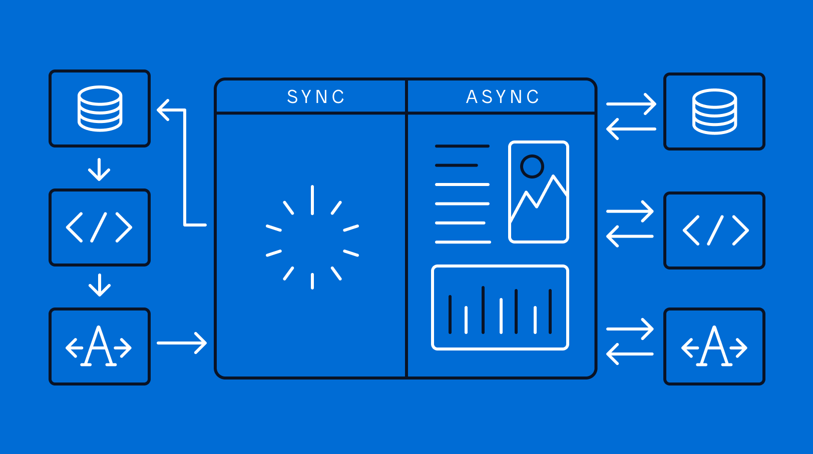

# 异步编程

在Unity中，异步编程的思想可以应用到很多方面，通常用于处理需要一段时间才能完成的任务，例如加载资源、网络请求或动画效果等。通过异步，可以避免阻塞主线程，保持游戏或应用程序的流畅性。

本文主要介绍异步编程需要的组件和他们的区别：
- `Coroutine`是异步编程
- `async` / `await` 是异步编程
- *响应式编程配合生命周期也可以是异步编程（混沌邪恶

## 三种方案的优缺点

1. `Coroutine`
    - 优点：unity原生，很多api都是用协程实现（例如`LoadSceneAsync`）
    - 缺点：`IEnumarable`没有返回值，不方便复杂的逻辑。
2. `async` / `await`
    - 优点：
        - 有返回值
        - 写起来逻辑更清晰
        - 提供比协程更多的逻辑控制（`cancellationToken`）
        - 同步异步都能用
    - 缺点：
        - 比协程复杂一点，要了解它的工作方式，不了解的话，可能会引起：[一个不恰当使用导致try catch没用的例子](https://stackoverflow.com/questions/5383310/catch-an-exception-thrown-by-an-async-void-method)
        - 在WebGL中不能使用[这个视频中提到](https://youtu.be/WY-mk-ZGAq8?si=Do5vRtqHYq3gwhwX&t=919)
        - 有些使用协程的api使用起来不方便
    - *`Unity 2023.1`中引入`Awaitable` class，提供`WaitForSecondsAsync`, `NextFrameAsync`等api。
3. 响应式编程配合生命周期
    - 参考DOTween和UI事件，特定的使用场景

## C#异步编程模型 `async` / `await`

方法使用`async`修饰，方法内部内容会被C#编译器转化为`异步状态机类`，用于实现异步执行的功能。
> 并使用异步特性修饰方法，以便能够在metadata中查看

### 一些问题

异常捕获问题：

```cs
如果不Await异常就捕获不了();
// await 如果不Await异常就捕获不了(); // 如果用注释中的，则能捕获到异常
await Task.Delay(200);

async Task 如果不Await异常就捕获不了()
{
    await Task.Delay(20);
    throw new Exception(); // 可以试着在console中执行一下，这个异常不会触发断点调试
}
```

## 例子-使用`async` / `await`实现选择窗口

选择窗口可以理解为上传、打开文件时，弹出的文件选择窗口。


<center> 一个示意图，我做的肯定简单得多 </center>

目的是可以向网络API一样，异步的方式获取所需资源（某个类）
> 用代码的方式就是`var data = await xxxxxRequest(xxxx)`，之后就可以对data各种操作。

代码是`My-TDS`中实现`Operator`选择的逻辑，这样写可以复用到同样需要选择`Operator`的UI上。
> [在这个提交里添加了这个功能](https://github.com/Unarimit/my-topdown-shooting-game/commit/9f0a51cc8f6550cfa6aa7a230e984af4c927d3d0#diff-24a12e61770d7ee56b1dac79d23d6bd05a1c045df723ea7537a786450a2bc23c)

```cs
internal class OperatorChooseUI : MonoBehaviour
{
    public static async Task<Operator> ChooseOperator(IEnumerable<Operator> operators)
    {
        await Task.Delay(20);
        var comp = Instantiate(ResourceManager.Load<GameObject>("UIs/OperatorChooseCanvas"))
            .transform.GetChild(0)
            .GetComponent<OperatorChooseUI>();
        return await comp.ChooseOperatorInner(operators);
    }

    Operator choseOp = null;

    public async Task<Operator> ChooseOperatorInner(IEnumerable<Operator> operators)
    {
        // 1.创建子UI
        transform.Find("Scroll View").GetComponent<OperatorChooseScrollViewUI>().Inject(this, operators);

        // 2.等待finish
        while (choseOp is null) await Task.Delay(20);

        // 3.过渡消失
        GetComponent<CanvasGroup>().DOFade(0, 0.5f).OnComplete(() => Destroy(transform.parent.gameObject));
        return choseOp;
    }

    public void Choose(Operator op) // 子UI的button会调用这个方法
    {
        choseOp = op;
    }
}
```

代码的逻辑是，调用时弹出一个`Operator`选择窗口，用户点击了某个选择按钮时，就返回一个`Operator`给调用方。
> 调用函数在用户选择期间处于挂起状态。

```cs
// 简单调用测试一下
var op = await OperatorChooseUI.ChooseOperator(MyServices.Database.Operators);
Debug.Log(op.Name);
```


## 参考
- 头图：[Asynchronous vs. Synchronous Programming: Key Similarities and Differences - mendix](https://www.mendix.com/blog/asynchronous-vs-synchronous-programming/)
- 简单介绍async / await 以及在unity中的使用：[Unity async / await: Coroutine's Hot Sister - Youtube](https://youtu.be/WY-mk-ZGAq8?si=Do5vRtqHYq3gwhwX)
- [Unity async / await: Awaitable - Youtube](https://www.youtube.com/watch?v=X9Dtb_4os1o)
- [一个不恰当使用导致try catch没用的例子 - Stackoverflow](https://stackoverflow.com/questions/5383310/catch-an-exception-thrown-by-an-async-void-method)
- 《CLR Via C# 第四版》28章节中的28.2-28.5介绍了await/async的工作原理，和线程上下文[CLR Via C# -  Jeffrey Richter](https://book.douban.com/subject/26285940/)