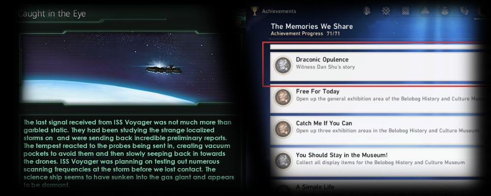

# 事件系统

> 事件系统是指在Unity中实现成就、触发任务等功能的实现。不是指`UntiyEvent`。

我认为，事件系统应该分为延时事件系统和即时事件系统
- 延时事件系统：主要强调事件发生的时间
    - 例如游戏进行的第100个回合会有一个胜负判定，这是一个延时事件
    - 游戏《群星》中，存在大量按时间触发的事件，丰富了游戏内容
    - **实现方式：按时间排序的事件队列（优先队列）**
- 即时事件系统：当事件发生时就立刻处理，需要回调函数，常常用C#事件实现
    - 如各种游戏的成就系统，任务系统
    - **实现方式：对事件标记的存储方法注册监听事件**

> 说到事件系统，总让我想到消息队列这种常用于分布式、多任务的后端技术。但这种技术好像在游戏中（不包括后端业务）没有使用场景。

## 延时事件系统-例子
我认为上述说明已经足够，直接从一个例子开始吧。

在[My-TDS家园场景](https://github.com/Unarimit/my-topdown-shooting-game/tree/dev/Assets/Scripts/HomeLogic)中，有一个延时事件系统的设计，用于结算当天发生的事件，做了以下工作：
- 定义[事件信息类`HomeMessage`](https://github.com/Unarimit/my-topdown-shooting-game/blob/dev/Assets/Scripts/Entities/HomeMessage/HomeMessage.cs)，使用委托存储事件逻辑。
- 定义[事件队列`HomeMessageQueue`](https://github.com/Unarimit/my-topdown-shooting-game/blob/dev/Assets/Scripts/Entities/HomeMessage/HomeMessageQueue.cs)
- 在[`Home`场景加载时判断](https://github.com/Unarimit/my-topdown-shooting-game/blob/dev/Assets/Scripts/HomeLogic/HomeStartup.cs)

```cs
internal class HomeMessage
{
    private static int _ID = 0;
    public int Id;
    public int Day; // 延时事件的延时根据
    public Action<HomeContextManager> MessageAction; // 使用委托传递主要逻辑
    public HomeMessage()
    {
        Id = _ID++;
    }
    public void DoMessage(HomeContextManager context)
    {
        MessageAction(context);
    }
}
```
`HomeMessageQueue.cs`我就不单独列出了，主要是封装了`SortedSet<T>`，让他像一个优先队列。

```cs
internal class HomeStartup : MonoBehaviour{
    private void Start(){
        // ...
        // 处理HomeMessages事件
        while (MyServices.Database.HomeMessages.Count != 0 && MyServices.Database.HomeMessages.Peek().Day <= MyServices.GameDataHelper.DayNow)
        {
            var act = MyServices.Database.HomeMessages.Pop();
            act.MessageAction(HomeContextManager.Instance);
        }
    }
}
```

## 即时事件系统-例子
我认为上述说明已经足够，直接从一个例子开始吧。

在[My-TDS战斗场景](https://github.com/Unarimit/my-topdown-shooting-game/tree/dev/Assets/Scripts/CombatLogic)中，有一个即时事件系统的设计，用于结算战斗时什么时候满足战斗目标，触发战斗结算。做了以下工作：
- [在`GameLevelManager`中记录`事件标记`](https://github.com/Unarimit/my-topdown-shooting-game/blob/dev/Assets/Scripts/CombatLogic/LevelLogic/GameLevelManager.cs)。
- 在`GameLevelManager`的添加`事件标记`方法中检测是否满足目标。
- *这里我把敌人的掉落物和`事件标记`混合了起来取巧，使其一起被检测，不用独立掉落物存储和注册回调逻辑了。但不相关物体会对性能产生一点点影响（如果继续向内部函数传key的话可以实现O(1)的不相关过滤，这里是懒得做了吧）。

下面是代码，请主要关注`addDropout`方法会调用`事件标记`检测方法这一点。

```cs
public class GameLevelManager : MonoBehaviour{
    private Dictionary<string, int> Dropouts = new Dictionary<string, int>();
    public void CalculateDropout(CombatOperator cOperator)
    {
        if (cOperator.Team == 0) addDropout(MyConfig.ItemTable.KillTeam.ToString(), 1);
        else if (cOperator.Team == 1)
        {
            // 自带掉落
            foreach(var ePrab in _rule.OperatorPrefabs)
            {
                if(ePrab.OpInfo.Id == cOperator.OpInfo.Id)
                {
                    if(ePrab.Dropouts != null)
                    {
                        foreach (var dp in ePrab.Dropouts)
                        {
                            addDropout(dp.DropItem.ItemId, dp.GetDropoutAmount());
                        }
                    }
                    break;
                }
            }
            // 敌人指示物
            addDropout(MyConfig.ItemTable.KillEnemy.ToString(), 1);
        }
    }
    private void addDropout(string key, int value)
    {
        if (!Dropouts.ContainsKey(key)) Dropouts.Add(key, 0);
        Dropouts[key] += value;
        CheckAimAndAction();
    }
    private int getDropout(string key)
    {
        if (Dropouts.ContainsKey(key)) return Dropouts[key];
        else return 0;
    }
    public delegate void AimChangeEventHandler(string text);
    public event AimChangeEventHandler AimChangeEvent;
    public void CheckAimAndAction()
    {
        if (isAccomplish is true) return;

        // 这里在更新ui
        if(AimChangeEvent != null) AimChangeEvent.Invoke(generateText());

        // 最后执行物体控制指令（
        if (isMatchWinCondition())
        {
            levelAccomplish(true);
        }
        if (isMatchLossCondition())
        {
            levelAccomplish(false);
        }

    }
}
```

## 参考
- [《Game Programming Patterns》](https://gameprogrammingpatterns.com/)