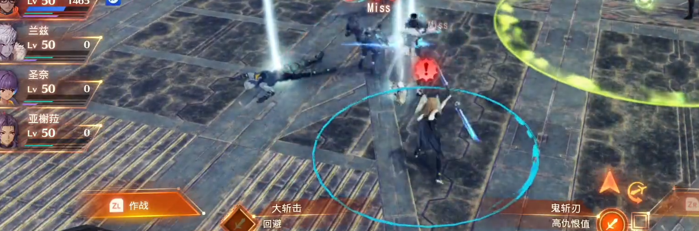

# 人机切换

在一些出现4人或更多人小组作战的单机游戏中，玩家操控一个角色，其他角色由AI操控。为了防止AI决策不如人意，总会提供切换角色的选项（switch！）。如异度之刃系列、最终幻想系列等。

## 需求提取

在角色切换时，AI操控的角色的操控权会移交到玩家手中，像对的玩家操控的角色也会移交到AI手中。在切换时可能需要：
- 保证角色动画不变，不然就太奇怪了
- 玩家操控时的提示UI也需要更新（例如技能，每个角色的技能肯定有差异的对吧，还有小地图等）
- 影响游戏逻辑的数据结构更新
- 过渡动画
- 切换时的加成（换手！）
- 。。。

## 在Unity中实现

我们首先排除把两个待切换角色的`GameObject`销毁重新创建的想法，因为很难保证动画状态不变。

由于Unity的脚本是基于`组件模式`实现的（如果不知道什么是Unity中的组件的话，提示：`Component` ），可以从组件的角度思考如何解决切换时的问题。具体来说，找到AI操控的角色和玩家操控的角色不同的地方，由特定组件管理这些不同（组件、属性）的管理。
> 在《游戏编程设计》中，`组件模式`章节讨论了对操控部分的抽象，使得可以让他支持AI操控、玩家操控或其他操控方法。

使用组件管理的好处是
- 可以利用生命周期，创建和销毁相关组件，简化创建流程。
- AI组件和玩家控制组件都可以通过GetComponent获取角色的操作控制组件，解耦控制逻辑。
- 可以保持相同功能的组件状态不变，尤其是动画状态。

### 例子

以下代码出现在我的游戏的开发过程中，通过一个函数`SwithAgentWithPlayer`控制角色控制器在AI和玩家的转换。他是通过在组件生命周期中注册和注销其他组件和状态实现的，所以列出了三个部分代码：
- `PlayerController`类：继承自`MonoBehaviour`，是玩家操控角色的组件。
- `AgentController`类：继承自`MonoBehaviour`，是AI操控角色的组件。
- `SwithAgentWithPlayer`方法：

涉及对下列逻辑的控制：
- 角色`GameObject`的"控制权"
- 追随玩家操控角色的相机
- 小地图图标
- 玩家标识`Tag`
- 和玩家操控角色相关的UI

下面是代码：

```cs
// 玩家控制类
public class PlayerController : MonoBehaviour{
    private void Awake()
    {
        _controller = GetComponent<OperatorController>();
        // 注册其他组件
        // 相机追踪
        _cameraFlowing = Instantiate(ResourceManager.Load<GameObject>("Characters/CameraFlowing"), transform);
        _context.m_Camera.Follow = _cameraFlowing.transform;
        // 小地图
        mapMarkUI = initMiniMapMark();
        // 玩家标识
        transform.tag = MyConfig.PLAYER_TAG;
    }
    private void OnDestroy()
    {
        // 玩家标识
        transform.tag = MyConfig.UNTAGED_TAG;
        // 注销组件
        if (_cameraFlowing != null) Destroy(_cameraFlowing);
        if (mapMarkUI != null) Destroy(mapMarkUI);
    }
}
```
```cs
// AI控制类
public class AgentController : MonoBehaviour{
    private void Awake()
    {
        // 注册其他组件
        NavMeshAgent = GetComponent<NavMeshAgent>();
        NavMeshAgent.enabled = true;
        mapMarkUI = initMiniMapMark();
    }
    private void OnDestroy()
    {
        // 注销组件
        NavMeshAgent.enabled = false;
        if(mapMarkUI != null) Destroy(mapMarkUI);
    }
}
```

```cs
public void SwithAgentWithPlayer(Transform agent)
{
    // ...
    // 主要逻辑
    Destroy(oldOpTrans.transform.GetComponent<PlayerController>());
    Destroy(agent.transform.GetComponent<AgentController>());
    agent.transform.AddComponent<PlayerController>();
    oldOpTrans.transform.AddComponent<AgentController>();

    agent.GetComponent<OperatorController>().RefreshPlayerUIRef();
    // ...
}
```


具体的代码可以在[MyTDS-CombatContextManager.cs](https://github.com/Unarimit/my-topdown-shooting-game/blob/0154b461cfff4dbdddf2188972c68159486be56e/Assets/Scripts/CombatLogic/CombatContextManager.cs)、[MyTDS-PlayerController.cs](https://github.com/Unarimit/my-topdown-shooting-game/blob/0154b461cfff4dbdddf2188972c68159486be56e/Assets/Scripts/CombatLogic/Characters/Player/PlayerController.cs)和[MyTDS-AgentController.cs](https://github.com/Unarimit/my-topdown-shooting-game/blob/0154b461cfff4dbdddf2188972c68159486be56e/Assets/Scripts/CombatLogic/Characters/Computer/Agent/AgentController.cs)找到。

## 参考
- 头图：[异度之刃3](https://www.nintendo.com.hk/switch/az3ha/index.html) // c酱录播截图