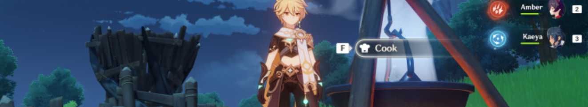
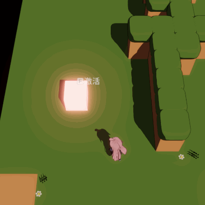

# 环境交互

可以分为按键交互和无按键交互
- 按键交互：如碰到篝火可以做饭，碰到墙可以爬。通过碰撞箱和方向判断实现，在检测到按键输入后，需要调用UI函数或游戏逻辑事件。
- 无按键交互：如水里游泳，雪地脚印。主要通过shader和cs脚本控制渲染参数实现。
- 开放世界触发场景加载

## 按键交互

### 简单碰撞箱交互

下图是一个通过`ShpereCollider`实现的靠近互动逻辑。
- 勾选`isTrigger`，并放入设定的互动碰撞层
- 监听`Trigger`事件判断是否显示UI，和挂载互动事件响应
- 物体和角色必须其中一方拥有rigidbody



关键代码：

```cs
private void OnTriggerEnter(Collider other)
{
    if (other.tag == TestDB.PLAYER_TAG)
    {
        showInteractTip();
        other.gameObject.GetComponent<PlayerController>().InteractEventHandler += doInteract;
    }
}
private void OnTriggerExit(Collider other)
{
    if (other.tag == TestDB.PLAYER_TAG)
    {
        closeInteractTip();
        other.gameObject.GetComponent<PlayerController>().InteractEventHandler -= doInteract;
    }
}
```
完整代码链接：[InteractableObjectController.cs](https://github.com/Unarimit/my-topdown-shooting-game/blob/9981b70eb553e8c827eaab56de2667d0f3f07d3c/Assets/Scripts/CombatLogic/LevelLogic/InteractableObjectController.cs)

## 无按键交互

WIP

## 参考
- 头图：[原神](https://ys.mihoyo.com/)