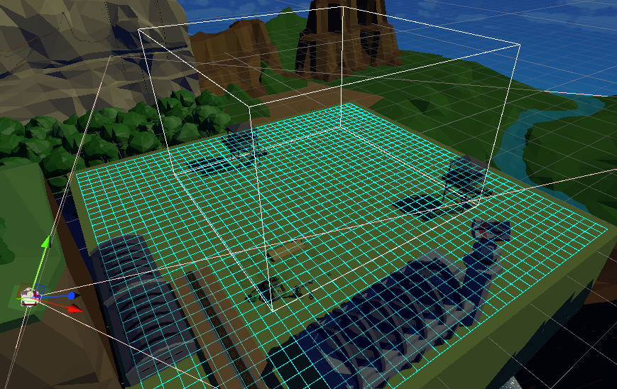

# RTS相机

可以随鼠标移到边界而平移的相机，因为多在RTS游戏中使用（如星际、魔兽、红警系列），所以叫这个名。


## 需求提取

当玩家鼠标移动到边界时，拖动(pan)相机
- 检测鼠标移动到边界，通过`Mouse.current.position.value`api完成。
- 正确的根据上下左右边界移动相机，需要根据角度计算正确的方向。
- 设置相机移动边界。

*其实没有什么技术难度，最多就是看unity TD模板的时候，四元数和向量做乘法挺震撼的。

## 代码实现

发现`CinemachineVirtualCamera`里面没有这个功能，就参考了Unity的塔防模板抄了一个，在基础上增加了对相机中心范围的显示（使用Gizmo），取消了缩放的关联。

<center>


使用Gizmos显示相机中心范围（中间的白色Cube框线）

</center>

代码如下：

```cs
/// <summary>
/// 可随鼠标移动的相机
/// </summary>
internal class PanableCameraController : MonoBehaviour
{
    public Rect m_LookCenterBounds = new Rect(-10, -10, 20, 20);
    public float m_GroundHeight = 40f;

    float screenPanThreshold = 40f;
    float panSpeed = 30f;

    // 记录当前偏移
    private Vector3 lookDiff;
    // 定义四个方向
    Vector3 left;
    Vector3 right;
    Vector3 up;
    Vector3 down;

    // 当切换回相机时，复位
    Vector3 InitPos;
    private void Awake()
    {
        InitPos = transform.position;
    }
    private void Start()
    {
        up = new Vector3(transform.forward.x, 0, transform.forward.z).normalized;
        down = -up;
        right = new Vector3(transform.right.x, 0, transform.right.z).normalized;
        left = -right;
    }

    private void OnEnable()
    {
        lookDiff = Vector3.zero;
        transform.position = InitPos;
    }

    private void Update()
    {
        edgePanCamera();
    }

    private void OnDrawGizmos()
    {
        var lookRay = new Ray(transform.position, transform.forward);
        var lookCenter = lookRay.GetPoint(m_GroundHeight);
        Vector3 center = new Vector3(
            m_LookCenterBounds.xMin + m_LookCenterBounds.xMax + lookCenter.x, 
            transform.position.y-m_GroundHeight / 2, 
            m_LookCenterBounds.yMin + m_LookCenterBounds.yMax + lookCenter.z
        );
        Vector3 size = new Vector3(m_LookCenterBounds.xMax - m_LookCenterBounds.xMin, m_GroundHeight, m_LookCenterBounds.yMax - m_LookCenterBounds.yMin);
        
        Gizmos.DrawWireCube(center, size);
    }

    private void edgePanCamera()
    {
        Vector2 mousePos = Mouse.current.position.value;

        bool mouseInside = (mousePos.x >= 0) &&
                            (mousePos.x < Screen.width) &&
                            (mousePos.y >= 0) &&
                            (mousePos.y < Screen.height);
        if (mouseInside is false) return;


        // Left
        if ((mousePos.x < screenPanThreshold))
        {
            float panAmount = (screenPanThreshold - mousePos.x) / screenPanThreshold;
            panAmount = Mathf.Clamp01(Mathf.Log(panAmount) + 1);
            panCamera(left * Time.deltaTime * panSpeed * panAmount);
        }

        // Right
        if ((mousePos.x > Screen.width - screenPanThreshold))
        {
            float panAmount = ((screenPanThreshold - Screen.width) + mousePos.x) / screenPanThreshold;
            panAmount = Mathf.Clamp01(Mathf.Log(panAmount) + 1);
            panCamera(right * Time.deltaTime * panSpeed * panAmount);
        }

        // Down
        if ((mousePos.y < screenPanThreshold))
        {
            float panAmount = (screenPanThreshold - mousePos.y) / screenPanThreshold;
            panAmount = Mathf.Clamp01(Mathf.Log(panAmount) + 1);
            panCamera(down * Time.deltaTime * panSpeed * panAmount);
        }

        // Up
        if ((mousePos.y > Screen.height - screenPanThreshold))
        {
            float panAmount = ((screenPanThreshold - Screen.height) + mousePos.y) / screenPanThreshold;
            panAmount = Mathf.Clamp01(Mathf.Log(panAmount) + 1);
            panCamera(up * Time.deltaTime * panSpeed * panAmount);
        }
    }

    /// <summary>
    /// Pan the camera
    /// </summary>
    /// <param name="panDelta">How far to pan the camera, in world space units</param>
    private void panCamera(Vector3 panDelta)
    {
        Vector3 pos = lookDiff;
        pos += panDelta;

        // Clamp to look bounds
        pos.x = Mathf.Clamp(pos.x, m_LookCenterBounds.xMin, m_LookCenterBounds.xMax);
        pos.z = Mathf.Clamp(pos.z, m_LookCenterBounds.yMin, m_LookCenterBounds.yMax);

        transform.position += new Vector3(pos.x - lookDiff.x, 0, pos.z - lookDiff.z);
        lookDiff = pos;
    }
}
```

## 参考
- [Tower Defense Template - UnityAssets](https://assetstore.unity.com/packages/essentials/tutorial-projects/tower-defense-template-107692)