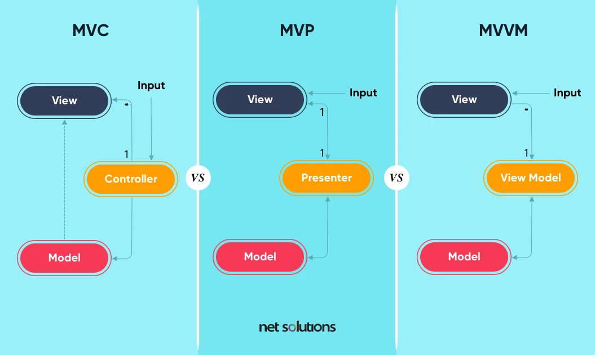

# UI系统

对于动态窗口（如mmorpg频繁开启的任务状态、背包、人物等），对UI采用设计模式是非常有必要的。

列举一个简单的需求：**一键隐藏所有UI**（这是一个很多游戏都有的功能），可以作为UI系统设计的出发点。

由于游戏中的UI有层次性，不能套用网页设计和安卓设计常使用的单页模式，所以就需要一个全局单例提供对不同层次的UI的控制，即UIManager的存在。

有些UI功能可能会允许多个窗口交互，或是点击底层UI会关闭顶层UI，这在mmorpg中比较常见：
- 对于多个窗口交互（例如把物品从背包拖到仓库），我暂时没有好办法（物品的拖拽和检测，应该是有一套通用的逻辑的）。
- 对于不同层次UI的管理，可以简单粗暴的捕获raycast处理，也可以记录事件状态做额外的交互（如果不想设置额外的事件响应，就要为UI设计统一的管理类，可以参考GameFramework等框架的实现）。

## UIManager

应该只包含涉及层级时的UI逻辑，例如开启任务菜单，打开地图等逻辑。至于层级内的UI逻辑，如查看装备属性，编辑背包物品逻辑则应该由装备UI，背包UI完成。

## UI控制

可以借鉴MVVM(Model, View, ViewModel)+数据绑定的思想实现，即一个ViewModel类对应一个UI，当其中的数据发生变化时，UI也会变化。数据绑定可以通过Model类的OOP设计+C# event实现。

虽然有方便的单例模式，但一堆单例会带来代码上的高耦合，不利于后续维护。

### 由UI直接修改，读取Model产生的问题

- 造成Model逻辑和UI逻辑的耦合
- Model使用事件做数据绑定，也会产生延迟加载导致UI事件绑定失效

> 但像是仓库，背包系统逻辑和UI紧密的功能使用UI直接控制Model是没有问题的。

### UI基类

作为父类被UIManager检索存字典。

可以提供`Refresh`方法，用于主动检测环境变量改动UI。

可以提供`Enter`,`Quit`方法，用于实现进场、离场画面。

### 例子

WIP

## 参考

::: details 达内Unity培训课：
核心类
1. Ul 窗口类 UIWindow 
    - 所有 UI 窗口的基类，用于以层次化的方式管理具体窗口类。
    - 定义所有窗口共有行为(显隐、获取事件监听器)。
2. UI 管理类 UIManager
    - 管理(记录、禁用、查找)所有窗口。
3. UI 事件监听器 UIEventListener
    - 提供当前 UI 所有事件(具有事件参数类)。

使用方式
1. 定义 UIXXXWindow 类，继承自 UIWindow，负责处理该窗口逻辑。
2. 通过窗口基类的 GetUIEventListener 方法获取需要交瓦的 UI 元素事件监听器。
3. 通过事件监听器 UIEventListener 提供的各种事件，实现交互行为。
4. 通过 UIManager 访问各个窗口成员。
    - `UIManagerInstance.GetWindow<窗口类型>().成员`:
:::

- 头图：[What’s a Design Pattern in Software Engineering? - Netsolutions](https://www.netsolutions.com/insights/software-design-pattern/)