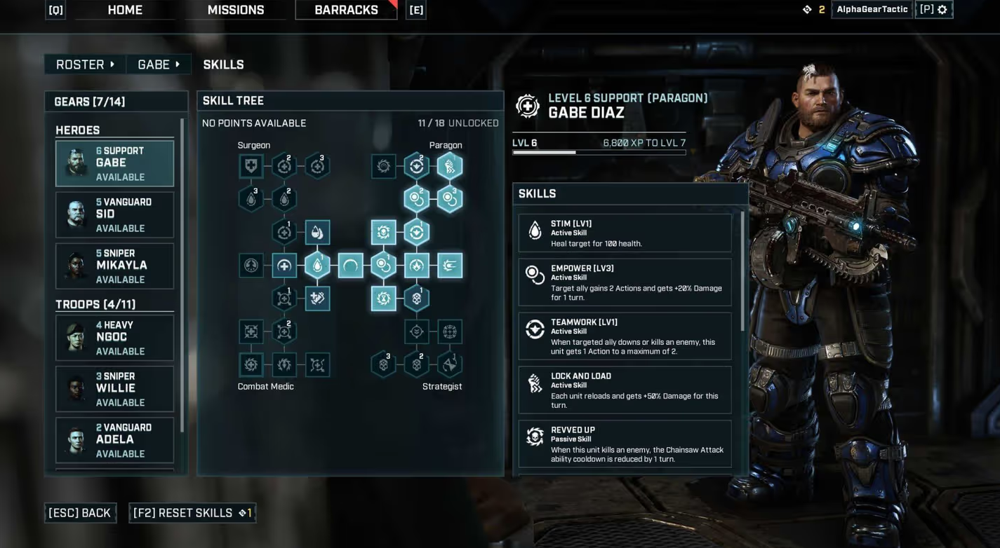

# Gameplay

这是一个前导性质（看看别人游戏怎么做的）的篇章，不涉及代码和具体技术。可能发表一些游玩其他游戏时的感想之类的，并探讨一些功能是如何实现的（仅从理论方面）。

## 百度百科
“游戏性”可以被笼统地理解为“游戏的核心性质”；但在英文中，“游戏性”（Gameplay），可以指“游戏的具体操作方法”和“游戏的抽象趣味整体”等双重含义。

## 一般认为
Gameplay是指**游戏客户端**开发者所必备的技能集合，即掌握基本几种游戏的玩法实现方式。但工作中要求美术素材的导入、性能优化等，需要对涉及游戏开发的各个领域都有所了解。**目前主流的游戏类型都有开源或收费的框架（FPS，RPG等），可以参照这些实现，提高自己的水平。** 

## 可以参考
- [游戏Gameplay程序员的核心竞争力是什么？ - 大钊的回答 - 知乎](https://www.zhihu.com/question/601194013/answer/3030169440)
- [[Unity教程]-如何制作技能系统 | Prototype系列](https://www.bilibili.com/video/BV1LV411S7d8)
    - 实际上在讲怎么制作一个游戏原型
- [游戏引擎架构-第2版](https://book.douban.com/subject/34864920/)
