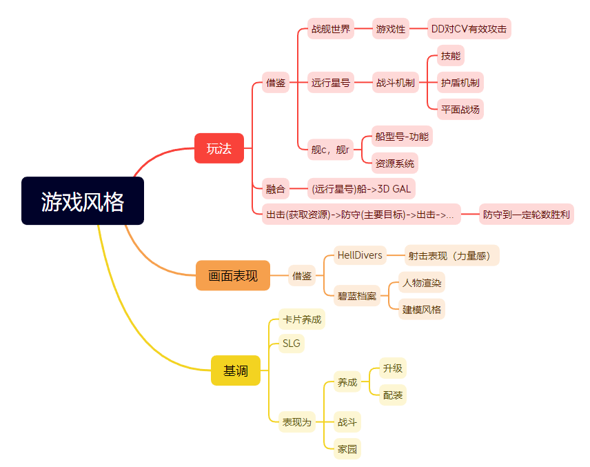

# 上帝视角射击游戏-2023

因为是个人项目，所以采用版本迭代的方式开发

大纲：

## 第一版
1. 在unity的第三人称模板基础上改进
2. 导入fbx模型和动画
3. 完成动画控制逻辑
4. 导入简易场景，完成游戏场景搭建
5. 更改渲染风格（仅限角色）。并改动了一些shader：光照接受方面和阴影渲染部分的的hlsl和shader代码
6. 加入一些特效增加射击手感
7. 通过状态机加入简单的NPC自动控制，完成敌军和友军概念的建立

整个流程经历8天，净时间大概42小时
[B站视频介绍](https://www.bilibili.com/video/BV1Uh4y1N7sK/)

## 第二版
主要功能
1. 枪械完善
    - 换子弹动作，动作冲突优先级
2. 增加技能系统
    - 代码控制，技能特效
3. UI补充
    - 操作说明，任务说明，驾驶舱视角，人物状态，任务状态。
4. 场景搭建&关卡设定

系统优化
1. 代码优化
    - 分离武器和人物类
    - 文件结构优化
2. AI优化，NevMesh替换自己写的无脑走路功能
3. 技能系统
    - 将技能释放规范化，可以通过一个json文件定义技能
4. 更换渲染方案
    - NiloExample -> FernNPR