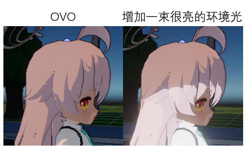
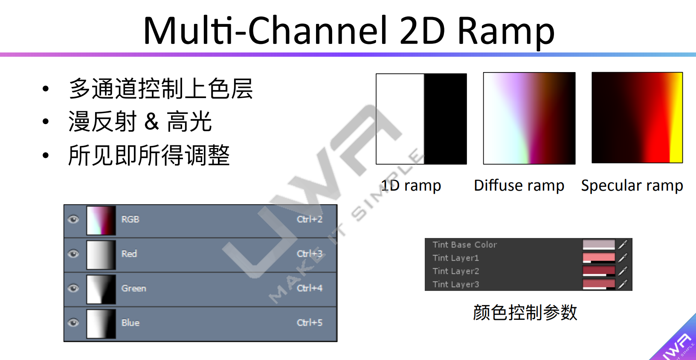
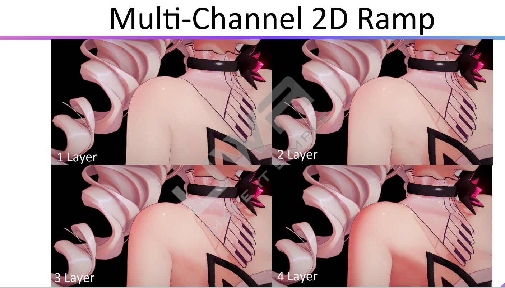
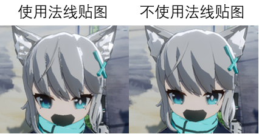
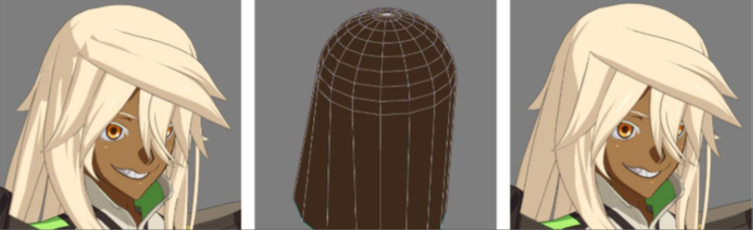

# NPR渲染风格

要点+实现方式+性能
参照Nilo和FarnNPR完成实现方法和英文命名的对照

TODO：一张图通过圈点的方式指出NPR的必要内容
[[toc]]
介绍：NPR的要点，主要是会用那些Shader

## 基础贴图

对于不同的渲染风格和不同的细致程度，需要的贴图数量不同

对于一个仿原神渲染风格的shader，他包含如下贴图：
1. BaseMap
2. NormalMap
3. LightMap
    - 表达头发纹理的阴影
4. ShadowMap
    - 腿中的窝窝那里？

## 着色（阴影 & 光线）

在FarnNPR中，这一功能在`Diffuse`下拉栏中，其中包括`CelShader`, `RampShading`和一些特化与脸部或头发的选项

### CelShading

wiki中是这样描述`CelShading`（赛璐珞渲染）的：
> Cel shading or toon shading is a type of non-photorealistic rendering designed to make 3-D computer graphics appear ....

并且将`Cel shading`视作`toon shading`，足以证明他在NPR中的重要性。他的实现理论基础也很简单，就是把因为光线和遮挡造成的阴影分成多个离散的部分显示。

就像那张对比图中展示的那样：

在开源方案`FarnNPR`中，则是分为两个部分，亮面和暗面，是根据光线分布划分出来的。而具体多亮或多暗，则综合所有光线计算。

即便受直射光影响有一部分很亮的地方，但仍可以从中间看出明暗的分界线

### RampShading

`RampShading`（渐变渲染）是渲染技术中的术语，百度搜索这个词时，都是将如何通过多通道的Ramp去渲染达到比较好的效果。

下面是一些精美的买家秀

在开源方案`FarnNPR`中，`RampShading`应该是指可以通过这种方式达到更多层级的渐变效果（`CelShading`为阴面、暗面两级），算是一种对`CelShading`的补充（TODO：待实践确认）

## 光晕

Ring(Fresnel Rim)

## 描边

Outline

## 头发高光

Specular(Anisotropy, AngleRing, FernNPR stylized)，感觉用了平滑法线贴图会更好

## Shadow

Depth Shadow

## 表现优化

### 利用法线贴图平滑阴影

尝试使用法线贴图优化头发阴影，但效果并不是很好。是因为**模型本身面数就低**，再加上NPRshader对使用法线和不使用法线的优化方式不同吧。

当然，参照其他游戏的处理手法，我们可以通过近似平滑物体，映射法线来实现平滑阴影的效果。

>通常NPR中的人物着色不会借助于法线贴图，这是与PBR的显著差异之一，因为通常NPR要求着色简洁，不再需要法线贴图提供细节。《原神》中的人物面部利用平滑球的法线进行替代便可以获得高度相似的结果。法线修正可以不止用在面部，也不是光这一种修正办法，手掰法线。（摘自：[卡通渲染NPR概述 - 凛冬与仓鼠的文章 - 知乎](https://zhuanlan.zhihu.com/p/416293436)）

使用形状相似的简易模型来修正法线

::: details 点击查看实现方法 - gpt生成
在Blender中为人物模型的头发生成近似的平滑球法线可以通过以下步骤实现：

1. 创建一个球体模型：在Blender中选择“Add”（添加）> “Mesh”（网格）> “UV Sphere”（UV 球体）来创建一个球体模型。该球体将用作代表头发的基本形状。

2. 调整球体大小和位置：选择球体模型，调整其大小和位置，使其适合头发的位置和大小。

3. 应用材质和纹理：为球体模型创建一个材质，并为该材质添加纹理。可以使用简单的白色或灰色纹理，或者使用适合你的头发样式的具体纹理。

4. 生成法线贴图：在球体材质的节点编辑器中添加一个“Geometry”（几何）节点，并连接到“Normal Map”（法线贴图）节点上。调整法线贴图节点的“Strength”（强度）值，以获得适当的平滑效果。

5. 通过烘焙将法线贴图应用到头发模型：选择头发模型，进入“Edit”（编辑）模式，然后选择球体模型。接下来，通过选择“Bake”（烘焙）> “Bake Selected to Active”（烘焙所选到活动对象）来烘焙法线贴图。这将把球体模型的法线贴图应用到头发模型上。

6. 调整法线贴图：在烘焙完成后，你可以通过调整头发模型上的法线贴图节点的设置来微调效果。尝试调整“Strength”（强度）和“Distance”（距离）值，以达到最佳的平滑阴影效果。

完成这些步骤后，你应该能够将近似的平滑球法线应用到人物模型的头发上，以获得平滑的阴影效果。希望这对你有所帮助！

[Blender教程】使用Blender烘焙法线贴图 - 0xSimple - bilibili](https://www.bilibili.com/video/BV1Nh411H7N3)
:::

## 参考
- [FernNPR - Github](https://github.com/FernRender/FernRenderCore)
- [FernNPR 最佳实践？- Bilibili](https://www.bilibili.com/video/BV19K411B787)
- [Nilo - Github](https://github.com/ColinLeung-NiloCat/UnityURPToonLitShaderExample)
- [Nilo-UI Preview - Google Drive](https://drive.google.com/drive/folders/1SlOhvqCZrDBRkSgzwW0ZIzAkDqonpa26)
- [卡通渲染NPR概述 - 凛冬与仓鼠的文章 - 知乎](https://zhuanlan.zhihu.com/p/416293436)
- [人物3渲2学习总结 - CSDN](https://blog.csdn.net/qq_45796212/article/details/124568976)
- [纳西妲仿原神渲染预设工程 - Bilibili](https://www.bilibili.com/video/BV1HN4y1X7uS)
    - 对应技术解析: [【虚幻&Unity】两种引擎 原神风格基础卡通渲染 完整流程 - Bilibili](https://www.bilibili.com/video/BV1h14y177bp/)