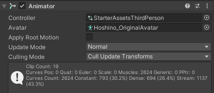
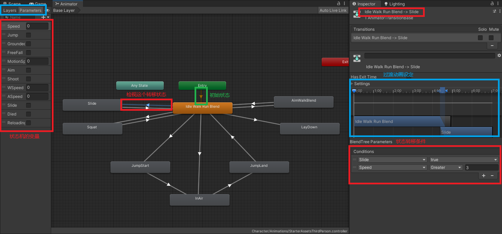
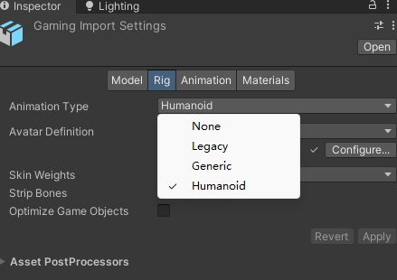

# 动画机

本章包括：
- `Animator组件`介绍（Animator Component）
- `Animator面板`提供的功能（Animator Window）
- 关于3D动画格式的一些知识
- 动态导入，从fbx导入Avatar

## Animator组件

一般绑定在被控制的物体上面，使其在进行移动、攻击行为时，播放相应的动画。

<center></center>

<center>一个角色inspector中的animator</center>

在上图中可以看到要配置Controller和Avatar
- Controller：动画状态机，通过`Animator Window`编辑
    - 保持动画格式和模型格式相同（都是Genetic或Humanoid）
- Avatar：角色的骨骼表示
    - 保证被控制的骨骼（在Hierarchy中的子物体）来自这个Avatar

不难发现如果为一个角色写好一套逻辑，只想改变模型的话：修改物体Hierarchy下的模型和骨骼，在修改对应的Avatar就可以了。

## Animator面板

动画之前的切换采用了有限状态机的形式，可以通过配置在动画切换时播放过渡动画

除了状态之间的过渡动画外，还有混合树的形式，如通过速度blend走和跑两个动作，使速度介于走和跑中间时播放blend动画。

对于复杂的动作，可以使用层级控制（Layer）模式。例如可以控制上半身做释放技能动作，下半身仍做移动动作。

<center></center>

<center>一个状态动画机示例，看不清可以右键新标签页打开图片</center>

关于对其元素更多的解释，可以查看[Animator Controllers文档](https://docs.unity3d.com/cn/current/Manual/AnimatorControllers.html)

### AnimationEvent

可以在动画clip中设置AnimationEvent，在执行到指定动画帧时，会在执行动画的物体上调用相应的函数。

详见[使用动画事件 - unity doc](https://docs.unity3d.com/cn/2021.3/Manual/script-AnimationWindowEvent.html)

## humanoid & dynamic

在导入模型文件时，需要配置rig（翻译为：操纵 or 绑定），如下图所示。

<center></center>

WIP

## 动态导入Avatar

仅介绍humanoid的方式，参考方法：

`public static Avatar BuildHumanAvatar(GameObject go, HumanDescription humanDescription)`

这个函数显然不如`Editor`的`Avatar配置`一样智能，只会按照humanoid的标准找骨骼，找不到就报错。

只能自己配置`HumanDescription`，其中包括：
- `human`:模型骨骼名称对应humanoid骨骼名称的映射
- `skeleton`:骨骼位置
- 其他如`m_ArmTwist`的float参数

由于`skeleton`中需要配置`T-pose`时的参数，如果模型初始状态不处于`T-pose`时会很麻烦
> `human`相对来说好配置，可由`Editor`的`Avatar配置`导出一套映射。理论上如果模型处于`T-pose`就不需要配置`skeleton`？

### 从默认Avatar获取`HumanDescription`

这里假定导入的模型在humanoid部分，骨骼都是相同的情况，以下是示例代码

```cs
private HumanDescription GetHumanDesc()
{
    var res = TestAvatar.humanDescription;
    int t = 0;
    for(; t < res.skeleton.Length; t++)
    {
        if (res.skeleton[t].name == "bone_root") break; // 如果根骨骼不叫"bone_root"也要改一下
    }
    res.skeleton = res.skeleton.Skip(t-1).Take(HUMANOID_BOUND).ToArray(); // 保留mesh根当作根，我也不知道为什么要这样，反正这样是对的
    // HUMANOID_BOUND 需要debug目测一下到哪里结束HUMANOID部分

    // 清空parent（一个internal修饰的变量，记录模型中的父骨骼名称）
    res.skeleton[0] = new SkeletonBone { name = "this_is_root", position = res.skeleton[0].position, rotation = res.skeleton[0].rotation, scale = res.skeleton[0].scale };
    res.skeleton[1] = new SkeletonBone { name = res.skeleton[1].name, position = res.skeleton[1].position, rotation = res.skeleton[1].rotation, scale = res.skeleton[1].scale };
    return res;
}
```

## 其他选项

### 导入动画时

- 可以配置动画的Root Transform选项，使模型按照动画的轨迹在场景中位移。

## 参考
- [动画 - Unity Doc](https://docs.unity3d.com/cn/current/Manual/AnimationSection.html)
- [ConfiguringtheAvatar - Unity Doc](https://docs.unity3d.com/Manual/ConfiguringtheAvatar.html)
- Animation Rigging
    - blend
- Spine动画：[NIKKE射击系统在Unity中的实现-Bilibili](https://www.bilibili.com/video/BV1Hz4y1F75i)