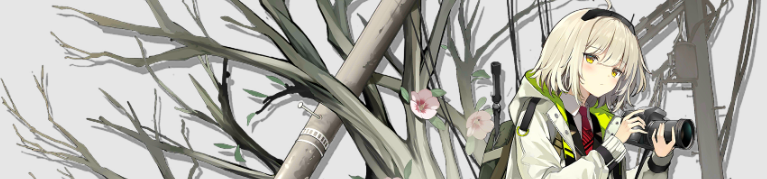
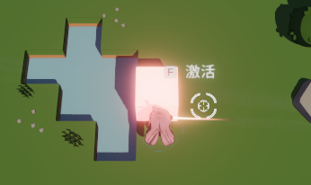
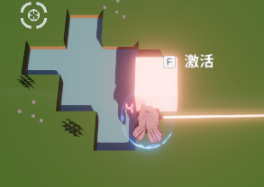

# 摄像机

摄像机作为游戏制作的3C之一，... 后面忘了

## 基本相机属性
::: tip
渲染管线不同，相机的配置属性不同
:::
Unity版本2022.3，使用URP v14

- `RenderType`：base和overlay，base是默认的，独立工作的相机。overlay依赖于base相机，在base基础上叠放渲染结果。
- `Projection`：可以通过调整FOV（视场）帮助cpu正确的剔除不需要渲染的物体
- `Rendering`：总之就是渲染相关
    - 里面有一个`Post-Processing`选项，每次都忘记选。
- `Stack`: base中独有，可以在里面添加overlay相机，将渲染结果覆盖到上方
- `Enviorment`：设置背景，即没投影到物体显示什么东西
- `Output`
    - 两个渲染位置：RenderTexture & Screen


### 分层渲染

当涉及UI和3D物体的显示时，常常需要分层渲染，如世界坐标系下的互动UI一定在3D物体之上，或主角的模型在UI面板之前显示等。

下图是一个可互动发光物体上显示的互动提示UI，可以看到它因为后处理被整体拉低了颜色。

<center></center>

若我们使用分层渲染(如下图所示)，世界坐标下的UI可以避免被后处理影响，也不会被3D物体遮挡。

<center></center>

分层渲染在不同的渲染管线下实现方式不同：
- URP中，需要配置`overlay`相机，主相机和`overlay`相机对UI layer要做过滤。
    - 参考：[Unity URP相机使用简介 - CSDN](https://blog.csdn.net/aaa27987/article/details/129753424)
    - 采用上述方法配置，`overlay`层会和`base`相机同时受到`anti-aliasing`（抗锯齿）影响，这对UI很不友好，有两个方法解决这一问题。
        - 先看看[UI受`anti-aliasing`影响会怎么样 - unity forum](https://forum.unity.com/threads/blurry-font-when-using-screen-space-camera.509147/)
        - 再配置一个不带`anti-aliasing`的`base`相机，提高渲染优先级，背景设为`Uninitialized`，过滤layer。
        - 在`overlay`相机的`Renderer`配置不带`anti-aliasing`的`URP Render setting`（TODO：需要验证可行性）。
- Built-in Pipeline中，需要配置两个相机，`渲染优先级`，`Clear Flags`，同时相机对UI layer要做过滤。
    - 参考：[World Space canvas on top of “everything” ? - unity discussions](https://discussions.unity.com/t/world-space-canvas-on-top-of-everything/128165/3)

## 自动相机-Cinemachine

`Cinemachine`是unity提供的一套控制相机移动的组件，需要配置以下组件:
- `CinemachineVirtualCamera`
- `CinemachineBrain`：可以控制多个`CinemachineVirtualCamera`替换主相机
    - 可以实现丝滑的在两个`CinemachineVirtualCamera`之间切换，是主要功能之一

### CinemachineBrain

`CinemachineBrain`用来控制主相机，和相机切换时的blend、
- 通过改变`CinemachineVirtualCamera`优先级的方式切换相机
- 默认为平滑过渡，可以给每个虚拟相机设置过渡曲线

`CinemachineBrain`配置可以参考：[How to use Cameras in Unity: Cinemachine Overview and Brain Explained!](https://www.youtube.com/watch?v=P_ibDJhFVMU)
- 通过`World Up Override`消除Camera Roll

### CinemachineVirtualCamera

`CinemachineVirtualCamera`有两组主要属性
- 第一组：`Follow`和`Body`。
- 第二组：`LookAt`和`Aim`。

对于第一组属性，选择该组件的`Body`，确定相机的**跟随**目标的风格
- `3rd person follow`：第三人称相机，在TPS、(A)RPG类型中使用较多
    - 例如：神秘海域，原神，PUBG
- `Farming Transposer`：第三人称俯视视角，在MOBA、RTS(即时策略)、2D-RPG类型中使用较多
    - 例如：模拟农场，英雄联盟、HellDivers、冒险岛
    - 特性：角色前向的视野会比其他方向多
- `Hard Lock to Target`：第一人称
- `Orbital Transposer`：第三人称环绕，用于一些游戏的胜利演出之类的？
    - 例如：跑跑卡丁车冲线后动画
- `Tracked Dolly`：一定范围内水平移动
- `Transposer`：随`Transform`相对运动

第二组属性的用法，可以参考：[How to use Cameras in Unity: Cinemachine Virtual Cameras Explained](https://www.youtube.com/watch?v=asruvbmUyw8)，里面对组件的各个属性有详细介绍。例如配置第二组属性，可以实现多人联机拖拽视角的效果

## 例子

### 实现moba游戏跟随相机

``` csharp
float smoothness = 0.5f;
void Start(){
    cemeraOffset = transform.position - player.transform.position;
}
void update(){
    Vector3 newPos = Player.position + cemeraOffset;
    transform.position = Vector3.Slerp(transform.position, newPos, smoothness);
}
```

实际上可以通过`CinemachineVirtualCamera`(Framing Transposer)实现一样的功能，并且有更多参数可以调节，可以做得更好

## bugs
### 内存溢出：在URP管线下，两个相机，使用全局Volume和后处理

一个相机输出到render texture（256\*256），一个相机输出到屏幕，1920\*1080分辨率

TODO: 不知道是不是我导入其他后处理效果导致的（关闭导入的后处理效果不影响），进一步实验确认。

现象：点击play，三秒钟内存使用8G，在等几秒立刻崩溃。

虽然说改用local Volume可以解决这个问题，但他奶奶的global模式是干什么用的？

## 参考
- 简易跟随相机代码：[Making A MOBA Character #1: MOVEMENT (Unity 2019 Tutorial) - Youtube](https://youtu.be/d_0dAwk3wqI?si=lkzEyYuIJKDawH5Q&t=140)
- [How to use Cameras in Unity: Cinemachine Virtual Cameras Explained - Youtube](https://www.youtube.com/watch?v=asruvbmUyw8)
- [Unity HDRP 多摄像机分层渲染 - cnblog](https://www.cnblogs.com/koshio0219/p/14263078.html)
- URP 相机-overlay和base模式，多相机：[Unity URP相机使用简介 - CSDN](https://blog.csdn.net/aaa27987/article/details/129753424)
- Built-in Pipeline 相机层次渲染：[World Space canvas on top of “everything” ? - unity discussions](https://discussions.unity.com/t/world-space-canvas-on-top-of-everything/128165/3)
- 头图：[稀音精二立绘, 明日方舟 - 萌娘百科](https://zh.moegirl.org.cn/%E7%A8%80%E9%9F%B3)