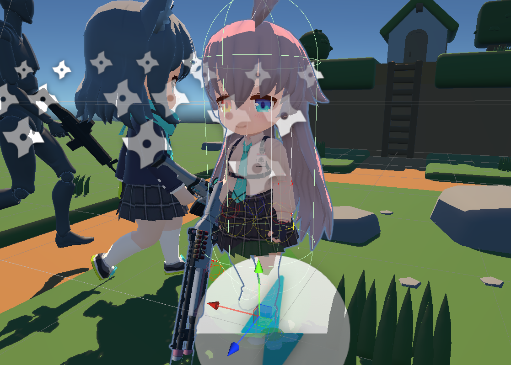

 

# 角色控制

角色控制即把玩家的输入转化为角色的动作响应。可能需要考虑：
- 角色动画（Animator）和效果控制
- 动作和实际坐标变化之间的协调
- 输入和当前角色行为冲突和优先级
- 和场景的互动（拾取，脚印等）
- 角色死亡和重生
- 镜头控制（Cinemachine）
- 。。。


实现一个简单的角色控制并不难，很多复杂的地方都可以使用工具完成（如跳跃时的坐标变换可以用DOTween），但实现过程中不断地维护可能出现各种各样的问题，所以需要一定的设计模式。

## 运用设计模式

可以使用[命令模式](./../GameCodeDesign/DesignPattern.html#命令模式)，将玩家输入放入实例化的命令中响应玩家的行为。

这样做的好处是，方便做网络同步以及解耦动作和控制代码。

理想的角色控制类可能是:
```cs
void Update(){
    if(inpunt.jump){
        if(canJumm()){
            CurrentAction = ActionsSet[Jump];
        }
    }
    else if(input.move){
        if(canMove()){
            CurrentAction = ActionsSet[Move];
        }
    }
    // else if...

    CurrentAction.Update(); // 在其中完成动画和游戏逻辑
}
```

## CharacterController

unity提供的简单控制角色的方法，属于物理系统的一部分，有：
- Move函数
- 胶囊碰撞箱（不受物理系统影响，但空间不够会过不去）

> 另外他的碰撞检测好像不受与他碰撞的物体的rigidbody中检测方式的影响，一直是离散检测。在做射击检测时发现这个问题。

## 网络传输

WIP

## 参考
- [Character Control - Unity Doc](https://docs.unity3d.com/cn/current/Manual/character-control-section.html)