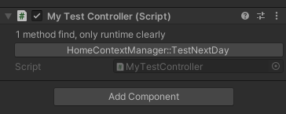

# 自定义Editor

自定义Editor用于方便测试，或者给其他从业者（如美术、策划）编辑关卡使用的。

## CustomEditor

用于拓展`MonoBehaviour`的Inspector，可以通过定义UI控件，配置`MonoBehaviour`或执行某些方法。还可以配合`[ExecuteInEditMode]`的`MonoBehaviour`在Editor中改造“世界”。

如：`UGUI Map`插件使用它来配置地图，Terrain、ProBuilder等Unity内置工具提供了丰富的世界编辑器功能。

当看到一个类继承了Editor并有`CustomEditor`特性时，他就是一个用于拓展某个`MonoBehaviour`的`CustomEditor`了

如下图所示：
```cs
[CustomEditor(typeof(LookAtPoint))] // !
[CanEditMultipleObjects] // tells Unity that you can select multiple objects with this editor and change them all at the same time.
public class LookAtPointEditor : Editor // !
{

}
```

### 例子：用反射(Reflect)和特性(Attribute)来测试

之前看到一个Assets Store上的一个免费的测试插件叫[NaughtyAttributes](https://assetstore.unity.com/packages/tools/utilities/naughtyattributes-129996)，可以通过给方法添加特性来方便Debug（点链接进去看更具体哦），但我尝试Import的时候，发现他有好多功能，太复杂了些，不如自己写一个。

实现效果，给想要拿来测试的方法添加特性，会在测试控制器上显示一个按钮，点击执行：



代码如下

```cs
// 负责显示和执行的CustomEditor
[CustomEditor(typeof(MyTestController))]
internal class MyTestControllerEditor : Editor
{
    public override void OnInspectorGUI()
    {
        var controller = (MyTestController)target;

        GUILayout.Label($"{controller.MyTestInvokeInfos.Count} method find, only runtime clearly");
        foreach (var x in controller.MyTestInvokeInfos)
        {
            if (GUILayout.Button($"{x.Instance.GetType().Name}::{x.Method.Name}"))
            {
                x.Method.Invoke(x.Instance, null);
            }
        }
        
        base.OnInspectorGUI();
    }
}
```
```cs
// 负责反射获取信息的controller
public class MyTestController : MonoBehaviour
{
    public class MyTestInvokeInfo
    {
        public MonoBehaviour Instance;
        public MethodInfo Method; 
    }
    public List<MyTestInvokeInfo> MyTestInvokeInfos = new List<MyTestInvokeInfo>();
    private void Start()
    {
        var allMono = GameObject.FindObjectsOfType<MonoBehaviour>();
        var blackList = new HashSet<Type>();
        foreach (var mono in allMono)
        {
            if (blackList.Contains(mono.GetType())) continue;
            var methods = mono.GetType().GetMethods()
                .Where(m => m.GetCustomAttributes(typeof(MyTestAttribute), false).Length > 0)
                .ToArray();
            foreach (var m in methods)
            {
                MyTestInvokeInfos.Add(new MyTestInvokeInfo { Method = m, Instance = mono });
            }
            if (methods.Length == 0) blackList.Add(mono.GetType());
        }
    }
}

```

```cs
// 自定义特性
internal class MyTestAttribute : Attribute
{
    public MyTestAttribute() { }
}
```

## WindowsEditor

会用到Unity的另一套UI组件

暂时接触不到吧，WIP

## 参考
- [Custom Editors](https://docs.unity3d.com/Manual/editor-CustomEditors.html)
- [Find methods that have custom attribute using reflection - StackOverflow](https://stackoverflow.com/questions/3467765/find-methods-that-have-custom-attribute-using-reflection)