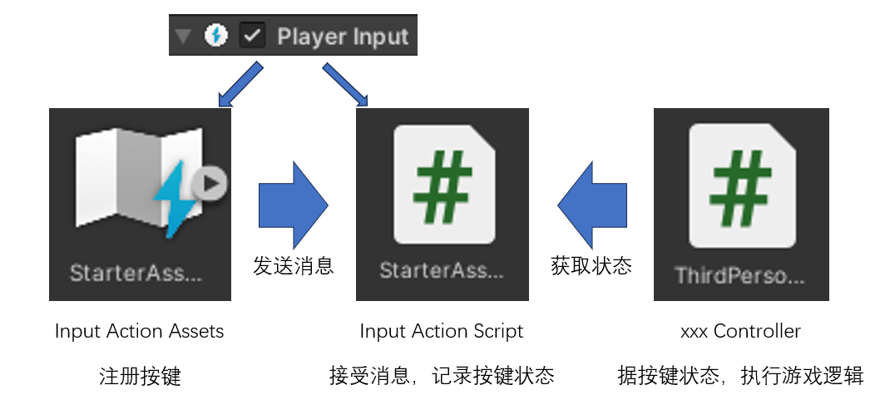
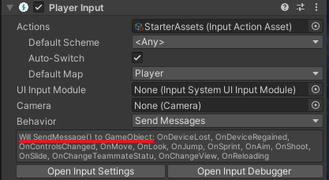
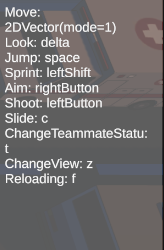

# 输入系统(InputSystem)

Input System在Unity 2019.1及更高版本中成为了新的默认输入系统。

用来处理玩家在键盘、手柄等介质的输入。

我们先来看一个最佳实践的例子吧：

## 最佳实践

根据unity自带的**第三人称模板**和一个教程视频(见参考)，利用inputsystem的最佳实践如下所示：



`Player Input`用于锁定接收指令的GameObject



其中`Input Action Script`需要和`Player Input`挂载在同一个GameObject上，其中的代码为：

``` csharp
// 节选部分
public class StarterAssetsInputs : MonoBehaviour
{
    public Vector2 move;
    public bool jump;
    public void OnMove(InputValue value)
    {
        MoveInput(value.Get<Vector2>());
    }
    public void OnJump(InputValue value)
    {
        JumpInput(value.isPressed);
    }

    public void MoveInput(Vector2 newMoveDirection)
    {
        move = newMoveDirection;
    } 
    public void JumpInput(bool newJumpState)
    {
        jump = newJumpState;
    }
}

```


## 讨论

和旧的输入系统比起来，开发者需要做的事情变多了，本来一句`Input.GetKeyDown( )`就搞定的问题，现在要涉及多个文件，合理吗？

可能相比更容易的玩家自定义按键和多输入设备映射带来的好处，这些复杂的工作是可以接受的吧。


## 其他例子

### 利用inputActions文件生成按键指南

先上效果：



然后是代码

``` csharp
public class KeyTipsController : MonoBehaviour
{

    public TextMeshProUGUI keyPromptText;
    public InputActionAsset inputActionAsset;

    private void Start()
    {
        GenerateKeyPrompts();
    }

    private void GenerateKeyPrompts()
    {
        var inputActions = inputActionAsset.actionMaps;
        var sb = new StringBuilder();
        foreach (var actionMap in inputActions)
        {
            foreach (var action in actionMap.actions)
            {
                // 忽略不是按键类型的操作
                if (!action.bindings[0].isPartOfComposite)
                {
                    if (action.bindings[0].effectivePath.Contains("/"))  sb.Append($"{action.name}: " +
                        $"{action.bindings[0].effectivePath.Split("/")[1]} \n");
                    else sb.Append($"{action.name}: {action.bindings[0].effectivePath} \n");

                }
            }
        }
        keyPromptText.text = sb.ToString();
    }
}
```

## 参考
- [InputSystem Best Practices Part1 - Youtube](https://www.youtube.com/watch?v=BAXZ6bxdTYI)