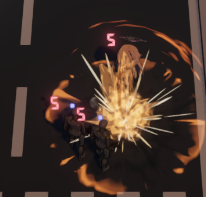

# TextMeshPro(TMP)

::: warning 
内容需要更多实践完善
:::

对于中文和加入新字体来说都是一个挺难用的组件。给了很多选项，看的眼花缭乱。

尤其是涉及字体采样率的优化和中文常用字选择的优化策略等。

需要更多实践以完善内容，或参照文档：[TextMesh Pro Documentation - doc.u3d](https://docs.unity3d.com/Packages/com.unity.textmeshpro@4.0/manual/index.html)

## 例子-实现伤害飘字

</br>



1. 导入字体`DS-Digital`（一个像是老式计算器上的字体，有字母和数字）
    - 复制ttf文件进入unity
    - 通过unity editor创建`Font Atlas`（包括贴图和材质）
        - windows -> TextMeshPro -> Font Asset Creator
2. 新建3D->Text，TextMeshPro组件的`Font Asset`选中1里创建的asset
    - mesh里面不选对应的材质也能有asset的效果，很迷
3. `Font Asset`的材质使用`TextMeshPro/Distance Field Overlay`shader，使其不受遮挡
    - 图中的效果改了颜色和HDR，还有描边
4. 实现漂浮代码（需要在inspector中拖入组件哦）
```cs
/// <summary>初始化的时候立刻设置DmageNum</summary>
public class DamageNumEffectController : MonoBehaviour
{
    public int DamageNum { get; set; }
    private TextMeshPro _text;
    private float speed = 3;
    private float speed_weak = 5f;
    private void Start()
    {
        _text = GetComponent<TextMeshPro>();
        _text.text = DamageNum.ToString();
    }
    void Update()
    {
        transform.rotation = Quaternion.LookRotation(Camera.main.transform.forward);
        transform.Translate(transform.up * speed * Time.deltaTime); //使字体向上移动
        if (speed > 0)
        {
            speed -= speed_weak * Time.deltaTime;//使得向上移动的速度逐渐减少
        }
        else
        {
            Destroy(gameObject);
        }
    }

}
```

## 参考
- 伤害飘字2d版：[Unity实现伤害飘字 - csdn](https://blog.csdn.net/WEIWEI6661012/article/details/129630051)
- TMP官方手册：[TextMesh Pro Documentation - doc.u3d](https://docs.unity3d.com/Packages/com.unity.textmeshpro@4.0/manual/index.html)