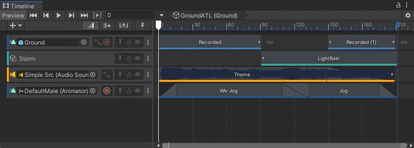
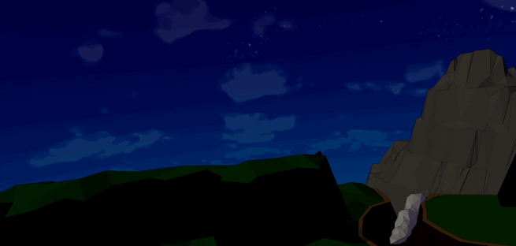
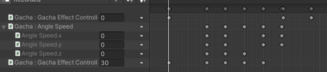

# Timeline

> "使用 Unity Timeline 可创建影片内容、游戏序列、音频序列和复杂的粒子效果。"

::: tip 注意
我仅轻度使用，对这个组件不是很了解
:::


鉴于官方文档只有英文，我建议先看一些文章了解以下Timeline可以做什么。例如[【Unity】TimeLine系列教程——编排剧情！ - 陈虹松的文章 - 知乎](https://zhuanlan.zhihu.com/p/29188275)就是一个很好的，告诉你Tineline可以干什么的文章。当然最好可以去看文档([Unity Timeline - unity manual](https://docs.unity3d.com/Packages/com.unity.timeline@1.5/manual/index.html))。

那我讲讲Timeline不适合干什么：
- 模拟一段符合物理常识的动画（想想你可以通过关键帧做到吗？）
- 使用关键帧切换VirtualCamera的状态（不知道为什么总会丢失关键帧记录！）

## 例子：使用Timeline模拟流星坠落效果

> 流星飞跃的效果可以拿来干什么? 当然是抽卡动画了！



**实现思路**：给“流星”设置关键属性，如角速度、速度等，并在`update`中按照速度更新位置。然后在Timeline中控制这些属性。（最后通过不断实验或公式计算使“流星”落到期望的地点）

**内容**：也就是说，我们需要一段控制类代码，并配置Timeline关键帧，来操控控制类代码。

**出现但是不包含的部分**：“流星”的追拍是用`Cinemachine`和其中的`Dolly Track`做的，自己创建一个`Dolly Track`看看应该就会了。


<center> 感觉我的Script像一个Animation </center>

```cs
internal enum GachaEffectStatu
{
    Playing,
    Boom,
    Finish
}
// “流星”效果控制类 ////当然，Gacha的意思是抽卡
internal class GachaEffectController : MonoBehaviour
{
    public GameObject m_Tail; // 发光效果
    public GameObject m_Boom; // 爆炸效果

    public float m_ForwordSpeed = 10f;
    public Vector3 m_AngleSpeed = Vector3.zero;
    /// <summary>
    /// 基本由timeline控制
    /// </summary>
    public GachaEffectStatu Statu = GachaEffectStatu.Finish;

    public void Play()
    {
        GetComponent<PlayableDirector>().Play();
        this.enabled = true;
    }
    private void OnEnable()
    {
        Statu = GachaEffectStatu.Playing;
    }

    private void Update()
    {
        if(Statu == GachaEffectStatu.Finish)
        {
            this.enabled = false;
            return;
        }
        if (Statu == GachaEffectStatu.Boom)
        {
            transform.eulerAngles = Vector3.zero;
            m_Tail.SetActive(false);
            m_Boom.GetComponent<ParticleSystem>().Play();
            this.enabled = false;
            return;
        }
        transform.position += transform.forward * m_ForwordSpeed * Time.deltaTime;
        transform.eulerAngles += m_AngleSpeed * Time.deltaTime; // 这里应该用Rotate方法的..
    }

}
```

## 参考
- [Unity Timeline - unity manual](https://docs.unity3d.com/Packages/com.unity.timeline@1.5/manual/index.html)
- [【Unity】TimeLine系列教程——编排剧情！ - 陈虹松的文章 - 知乎](https://zhuanlan.zhihu.com/p/29188275)