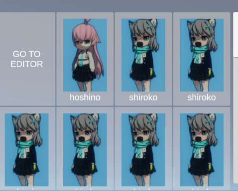

# UGUI(功能实现)

需要在场景添加eventsystem组件，一般会在创建ui组件时自动添加。使用inputsystem时需要简单设置一下。

本章包括内容：

[[toc]]

::: tip
UGUI的代码是公开的，想要了解组件是如何工作的可以看看。（例如`GridLayoutGroup`是如何计算每个ui的位置的。
:::

## 和其他UI系统的区别
- FairyGUI
    - 跨平台（Unreal、Unity、Cocos2dx..）
    - 额外的编辑器（方便团队协作）
- UI Toolkit（UIElement）
    - 提供UXML等样式编辑
    - 提供对话树等方便编辑的插件
    - 可以用来写Unity Editor UI
- UGUI
    - Unity主流UI
- NGUI & IMUI
    - 过时的老东西

## Canvas

创建Canvas UI时，会有三个`Component`在Canvas下。
- `Canvas`: 主要决定了如何渲染
    - `RenderMode`：永远显示在屏幕前、显示在相机前（可以被3d物体遮挡）、显示在世界坐标系下
- `CanvasScaler`: 用于适配分辨率不同的设备
- `GraphicRaycaster`: 射线检测相关，关了就触发不了ui事件了

### Canvas Group

可以控制当前Canvas以下所有UI的部分属性，有：
- `Alpha`: 配合DOTween做动画
- `interactable`,`Blocks Raycasts`,`Ignore Parent Groups`

### 使用Z轴

RectTransform的Z轴并没有什么卵用

有时候需要规定某些ui永远显示在上方，除了通过hierarchy中的排序之外：
- 为UI组件添加`Canvas`和`GraphicRaycaster`（如果这个ui不需要互动事件也可以不勾选），勾选重写顺序选项，通过order字段修改优先级。
- 通过多个`Canvas`实现，或配合额外的`Camera`实现分层渲染。

## 自适应布局方式

WIP

## 滚动视图

需要使用的组件有:
- `ScrollRect`
- `ScrollBar`
- `Mask`

对于以上组件的引用关系新建一个`ScrollView`看看就懂了（Hierarchy栏右键->UI->Scroll View）

如果还需要配置视图中的自动布局（例如实现一个滚动列表），则还需要以下组件
- xxxLayoutGroup，如`GridLayoutGroup`
- `ContentSizeFitter`

基于滚动视图实现内容自动布局，给`ScrollView`中的Content Object挂上上述的两个组件即可。
- 然后在Content Object的层级下随意添加ui组件，就可以看到效果了

 

使用gridgrouplayout自动布局的滚动视图

关于自动布局实现中遇到问题可以看看实践视频，如[Unity UGUI 自适应布局 - Bilibili](https://www.bilibili.com/video/BV1F741147L8)

## DOTween

Unity著名的缓动插件，在Asset Store免费下载。

为你能想到的所有类使用装饰者模式，拓展了缓动方法。在UGUI中，一般会使用:
- `RectTransform::DOSizeDelta(vector2, float)`缓动组件大小。
    - 确保该组件在inspector中使用height和width属性控制
- `Image::DOFade(float, float)`控制透明度实现渐进效果。
    - `DOTween.To(() => color.alpha, x => color.alpha=x, float, float);`可以实现一样的效果

## 例子

### 使用Img实现cooldown

利用img组件自带的一系列Fill属性即可

可以参考: [Making A MOBA Character #3: ABILITY COOLDOWN ICONS - Youtube](https://www.youtube.com/watch?v=wtrkrsJfz_4)

## 参考
- [Making A MOBA Character #3: ABILITY COOLDOWN ICONS - Youtube](https://www.youtube.com/watch?v=wtrkrsJfz_4)
- [滚动矩形 (Scroll Rect) - Unity Doc](https://docs.unity3d.com/cn/current/Manual/script-ScrollRect.html)
- [自动布局 - Unity Doc](https://docs.unity3d.com/cn/current/Manual/UIAutoLayout.html)
- [Unity UGUI 自适应布局 - Bilibili](https://www.bilibili.com/video/BV1F741147L8)
- [DOTween Documentation](https://dotween.demigiant.com/documentation.php)
- [泰裤辣 の Unity百宝箱】Canvas组件四件套 - 知乎](https://zhuanlan.zhihu.com/p/629759121)