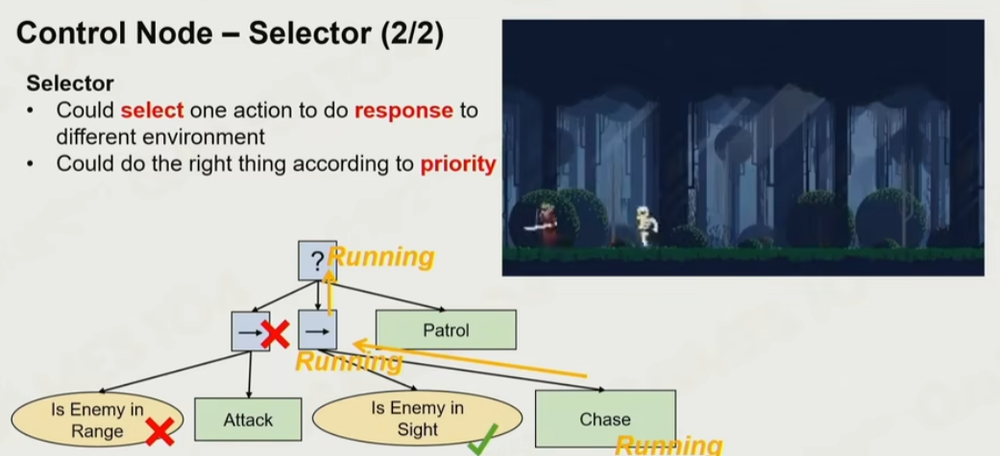
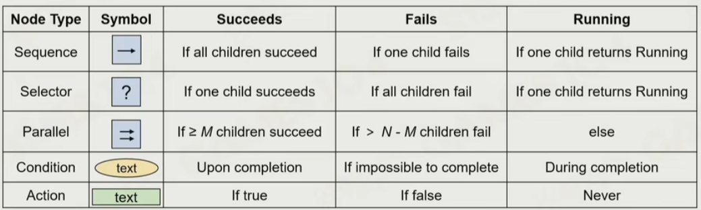
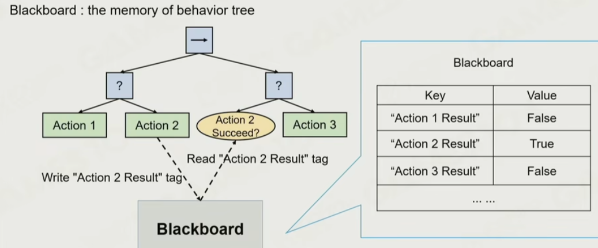

# 行为树

行为树是一种更符合人的直觉的表达AI行为的结构

 

## 基础

由于相关资料丰富，其基础概念不再这里讨论。而主要对几种AI逻辑使用行为树实现，并讨论他的实现过程。

### 节点

叶节点一般表示动作，除了叶节点之外：

还有四种节点，分别是：Sequance、Selector、Parallel、Condition

 

另外还有两种非必要的节点，Decorator和Precondition，用于简化行为树结构的“装饰”节点

### Blackboard -- 行为树产生的环境信息

 

### Tick方式

什么时候打断当前动作重新遍历？
- 除了重新遍历之外还可以通过事件驱动，避免额外的遍历，但并不直观，是一种优化手段

## Demo

通过【3】中提到的利用LLM写行为树的方式迭代游戏AI

## 参考
1. [游戏人工智能 - Steve Rabin](https://book.douban.com/subject/27154117/)
    - [online版本](http://www.gameaipro.com/)
2. [GAMES104-现代游戏引擎：从入门到实践，第十六讲](https://www.bilibili.com/video/BV1r34y1J7Sg)
3. [暴打黄金舰队的星际争霸II 微操 AI -- 自主进化 的LLM Agent 系统 EvoCurr - 知乎](https://zhuanlan.zhihu.com/p/1948166067718423713)