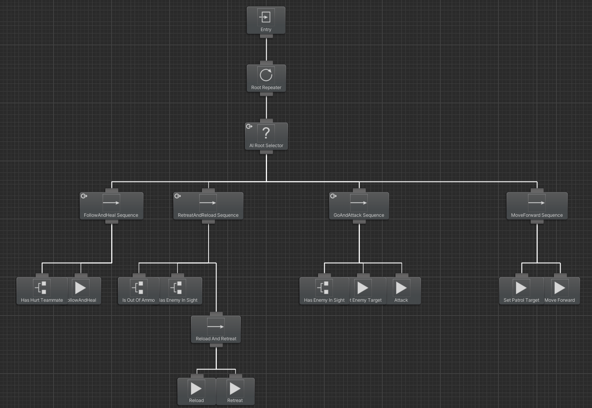

# 行为树

行为树是一种更符合人的直觉的表达AI行为的结构

 

## 基础

由于相关资料丰富，其基础概念不再这里讨论。而主要对几种AI逻辑使用行为树实现，并讨论他的实现过程。

### 节点

叶节点一般表示动作，除了叶节点之外：

还有四种节点，分别是：Sequance、Selector、Parallel、Condition

 

另外还有两种非必要的节点，Decorator和Precondition，用于简化行为树结构的“装饰”节点

### Blackboard -- 行为树产生的环境信息

 


### Tick方式

什么时候打断当前动作重新遍历？
- 除了重新遍历之外还可以通过事件驱动，避免额外的遍历，但并不直观，是一种优化手段

## Demo-俯视平面的战斗AI决策

> 因为发现用GOAP写的AI不够直观，且因为我不是专业人员（如战斗策划）经验有限。所以打算通过【3】中提到的利用LLM写行为树的方式迭代游戏AI

**WIP**

### Step1-将GOAP转化行为树

首先用AI将GOAP方法转化为行为树，在生成完毕并解决了三次报错和一次逻辑异常后，效果如下：



实际运行后效果还是不错的（可能因为逻辑相对简单）。

### Step2-搭建训练环境

这部分直接给需求，交给ai coding。

但由于涉及对旧依赖环境的处理，所以我还是花了2小时修改了运行期间缺环境造成的报错，主要是（这里列举一下下次注意，对于主要gameplay的可拓展性需要强一点）：
- 原有逻辑和玩家主控耦合，ai搭的环境没有玩家主控，所以有些ui一直在报错
- ai写的创建地图规则是不完整的，对变量赋值有误

::: details 提示词
对话-prompt1：
``` md
我想要实现一种利用LLM自动迭代行为树完成游戏AI的功能。我列出了需要你做的工作，可能还不够完善并且不清楚是否可行，你来完善它。
1. 行为树使用 unity asset store 中的 behavior designer。你需要修改行为树
2. 通过unity mcp控制游戏进行，在多个对局场景中测试ai实力，不断迭代。类似蒙特卡洛搜索树的方式，只不过由你来剪枝和选择节点
    - 你需要读unity console分析日志
    - 控制游戏开始和结束
    - 控制加载哪个对局场景

```
对话-prompt1 reply：
``` md
1. **测试场景配置**：Playground 场景是否已有不同的难度/配置？还是需要创建多个变体场景（如 `Playground_Easy`, `Playground_Hard`）？

A: 我已经将Playground 场景改为 GameScene场景，目前场景的阵容是随机生成的，你可以提供ScriptObejct和全局访问方法，我来提供不同配置时双方阵容的差距

2. **胜利条件**：AI 训练的目标是什么？
   - 击败所有敌人？
   - 生存一定时间？
   - 保护某个目标？
   - 具体的评估指标（胜率、KDA、耗时等）？

A：训练的目标是在游戏结束时胜利，且我方阵亡单位尽可能少。你需要将训练结果打印出来，并通过mcp读取，这样你就可以自动基于结果进行迭代。

3. **行为树结构**：当前是否有现成的行为树资源（.asset 文件）用于 AI？我需要查看其结构以便设计序列化方案。

A：最初版本的行为树在`Assets/Resources/Characters/CharacterBeselBehavior.asset`，使用了Unity行为树插件`Behavior Desginer`我需要你基于他继续迭代，但不要在上面改，需要保留原始版本做对比训练。例如你可以把敌人配置为最初版本的行为树，友军配置为新版本的行为树以便检验成果。

4. **迭代粒度**：LLM 每次修改的规模？
   - 微调：只改参数（如 Wait 2秒 → 3秒）
   - 中调：替换/增删节点
   - 大调：重构整个子树

A：一开始大调，如果大调不能再进步之后再在目前比较好的方案上微调
```
:::


### Step3-训练前准备，进一步完善行为树

参考【2】中提到的星际争霸2 ai，AlphaStar的训练步骤，需要用玩家的数据监督训练。那么我们在准备基准版本的行为树时，是否应当提供带有全部决策的版本（如技能使用等策略）？

## 参考
1. [游戏人工智能 - Steve Rabin](https://book.douban.com/subject/27154117/)
    - [online版本](http://www.gameaipro.com/)
2. [GAMES104-现代游戏引擎：从入门到实践，第十六讲](https://www.bilibili.com/video/BV1r34y1J7Sg)
3. [暴打黄金舰队的星际争霸II 微操 AI -- 自主进化 的LLM Agent 系统 EvoCurr - 知乎，作者：meisah](https://zhuanlan.zhihu.com/p/1948166067718423713)
    - 更多代码和流程参考：[一种解决SMAC任务的新方法：让大语言模型写决策树代码 - 知乎，作者：赵鉴](https://zhuanlan.zhihu.com/p/2355110476)