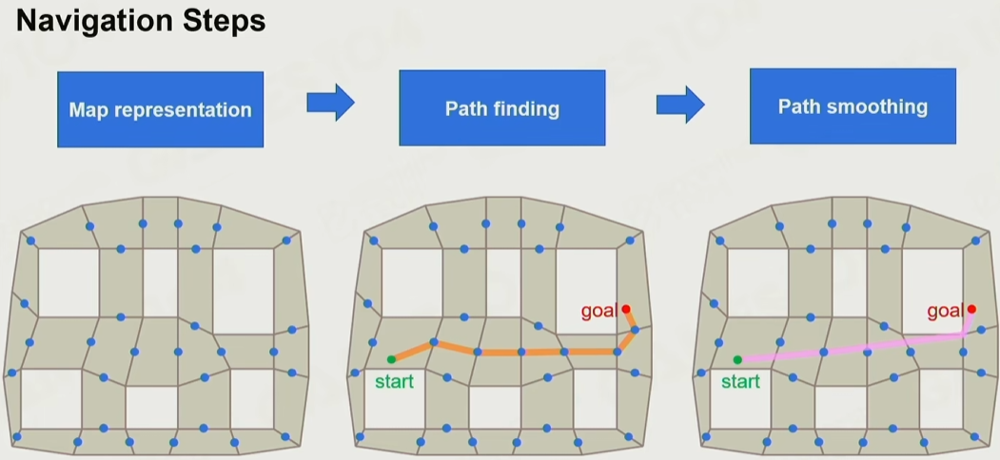
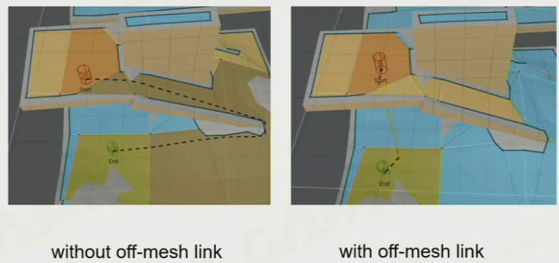
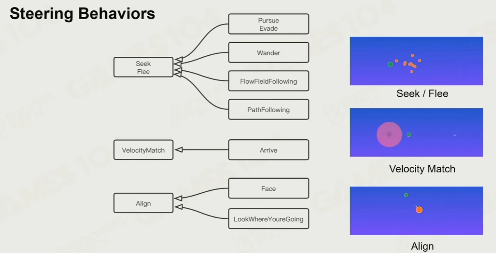
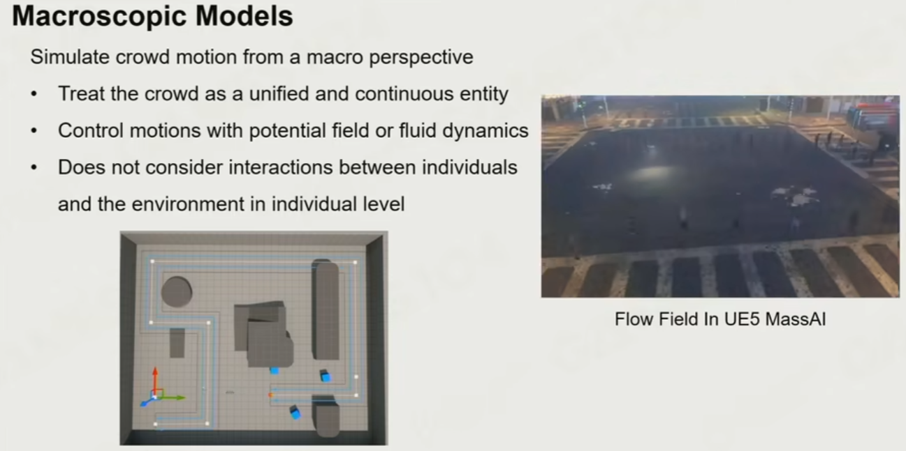
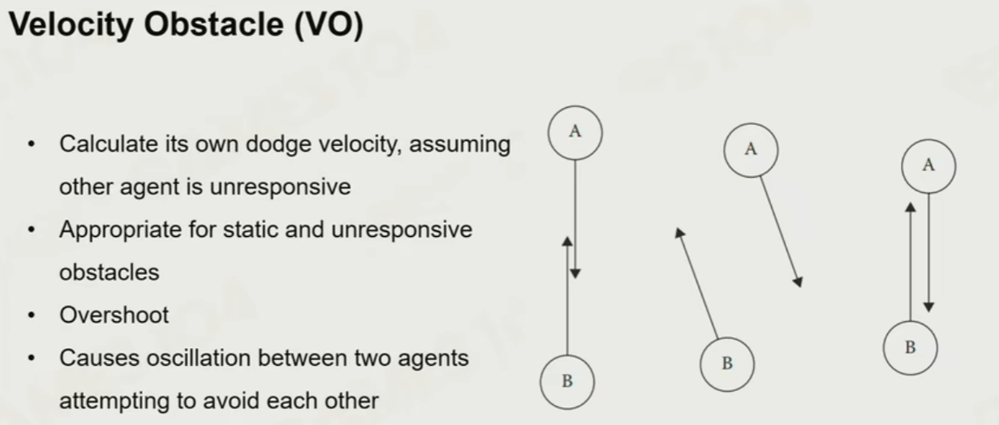

# 寻路

从寻路的三个部分开始，了解一个好的寻路系统需要掌握的内容。

## 基本实现原理

所有寻路系统都有三个部分构成【1】

地图表达（Map Representation）
- 数据结构选择：WayPoint Network（早期方法，类比做地铁，先引导到地铁站）、Grid（很难表达3D层叠结构）、Navigation Mesh、八叉树（主要用于飞行时的寻路）。现在比较常用的是Navigation Mesh

寻路（Path Finding）
- 从Dijkstra到A*
- 关于A*的启发函数的选择，如果不一定要找到最短路径，可以放宽要求快速算出一个次优解

优化路线（Path Smoothing）
- 如Funnel算法

其他Feature
- Tile：分块navMesh，应对游戏进行中需要重新生成navMesh的情况（如障碍物的出现和销毁）
- Off-mesh Link：解决“跳跃”产生的捷径问题
    - 
- Steering Behaviors：使到达路径点的速度变化合理
    - 

## 群体模拟实现原理

### 群体行为模型

有两种不同的模型（微观模型、宏观模型），根据场景选择合适的应用

微观模型-基于规则的
- 如：Separation（分离，向远离所有邻近个体的方向移动）、Cohesion（内聚，向 “质心” 方向移动）、Alignment（对齐，与附近的个体保持方向一致）

宏观模型：建立道路或终点等宏观规则，个体的行为相对不可控制
- 如ue的人群模拟demo
    - 
- 如RTS中的集群移动

### 群体碰撞避免

速度障碍法-基于速度的
- 有VO、RVO、ORCA算法，依次效果越好，性能消耗越高

## Unity方案-AINavigation

在了解了基本原理之后，unity的AINavigation对上面提到的内容实现了多少呢？

## 优化

考虑到在rimworld中表现糟糕的寻路延迟卡顿，寻路是否可以异步进行？（是因为寻路耗时，还是NavMap创造耗时？）

## 参考

1. [GAMES104-现代游戏引擎：从入门到实践，第十六讲](https://www.bilibili.com/video/BV19N4y1T7eU)
2. [ai.navigation@2.0 - Unity Manual](https://docs.unity3d.com/Packages/com.unity.ai.navigation@2.0/manual/CreateNavMesh.html)
3. [ARTIFICIAL INTELLIGENCE FOR GAMES - IAN MILLINGTON](https://theswissbay.ch/pdf/Gentoomen%20Library/Game%20Development/Programming/Artificial%20Intelligence%20for%20Games.pdf)