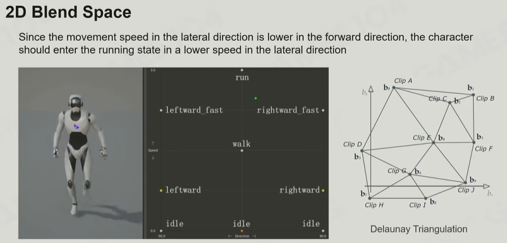
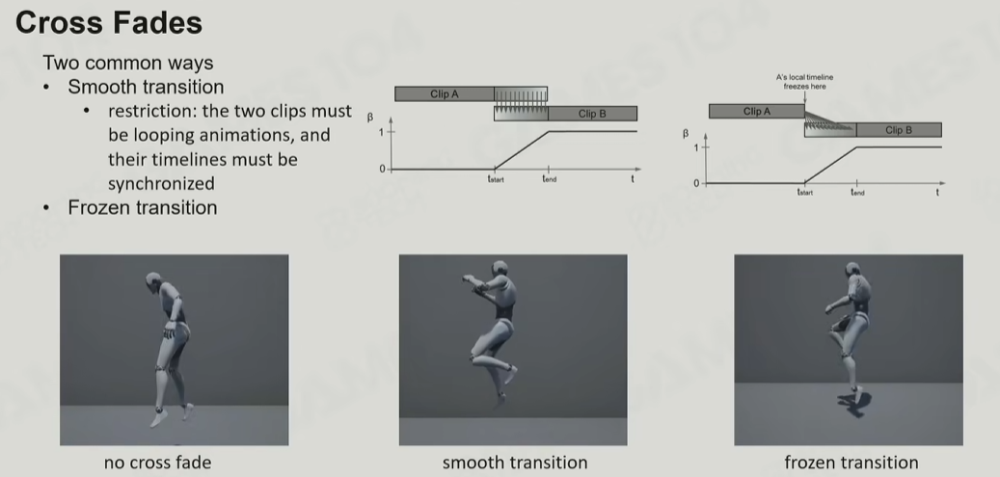

# 动画混合

本章是对GAMES104现代游戏引擎课程中提到的技术的总结【1】，并结合了相关资料。

后面会根据实践补充内容

## 混合时的技术和挑战
- 循环动画混合时（如跑和走）normalize后的动画落脚位置要一致，对动画资源提出了要求
- 2D Blend Space
    - 混合需要切合实际，例如侧向跑从走到跑的过渡会很快
    - 通过Delaunay三角化优化插值clip的数量

- mask blending，只在mask区域表现动画。如混合手和腿的动作
- additive blending，在混合之后额外加一个动画。如混合后朝相机点头
    - 避免过渡叠加造成不自然旋转
- 动画状态机
    - 状态管理，动画和坐标逻辑
    - CrossFade
    - Layed ASM，古典的动作游戏分离攻击、受击、移动等状态的方式
    - Blend Tree，相比Layed ASM更现代的混合模式。可以层层套娃，实现通过开关在两套动作组之间切换（如残血和健康动作组）。可以参考UE5【2】

## 参考
1. [GAMES104现代游戏引擎课程的第九讲-bilibili](https://www.bilibili.com/video/BV1pY411F7pA)
2. UE5的动画状态机是实现的比较好的，[动画蓝图-unreal doc](https://dev.epicgames.com/documentation/zh-cn/unreal-engine/animation-blueprints-in-unreal-engine)