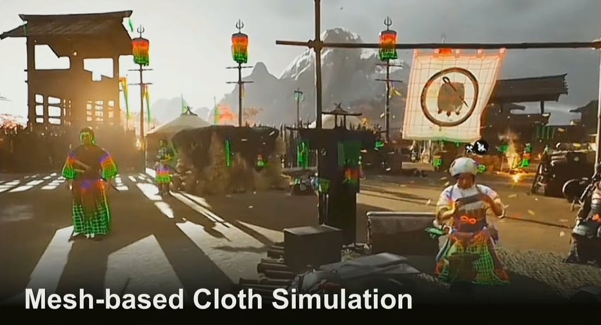

# 布料模拟

dynamic bone、magic cloth等，都是实现衣料模拟的常用库。其实现涉及弹簧质点物理模型和大量的经验参数

我在[记一次人物模型的运行时配置](../CodingRamble/HumanModelRuntimeConfig)中，也使用`magic cloth2`完成了角色衣料模拟的配置（主要是头发和裙子）

使用基于骨骼的布料模拟是性能友好的，但3A游戏现在主要以基于mesh的布料模拟

## 基于mesh的布料模拟

- 和render的mesh不同，用于布料模拟的mesh顶点数更少，是从render的mesh简化而来的。计算过后通过插值再应用到render的mesh
- 通过`约束->受力->位置`的布料模拟和蒙皮动画一样需要对mesh设置权重，规避一些复杂的受力分析，但即便如此，为了求解剩余的质点弹簧阵列，仍要进行一些积分运算
- 现在比较fancy的解法是PBD（position based dynamic，基于位置的动力学），但实时运算代价看起来还是比较高的

进阶
- 解决self collision：加厚布料 or 增加计算精度 or 力场->靠近时施加相反的力

## 参考
1. [GAMES104现代游戏引擎课程的第十一讲-bilibili](https://www.bilibili.com/video/BV1Ya411j7ds)