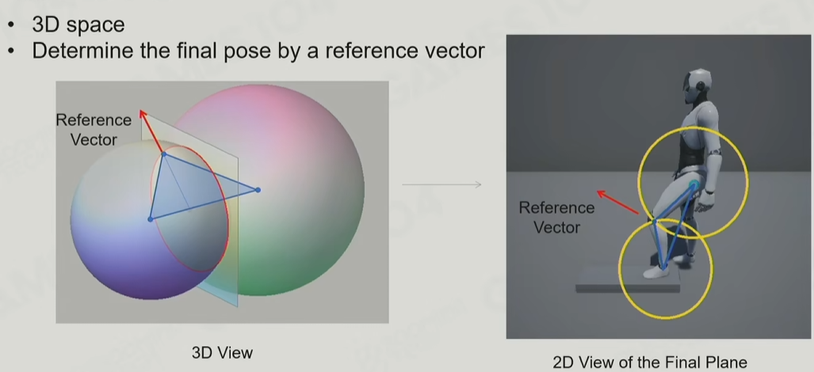
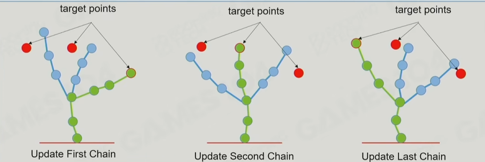
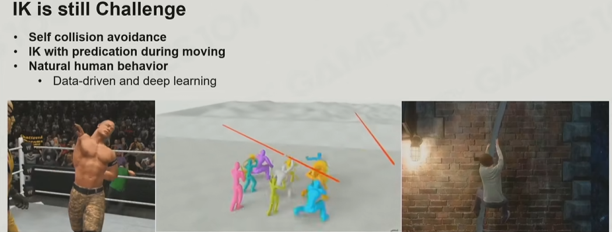

# IK

利用反向动力学优化动画效果
- 解决穿模问题（经典走楼梯）
- 模型和交互物的接触

## 常见IK场景和解法

只要考虑两个骨骼的IK
- 比较简单，拿到前向量作为参考值求解即可

考虑多个骨骼的IK
- 前提1：判断是否可达，要考虑盲区（如挠痒很难挠到背）
- 前提2：每个Joint的约束
- 解法：启发式算法，如循环坐标下降法（Cyclic Coordinate Decent，CCD）、FABRIK等

考虑多个控制点的IK（如攀爬2胳膊+2腿），如果像做普通多骨骼IK那样去做，后面的控制点可能会影响前面控制点的结果。如图每次求解在摇摆

- 解法：雅可比矩阵，矩阵中都是偏导数，一步步的去逼近目标点

## 挑战

## 参考
1. [GAMES104现代游戏引擎课程的第九讲-bilibili](https://www.bilibili.com/video/BV1pY411F7pA)