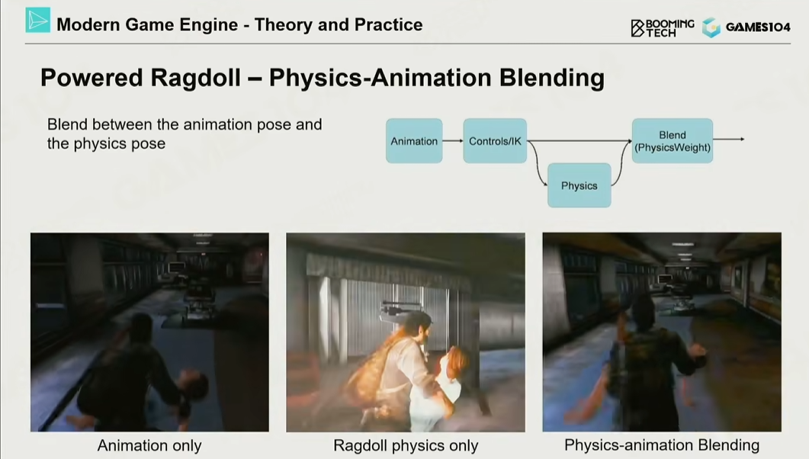

# 布娃娃效果

- 骨骼约束的建立（一般由TA来完成）
- 需要考虑蒙皮动画到布娃娃动画的过渡，或是混合。可以思考处决动画（被处决方），和角色搬运动画（被搬运方）的实现
    - 比如【1】中所表现的搬运动画，纯物理动画版本快把被搬运的小女孩晃成橡皮人了，可能是因为角色控制所设计的加速度不合常理，导致小女孩受力也很抽象。

## 参考
1. [GAMES104现代游戏引擎课程的第十一讲-bilibili](https://www.bilibili.com/video/BV1Ya411j7ds)