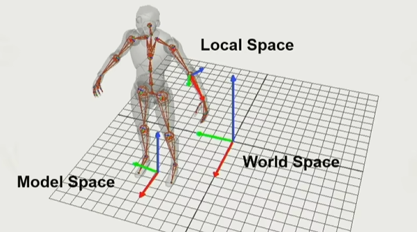
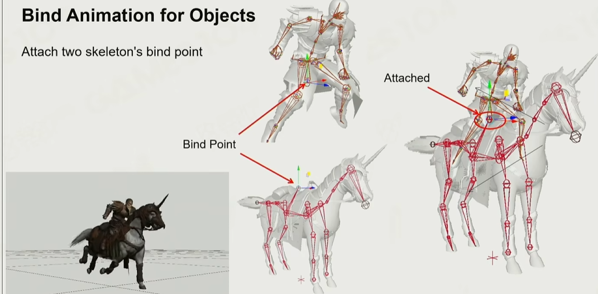
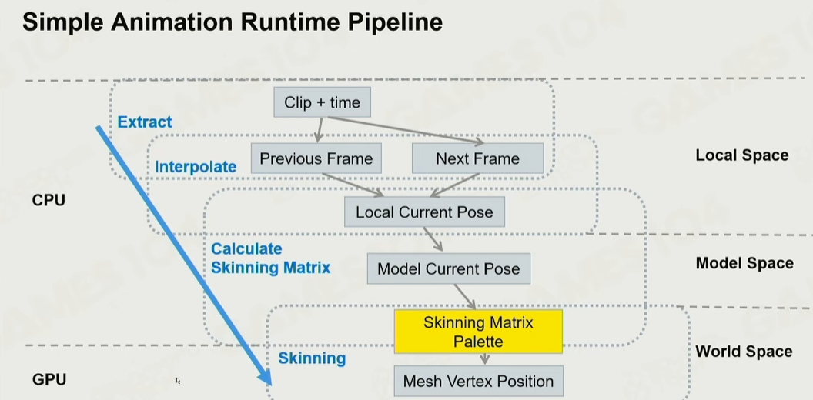
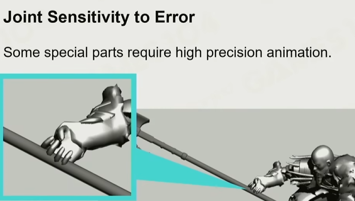

# 蒙皮动画

本章是对GAMES104现代游戏引擎课程中提到的技术的总结【1】，并结合了相关资料。

后面会根据实践补充内容

## 实现原理
- 顶点转换：不同坐标系
    - Model Space
    - Local Space
    - World Space

- 绑定动画：如下图所示，人骑马的动画，实际上人用人的动画，马用马的动画。会有一个专门的Mount节点

- 绑定姿势：T-Pose vs A-Pose
    - A-Pose绑定后肩膀表现力更强

- 骨骼定义。如人形标准骨骼Humanoid，标准化命名（pelvis、head），方便工具识别
    - 额外骨骼：眉毛、衣服等。武器可以采用Mount一个节点或单独绑的方式实现
    - Root节点：经常是中心点。Humanoid一般定义为两脚中间
    - 骨骼节点Joint的平移、朝向和放缩的意义，前两个用于动画，后一个可用于捏脸
    - 骨骼节点Joint的插值在Local Space做，和其蒙皮一起计算位移涉及稍微复杂的运算【1】
    - 蒙皮的插值在Model Space做，分别单独计算受各个顶点影响后的位置，再根据权重求和

- 计算
    - 计算骨骼移动的主要运算被转为矩阵在GPU中运行
    - *旋转的插值比较有讲究，NLERP和SLERP

## 动画压缩

- 关键帧（KeyFrame）压缩，剔除插值后，误差不高的帧（不关键的）
    - 使用Catmull曲线来插值，比线性插值更好
- 将坐标数值（float）量化到整数区间
- 将四元数128bits（4xfloat）压缩到48bits

一个压缩产生的错误如下图所示：

解决办法:
- 定义视觉误差，优化压缩方法
- *forward IK，独立出容易出问题的末端骨骼

## 管线工具
- AI+自动蒙皮
- 导出工具（压缩动画、忽略动画Root位移等）
    - 导出由DCC工具制作的动画。数字内容制作（Digital Content Creation, DCC）工具（3ds Max、Maya、Blender）

## 参考
1. [GAMES104现代游戏引擎课程的第八讲-bilibili](https://www.bilibili.com/video/BV1jr4y1t7WR)
