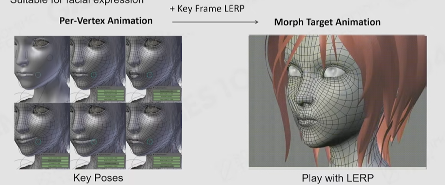

# 动画

## 挑战
- 3D: 根据环境交互物体的多样化，动画片段和所需的状态过渡会非常多

## 2D领域技术栈
- 仍使用sprite+帧动画，并配合粒子系统做特效。如《八方旅人》
- live2D（按部位拆分图层帧动画+封装开关）

## 3D领域技术栈
- 顶点动画（一般用于简单几何体，如用随机噪声移动顶点，模拟旗帜飘动的效果）
- Morph Target Animation，在KeyPos中做插值，经常用于人脸动画

- 蒙皮动画（Skinned Animation），最常见的人、怪物3D动画使用的技术。也会用于2D动画
- 基于物理的动画，如：布娃娃（RagDoll）、布料&液体模拟、IK等

## 参考
1. [GAMES104现代游戏引擎课程的第八讲-bilibili](https://www.bilibili.com/video/BV1jr4y1t7WR)
