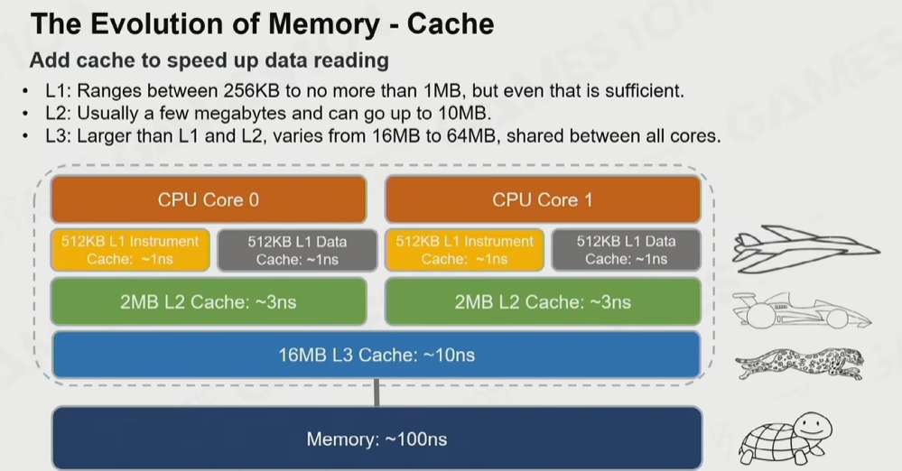
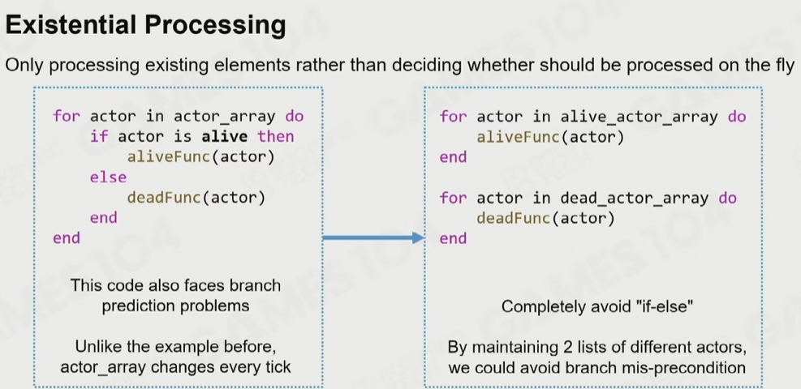
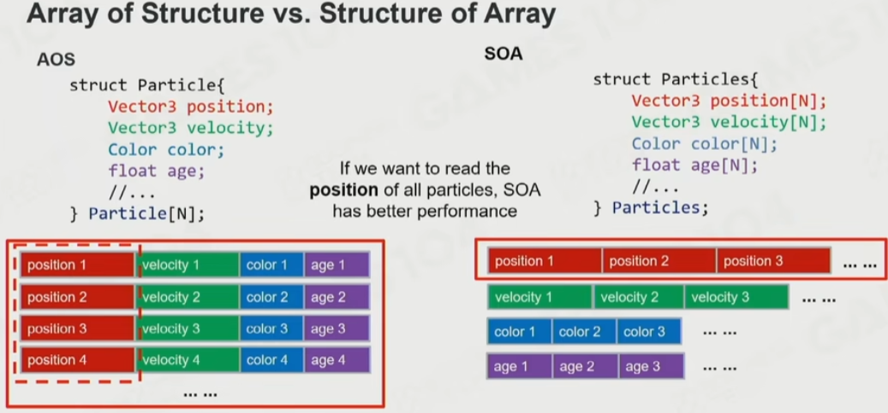
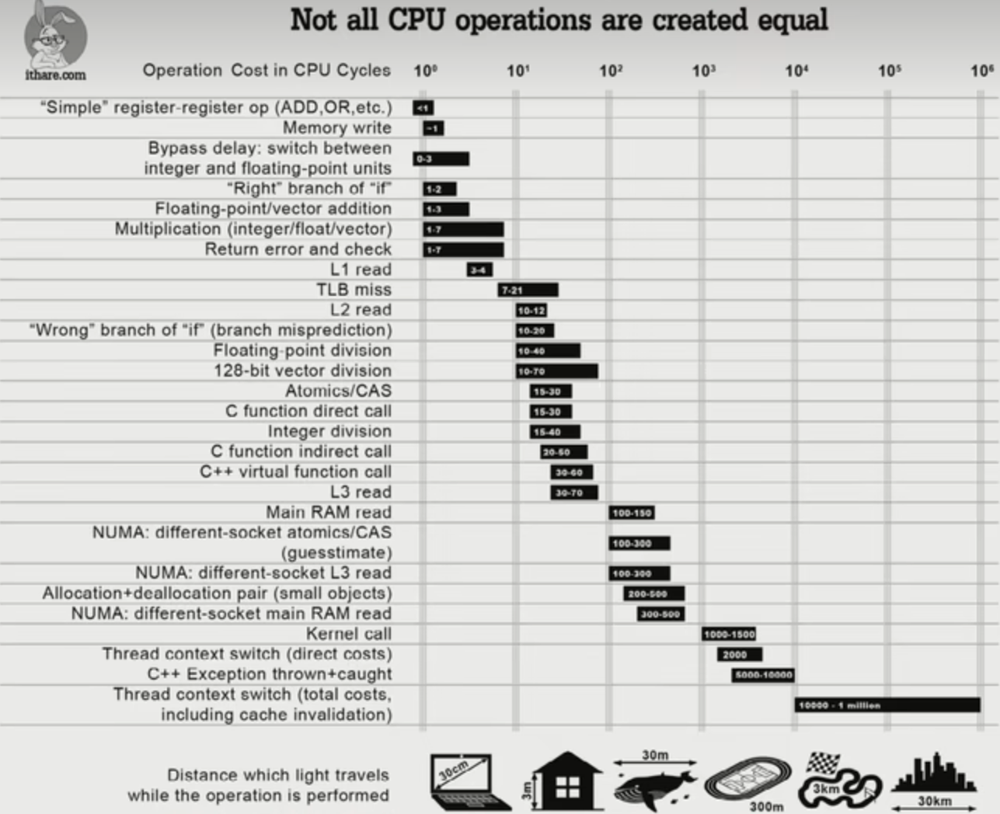
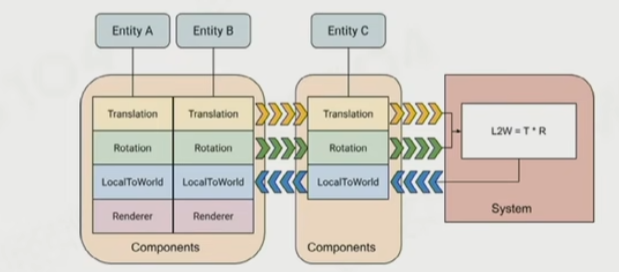
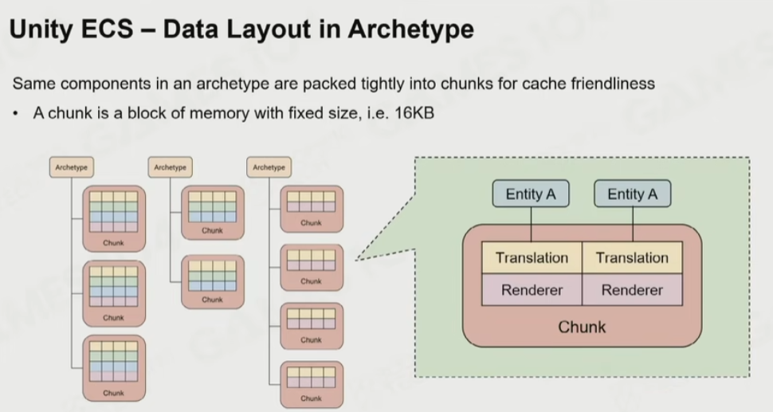

# 面向数据编程和ECS

面向数据编程（Date-Oriented Programming，DOP）提出，为了解决多go场景下，cache未命中导致的瓶颈（访存时钟耗费时间长）。

其主要思想是保持代码和数据在内存中紧凑，在后续运算时能命中CPU cache。

Unreal Mass Framework、Unity DOTS都是面向数据编程的框架，目的都是减少业务DOP的难度。

## 性能敏感编程

1. 多线程时不要出现2个线程访问读写同一个变量
2. 为了最大化利用分支推断效果，数据不要太“分散”。

例如可以通过数据分组优化：

数据在内存的排布按照"SOA"的方法，也会更有优势：

补充：常见运算占用的CPU时钟

## ECS (Entity Component System)

Entity：仅表示了一组Component，这一点和组件模式很像

Component：仅表示一组数据，不像组件模式那样包含逻辑了

System：处理Component中的数据，一次处理一组Component（即多个Entity的Component）

## Unity DOTS

[【1】](https://www.bilibili.com/video/BV1Md4y1G7zp/?vd_source=0adb7f42d815b5c9500f37460d0d6596)中，以Unity DOTS为例，介绍了Jobsystem、ECS、Burst Compiler结合较好实现了下方描述的面向数据编程的范式。

### Unity DOTS - ECS

按chunk一组一组用System处理

## Unity DOTS - Burst Compiler

为了绕过C#的内存管理，使用Burst Compiler将C#语法产生的ECS数据按"SOA"-Chunk方式排布。

## OOP的问题

## 参考
1. [GAMES104-现代游戏引擎：从入门到实践，第20讲](https://www.bilibili.com/video/BV1Md4y1G7zp)
2. [Unity 面向数据的技术栈 (DOTS) - unity.com](https://unity.com/cn/dots)