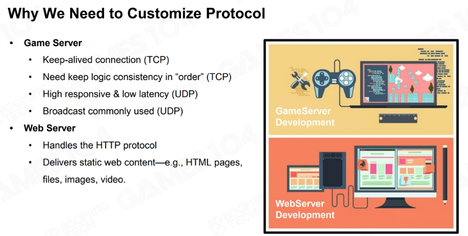
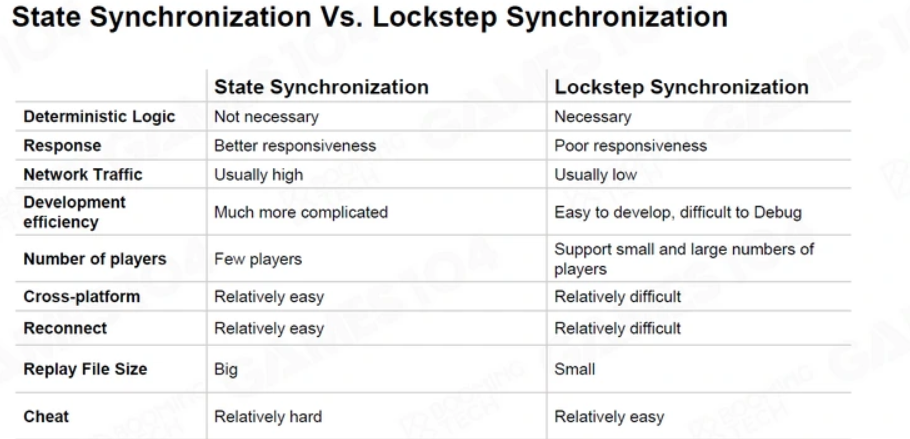

# 网络

内容包括从基础网络协议的TCP、UDP再到帧同步、状态同步这类网络同步常用方法。

## 协议的选择

根据游戏类型的不同选择合适的网络协议：
- 对于实时性要求比较高的游戏会优先选择UDP（如csgo、守望先锋）
- 策略类的游戏则会考虑使用TCP（如炉石传说）

在大型网络游戏中还可能会使用**复合类型**的协议来支持游戏中不同系统的通信需求。

### 可靠性保证-ARQ (Automatic Repeat Request)

ARQ (Automatic Repeat Request)是基于ACK的错误控制方法，为了实现信息传达的可靠性，协议需要实现ARQ功能。

TCP中，就通过滑动窗口和对应的ARQ机制保证（等待超时重传、回退窗口左标重传、指定重传三个方案可供选择）

如果使用UDP等不可靠的传输协议，就需要另外实现ARQ，TCP【2】是一个很好的例子

### 丢包优化-FEC (Forward Error Correction)

可以通过额外发送容易校验码的方式，达到即便有一点丢包也可以恢复丢包数据而不必频繁重传的效果。
- XOR FEC，类似RAID5，数据帧ABCD+异或码，ABCD如果只丢一帧可以通过异或码恢复。
- Reed-Solomon Codes，利用Vandemode矩阵及其逆阵来恢复丢失的数据。

## 同步游戏状态

- （古老的）快照同步（snapshot synchronization）：对世界的模拟只在服务端，把所有gameObject的信息全量发送给每个玩家。
    - 有很严重的缺点：需要传很多数据给玩家，服务端算力要求高
- 帧同步（lockstep synchronization）：将所有客户端操作汇总排序，下发给客户端模拟
    - rts、moba的对局初始化加载，都是受`lockstep`中`lock`的影响，需要等最慢的玩家模拟完状态
- 状态同步（state synchronization）

## 其他细节

- 通信是否需要封装？socket 或 RPC（Remote Procedure Call）
- 网络拓扑选择？P2P 或 专用服务器（要考虑不同地区的人的延迟，可能需要专用线路，一般由阿里云等服务商解决）
- 时钟同步（Clock Synchronization），以便确定玩家操作的时间

## 参考
1. [GAMES104-现代游戏引擎：从入门到实践，第18讲](https://www.bilibili.com/video/BV1HN4y157Zq)
2. [KCP - A Fast and Reliable ARQ Protocol - github](https://github.com/skywind3000/kcp)
3. [GDC2017【青幻译制】 守望先锋的游戏架构和网络代码 - bilibili](https://www.bilibili.com/video/BV1p4411k7N8)
4. [【网络同步】浅析帧同步和状态同步 - 曾志伟 知乎](https://zhuanlan.zhihu.com/p/357973435?utm_id=0)