# 初探碰撞系统

碰撞系统是游戏引擎很重要的一部分，理解其原理，可以在选择碰撞体和处理碰撞逻辑等实践中提供理论指导。

碰撞系统可以分为几何相交检测和刚体力学模拟两部分，本文主要围绕“几何相交检测”部分展开。

由于文中涉及大量碰撞体的碰撞逻辑介绍，摘录了《游戏引擎架构》中的一些图片。这些图片为了便于理解都是二维的，但文中的介绍和描述则是三维的（会提到z轴），请不要感到意外。

## 碰撞原型

复杂的碰撞体可由碰撞原型组合得到，碰撞原型都是些简单的几何体。

::: tip 凸性

凸形状（三角形，圆形，矩形等）检测相交会比凹形状（吃豆人等）检测相交更简单

> “凸形状的定义是，由形状内发射的光线不会穿越形状表面两次或以上。有一个简单的办法可判断形状是否为凸，我们可以想象用保鲜膜包裹形状，若形状是凸的，那么保鲜膜下便不会有气囊。” —— 《游戏引擎架构》

:::

碰撞原型有：
- 球体：最高效的碰撞体
- 胶囊体：由两点和半径定义，比圆柱体和长方体高效，因此常用来建模相似的物体，如人的四肢

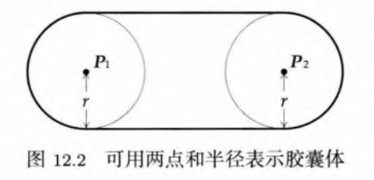

- 轴对齐包围盒（axis-aligned bounding box, AABB）：由两点定义，逼近原物体，可以高速检测与另一AABB是否相交（做过滤使用），但可能会逼近很差的形状。

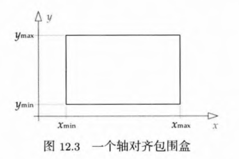

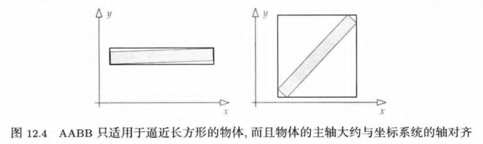

- 定向包围盒（oriented bounding box, OBB）：允许将AABB的盒子在坐标系中**旋转**，便得到OBB。表示为三个“半尺寸”（半高，半宽，半长）再加上一个变换（表示方式和unity的cube一样嘛）。OBB是一种常用的碰撞原型，因为能够较好地表示任意物体，而其表示方式仍然比较简单。

- 集散定向多胞形（discrete oriented polytope, DOP）：是比AABB和OBB更泛化的形状。AABB和OBB算是6-DOP。

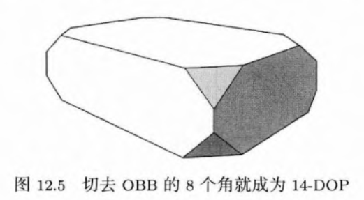

有些碰撞引起允许直接表达**任意凸体积**和**多边形汤（polygon soup）**，后者的意思是“任意的，非凸的形状，有时不一定是体积，可以是开放的表面”，会进行一些预处理（离线计算），通常用来表示地形或建筑。

## 碰撞检测

### 判断相交

将按照上文碰撞原型中的顺序，介绍其如何判断相交。

- 球体之间：最简单的，判断球是否相交，直接求两个中心点的距离，和半径和去比就行了。

- 胶囊体之间：利用求两条直线最近点，把胶囊体的相交简化成球体的相交。

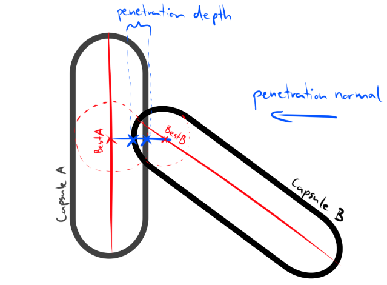

为了计算后面的碰撞原型，需要引入“[超平面分离定理（分离轴定理）](https://zh.wikipedia.org/wiki/%E8%B6%85%E5%B9%B3%E9%9D%A2%E5%88%86%E9%9B%A2%E5%AE%9A%E7%90%86)”，此定理指出，若能找到一个轴，两个凸形状在该轴上的投影不重叠，就能确定两个形状不相交。

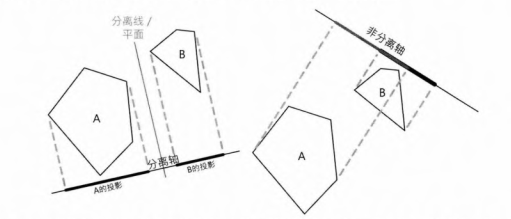

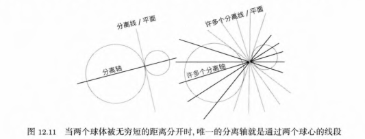

- 轴对齐包围盒（AABB）之间：根据上述定理，判断AABB和AABB的相交，检测其x,y,z轴上的(min, max)区间，是否有重叠。若三个轴上的区域都重叠，那么它们是相交的，否则它们不相交。

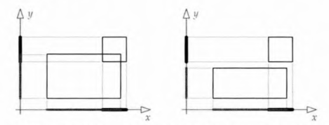

<b>二维的</b>不相交例子

- 定向包围盒（OBB）之间：相对AABB的只要判断主坐标轴，判断OBB和OBB的相交需要判断两个OBB“主坐标轴”的并集（可能有3-6个轴），若在这些轴的区域都重叠，那么它们是相交的，否则它们不相交。

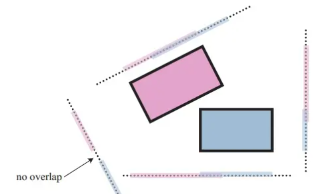

<b>二维的</b>不相交例子

- 球体和（AABB或OBB）：方法可能不是很直观，这里仅列出伪代码，可以去[知乎的一篇翻译文章](https://zhuanlan.zhihu.com/p/405154230)中看解释。对球体来说，AABB和OBB差别不大。

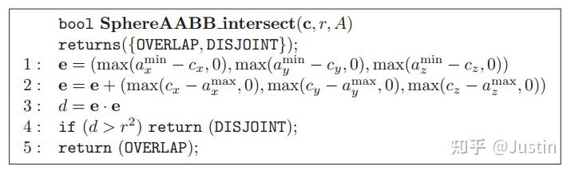

- 判断任意凸形状：使用[GJK算法](https://caseymuratori.com/blog_0003)。
    > “然而，读者需要意识到一个重点，就是形状对形状的组合的数目十分庞大。事实上，对于 N 种形状，所需的成对测试便需要 O(N^2)个。碰撞引擎的复杂度，很大程度上是由大量所需处理的相交组合所造成的。这也是碰撞引擎的作者总是尽量限制碰撞原型数量的原因，这样做可以大幅度降低所需处理的相交组合数目。(这是GJK流行的原因——GJK 能一举处理所有凸形状之间的碰撞检测。而不同形状的唯一区别只在于算法所使用的支持函数)。” —— 《游戏引擎架构》

### 检测快速运动的物体

写过子弹碰撞逻辑的人都知道，快速移动的子弹可能出现穿透碰撞体的现象。是因为游戏引擎中，运动通常以离散步时（time step）来模拟的。
> 这在unity中，一般通过设置`刚体`的`连续碰撞`参数解决。

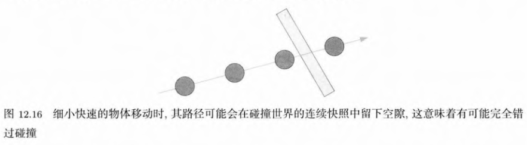

《游戏引擎架构》书中给出了两种解决方案：
- 1. 使用扫掠图形
    > 检测相交时,由测试碰撞世界的静态快照，改为测试形状从上一个快照的位置及定向移动至当前快照所形成的扫掠形状。此方法等同对快照间的形状做线性插值，因为我们通常以快照间的直线线段扫掠。
    - 但若目标不是直线移动，可能会出现一些误差。

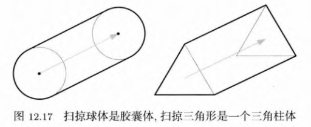

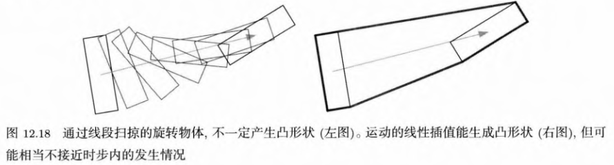

- 2. 使用连续碰撞检测
    > 处理隧穿的另一个方法是使用连续碰撞检测(continuouscollision detec-tion,CCD)技术。CCD的目标是对两个移动物体在某时间区间内，求得最早的冲击时间(time of impact, TOl)。CCD算法一般是迭代式的。

### 检测优化

若采用蛮力法做碰撞检测，时间复杂度为O(N^2)，其中N为物体数量。所以为了使其过程更加迅速，使用了下列优化手段：
- 利用时间连续性
    > 当碰撞体以正常速率移动时，在两时步中其位置及定向通常会很接近。通过跨越多帧把结果缓存，可以避免为每帧重新计算一些类型的信息。
- 使用空间分割算法
- 使用包围盒过滤一遍
    - 粗略阶段（AABB），中间阶段（OBB），精确阶段（使用真正的碰撞体）
- *通过碰撞层过滤
- 更多..
    - 如扫掠裁减算法，其基本思路是对各个碰撞体的AABB的最小、最大坐标在3个主轴上排序,然后通过遍历该有序表检测AABB间是否重叠。

## 碰撞查询

游戏中，我们可能会需要查询下一时刻两个物体是否会发生碰撞。如射击检测，找出半径范围的敌人，汽车从A点移动至B点是否碰到障碍物等。具体到实现，可以分为：
- 射线检测，返回物体的首次接触点。如unity的`RayCast`
- 物体投射，范围形状的首次接触点。如unity的`SphereCast`
- “幻影”碰撞器，可以理解为零距离形状投射，常用于判断碰撞体是否在范围内。如unity里collider的`IsTrigger`参数
- 等等

这类问题可以归纳为[几何查询（geometric query）问题](https://en.wikipedia.org/wiki/Computational_geometry#Geometric_query_problems)，也适用于上述的检测优化算法。另外，这些投射算法不会发生碰撞穿透问题。
- 可以看看名为[“空间数据库”](https://en.wikipedia.org/wiki/Spatial_database)的解决方案

## 参考
- [游戏引擎架构（第2版）- 【美】Jason Gregory](https://book.douban.com/subject/34864920/)
    - 12.3-碰撞检测系统
- [22.13包围盒（Bounding-Volume）/包围盒相交 Justin - 知乎](https://zhuanlan.zhihu.com/p/405154230)
    - 对[《Real-Time Rendering, Fourth Edition - Tomas》](https://book.douban.com/subject/30296179/)的翻译
- [Capsule Collision Detection - wicked engine](https://wickedengine.net/2020/04/26/capsule-collision-detection/)
- [几何查询（geometric query） - wiki](https://en.wikipedia.org/wiki/Computational_geometry#Geometric_query_problems)
- [空间数据库（Spatial Database） - wiki](https://en.wikipedia.org/wiki/Spatial_database)