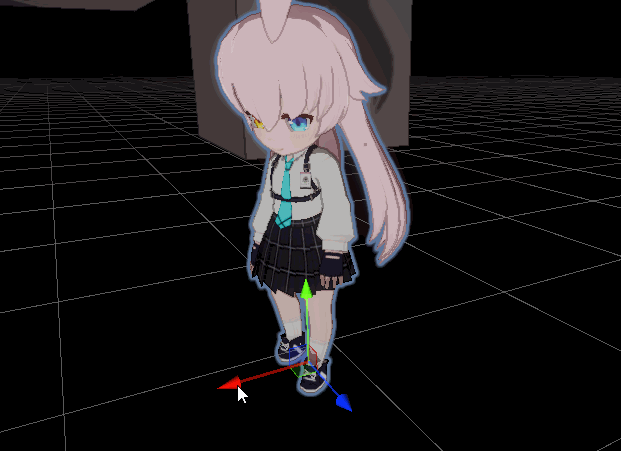

# 记一次人物模型的运行时配置



::: warning
所使用资源来自网络，可能会引起各种版权问题，仅做学习交流使用。如文中有侵犯权益的行为，请联系Github中的邮箱，我将于24小时之内删除。
:::

记录一次通过代码运行时（Runtime）配置碧蓝档案中角色模型`Humanoid Avatar`(`Animator`组件需要`Avatar`才可以运作)、`枪-特效绑定`、`material`和`额外骨骼`(头发和裙子)的摇动。
> 包含shiroko、hoshino、mashiro、aru和karin 5个角色模型，以下对其简称为"BA模型"

包括以下小节：
[[toc]]

所有配置代码都在[我的项目My-TDS，FbxLoadManager.cs](https://github.com/Unarimit/my-topdown-shooting-game/blob/version0.4/Assets/Scripts/CombatLogic/FbxLoadManager.cs)中的`LoadModel`函数中。

## 为什么需要运行时配置

对于"BA模型"，其格式较为统一，相较为每个人物在Unity中Editor下配置，还是按照一定格式在运行时统一配置比较方便。除此之外还有下列好处：
- 适应从外部Patch模型（如Mod制作只需对照格式制作即可像native模型一样映射到游戏中）
- （实际开发流程中）强制规范化（你也不想收到一堆骨骼命名、尺寸甚至pivot都不一样的人物模型吧）
- 一些通过点云扫描建模的元宇宙app生成avatar只能这么做吧

## 配置`Humanoid Avatar`

在`Unity Editor`中，在`Inspector`点几个按钮就配置了，但Runtime好像并不那么方便，至少我没找到对应的Api。
> 在github找到了一个[针对mixamo模型的生成方法](https://github.com/bkevelham/unity-avatar-generation/tree/main)，不像`unity editor`中的算法一样支持骨骼的模糊匹配。

通过`AvatarBuilder.BuildHumanAvatar`方法生成`Avatar`，关键是需要`HumanDescription`信息，这个信息的获取并不简单。
> 我完成了骨骼映射的部分，跑了一下很奇怪，模型都卷在一起了，所以放弃了自己从0配置`HumanDescription`

为了获取`HumanDescription`信息，考虑到这些模型的配置信息(Humanoid部分)都差不多，所以直接在unity editor中生成一个作为通用`HumanDescription`，将它作用到之后导入的模型（取巧的做法）。

从配置到好`Avatar`中获取`HumanDescription`的代码：

```cs
private HumanDescription GetHumanDesc()
{
    var res = NormalAvatar.humanDescription;
    int t = 0;
    for(; t < res.skeleton.Length; t++)
    {
        if (res.skeleton[t].name == "bone_root") break;
    }
    res.skeleton = res.skeleton.Skip(t-1).Take(115).ToArray(); // 保留mesh当作根，我也不知道为什么要这样，反正这样是对的
    
    // delete parent
    res.skeleton[0] = new SkeletonBone { name = "this_is_root", position = res.skeleton[0].position, rotation = res.skeleton[0].rotation, scale = res.skeleton[0].scale };
    res.skeleton[1] = new SkeletonBone { name = res.skeleton[1].name, position = res.skeleton[1].position, rotation = res.skeleton[1].rotation, scale = res.skeleton[1].scale };
    return res;
}
```

之后就可以把这个`HumanDescription`用于`AvatarBuilder.BuildHumanAvatar`方法了。
> 注意到里面有一个“经验数”-`115`，是因为通过debug观察，后面的骨骼都不是人形骨骼

## 配置`枪-特效绑定`

鉴于BA模型的人形骨骼命名都是一样的，直接把枪塞到手上就行了。

代码：

```cs
var weaponBone = boneRoot.Find("Bip001").Find("Bip001_Weapon");
var rhandBone = boneRoot.Find("Bip001").Find("Bip001 Pelvis").Find("Bip001 Spine").Find("Bip001 Spine1").Find("Bip001 R Clavicle")
    .Find("Bip001 R UpperArm").Find("Bip001 R Forearm").Find("Bip001 R Hand");
weaponBone.parent = rhandBone;
weaponBone.localPosition = new Vector3(-0.1f, 0, 0.1f);
weaponBone.localEulerAngles = new Vector3(-14, -88, 75);

// 配置枪口位置
var fireStart = weaponBone.Find("fire_01");
var gf = Instantiate(ResourceManager.Load<GameObject>("Effects/Gunfire"), fireStart);
gf.transform.localEulerAngles = new Vector3(0, -90, 0);
gf.transform.localScale = new Vector3(0.4f, 0.4f, 0.4f);
```

## 配置`material`

鉴于BA模型命名相对一致，同样通过关键词查找对应的`material`并替换。
> 需要注意只有重新赋值`skinRender.materials`这个属性，才能更改材质（只改变其中的元素不行）。这可能就是属性不直观的地方，如果用显示的`SetMaterials`方法，就好理解一些。

代码：

```cs
private void changeSkinMaterial(SkinnedMeshRenderer skinRender)
{
    var oldM = skinRender.materials;
    var newM = new Material[oldM.Length];
    for (int i = 0; i < oldM.Length; i++)
    {
        var x = oldM[i];
        //if (x.mainTexture != null) Debug.Log($"{x}, {x.mainTexture.name}");
        //else Debug.Log($"{x}, null texture");
        if(x.mainTexture == null)
        {
            newM[i] = x;
        }
        else if (x.name.Contains("_Face"))
        {
            newM[i] = Instantiate(default_face);
            newM[i].SetTexture("_BaseMap", x.mainTexture);
        }
        else if (x.name.Contains("_Hair"))
        {
            newM[i] = Instantiate(default_hair);
            newM[i].SetTexture("_BaseMap", x.mainTexture);
        }
        else if (x.name.Contains("_Body"))
        {
            newM[i] = Instantiate(default_body);
            newM[i].SetTexture("_BaseMap", x.mainTexture);

        }
        else if (x.name.Contains("_EyeMouth"))
        {
            newM[i] = Instantiate(default_eyeMouth);
            newM[i].SetTexture("_BaseMap", x.mainTexture);

        }
        else
        {
            newM[i] = x;
        }
    }
    skinRender.sharedMaterials = newM;
}
```

## 配置`额外骨骼`

使用"MagicaCloth2"实现，需要考虑以下事项：
- 根据关键词和层级找出目标骨骼
- 对于裙子，需要调试大腿的碰撞体大小，或延长裙子碰撞骨骼（避免穿模）
- 执行"MagicaCloth2"的`BuildAndRun()`
- 由于`BuildAndRun()`在另一个线程执行，需要确保骨骼在完成`Build`前锁定，防止可能的穿模问题
    - 当`Build`完成时，动画已经把人物的大腿卡在了裙子中间，裙子就开始颤抖

代码：

```cs
private void addMagicaBone(Transform root)
{
    var nodes = root.GetComponentsInChildren<Transform>();
    // hair (short front hair)
    var hairParent = nodes.Where(x => x.gameObject.name.Contains("hair") && x.parent.name.Contains("hair") is false).ToList();
    if (hairParent.Count() != 0)
    {
        var go = Instantiate(magicaHair, root);
        go.GetComponent<MagicaCloth>().SerializeData.rootBones = hairParent;
        go.GetComponent<MagicaCloth>().BuildAndRun();
    }
    // hair - tail (long back hair)
    var tailParent = nodes.Where(x => x.gameObject.name.Contains("tail") && x.parent.name.Contains("tail") is false).ToList();
    if (tailParent.Count() != 0)
    {
        var go = Instantiate(magicaTail, root);
        go.GetComponent<MagicaCloth>().SerializeData.rootBones = tailParent;
        go.GetComponent<MagicaCloth>().BuildAndRun();

    }

    // skirt: find parent
    var skirtParent = nodes.Where(x => x.gameObject.name.Contains("skirt") && x.parent.name.Contains("skirt") is false).ToList();
    if (skirtParent.Count() != 0)
    {
        // 找到叶节点并延长一段
        var skirtLeafs = nodes.Where(x => x.gameObject.name.Contains("skirt") && x.childCount == 0).ToList();
        foreach(var leaf in skirtLeafs)
        {
            var left_ex = new GameObject(leaf.name + "left_ex");
            left_ex.transform.parent = leaf.transform;
            left_ex.transform.position = leaf.position + (leaf.position - leaf.parent.position).normalized * 0.08f;
        }

        // bones
        var go = Instantiate(magicaSkirt, root);
        var comp = go.GetComponent<MagicaCloth>();
        comp.SerializeData.rootBones = skirtParent;
        var colliders = new List<ColliderComponent>();
        // colliders
        // -- 右腿
        {
            var rThighTrans = nodes.Where(x => x.gameObject.name.Contains("R Thigh"));
            if (rThighTrans.Count() != 1)
                throw new ArgumentException($"{root.name} have {rThighTrans.Count()} 'R Thigh' Bone, expected to be 1");
            var rTrans = Instantiate(rThighCollider, rThighTrans.First());
            colliders.Add(rTrans.GetComponent<MagicaCapsuleCollider>());
        }
        // -- 左腿
        {
            var lThighTrans = nodes.Where(x => x.gameObject.name.Contains("L Thigh"));
            if (lThighTrans.Count() != 1)
                throw new ArgumentException($"{root.name} have {lThighTrans.Count()} 'L Thigh' Bone, expected to be 1");
            var thTrans = Instantiate(lThighCollider, lThighTrans.First());
            colliders.Add(thTrans.GetComponent<MagicaCapsuleCollider>());
        }
        // -- 盆骨
        {
            var pelvisTrans = nodes.Where(x => x.gameObject.name.Contains("Pelvis"));
            if (pelvisTrans.Count() != 1)
                throw new ArgumentException($"{root.name} have {pelvisTrans.Count()} 'Pelvis' Bone, expected to be 1");
            var thTrans = Instantiate(pelvisCollider, pelvisTrans.First());
            colliders.Add(thTrans.GetComponent<MagicaSphereCollider>());
        }

        comp.SerializeData.colliderCollisionConstraint.colliderList = colliders;
        go.GetComponent<MagicaCloth>().BuildAndRun();

        // 冻结裙子根骨骼运动，直到MagicaCloth build完成
        int id = _ID++;
        freezeSkirtId.Add(id);
        StartCoroutine(freezeSkirt(skirtParent, id));
        go.GetComponent<MagicaCloth>().OnBuildComplete += (flag) => { freezeSkirtId.Remove(id); };
    }
}

static int _ID = 0;
HashSet<int> freezeSkirtId = new HashSet<int>();
private IEnumerator freezeSkirt(IList<Transform> skirtTopNode, int id)
{
    var points = skirtTopNode.Select(x => x.position).ToList();
    yield return null;
    while (freezeSkirtId.Contains(id))
    {
        for(int i = 0; i < skirtTopNode.Count; i++) skirtTopNode[i].position = points[i];
        yield return null;
    }
    yield return null;
}
```

## 总结

简单总结一下，我目前能发现不足的地方主要在异常处理，不能在假定模型满足格式要求的同时，不做异常检测和**抛出异常**。不然到时候出一个空引用异常很难发现是哪里的问题（是输入数据有问题还是模型本身有问题）。

另外就是`HumanDescription`用取巧的方式获取，没有去了解他的工作方式和相关参数的意义（有一堆错误容忍参数）。

## 参考
- [Unity 批处理模型转Humanoid - 腾讯独立游戏孵化器](https://gwb.tencent.com/community/detail/128310)
- [HumanDescription - Unity API Documentation](https://docs.unity3d.com/ScriptReference/HumanDescription.html)
- [AvatarBuilder - Unity API Documentation](https://docs.unity3d.com/ScriptReference/AvatarBuilder.BuildHumanAvatar.html)
- [针对mixamo模型的生成方法 - Github](https://github.com/bkevelham/unity-avatar-generation/tree/main)