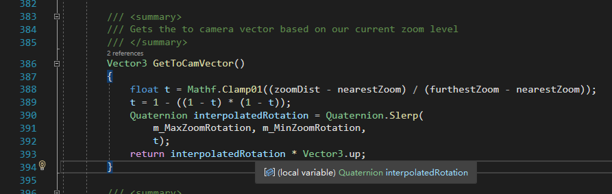

# 问题清单

罗列一些开发过程中遇到的问题，部分为未解决的问题。

## 代码设计问题

下列是我在游戏卡发中遇到的一些问题，做归档和回顾使用

### 设计层面

1. controller在oop中的作用，是否需要额外的model数据类？
2. 在editor中测试，经常出现数据还没加载好就被访问的情况，如何改善？
> 将初始化脚本执行顺序调高，见[同一函数的更新顺序](../UnityComponent/Lifetime.html#同一函数的更新顺序)

3. 统一管理类创造原型（实例化prefab） vs 原型Controller静态方法创造原型，哪个更好？（更利于理解游戏逻辑）

### 性能层面

1. update中遍历cnt100的数组和碰撞检测哪个更性能友好？
    - 分片算法的优化程度

### 插件使用

1. DOTween的`DelayCall`和`OnComplete`中报错，只会记录调用某个函数发生错误，不会深入函数中，影响debug。（尝试复现的时候没有发现此现象，可能是我记错了？）
> 可以仅在委托中改变控制变量，利用委托等方式绕开DOTween的调用栈。或在一些独立的模块的开发过程中，先执行以下试试。

## 图形学问题

四元数*向量？？

