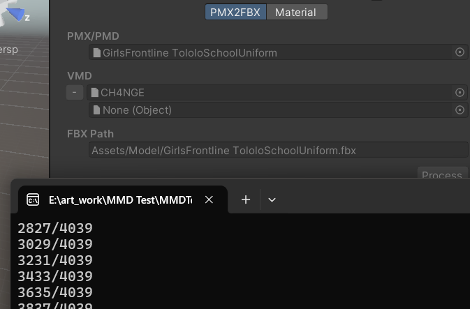

# 记录使用unity做MMD

## 文件导入格式说明
- .pmx：Polygon Model eXtended文件，是MMD专用模型文件格式
    - Unity导入pmx文件，可以用[MMD4Mecanim](https://stereoarts.jp/)，虽然教程是日语，但过程中的unity ui是英语，勉强能看懂
- .vmd：​Vocaloid Motion Data文件，是MMD专用 动画+镜头clip 文件格式
    - 导入方式同pmx，是在一个选项卡中一起配置导入的
- .fx： 为MikuMikuEffect (MME)​​ 文件，用于增强MMD的渲染。可以通过AlternativeFull软件制作

简单的选择文件导入就好：

## 导入后改进方向

- 渲染
- 动态骨骼的穿模问题
- 场景和特效

偏工程向，感觉这些工作应该是程序提供好GUI后由其他人员协作完成的，优先级不高。

### 渲染

没找到能用的开源方案，从MMD的渲染规则同步过来这个流程我不太理解。所以先搁置了 WIP

## 参考
- [零基础Unity实现MMD一站式解决教程 - bilibili 花间莉萝](https://www.bilibili.com/video/BV1XA4y1D7zL)
    - 视频附带CSDN文档，但CSDN私募了，点进去还要开会员
- 资源获取：
    - [模之屋](https://www.aplaybox.com/)
    - [bowlroll](https://bowlroll.net/)