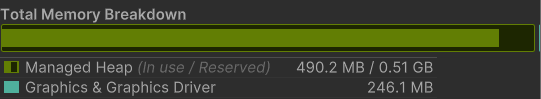
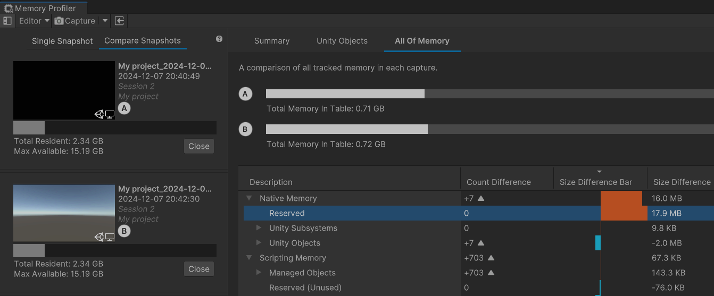
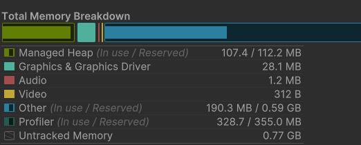
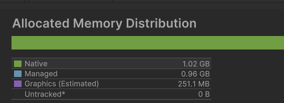
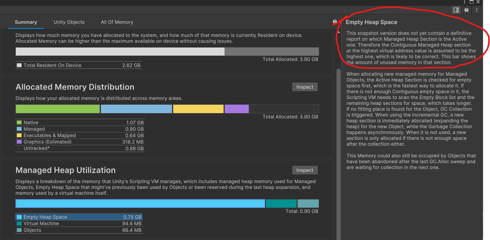

# Untiy内存问题两则

## 一、PrefabUtility，Prefab Instance和Prefab In Memory

PrefabUtility有好多方法，其中 `PrefabUtility.ApplyPrefabInstance` 和 `PrefabUtility.SavePrefabAsset` 分别作用于 Prefab Instance 和 Prefab In Memory (这两个方法最常用，这里就简单总结下了)

> 对这里有误解的和原因可能是因为GPT给的代码是实例化后再保存prefab，最后我先入为主以为得先实例化才能修改Prefab （因为没什么头绪，所以先问GPT要了个Demo）

## 二、Memory Profiler

最近突然注意到profiler中托管内存（Managed Heap）占比很高，而且看起来好像一直超出上限不断做gc，就去排查。最后发现这是unity2022.3.8中使用低版本Profiler时的正常的表现。。[相关问题中建议使用最新版本的 Memory Profiler](https://discussions.unity.com/t/memory-leak-reserved-going-10-gb/945249)

### 2.1 现象

使用Memory Profiler去对比快照发现`Reserverd`内存在不断增加（不知道这里为什么又划到Native去了。。）：

去搜相关内容发现，这种问题其实是Profiler标记错内存了，而且Unity2022.3.8版本就是会比我之前使用的Unity2021多很多托管内存。

之前用的Unity2021版本的Profiler：

### 2.2 解决？

升级到Memory Profiler 1.1.0 之后：

Profiler中确实这段内存不会再看起来像“内存不断分配再GC”的样子了，且Memory Profiler中也对这段内存为什么这么大给了一定的解释

## 三、总结

** unity

## 参考
- [PrefabUtility - Unity Scripting API](https://docs.unity3d.com/2022.3/Documentation/ScriptReference/PrefabUtility.html)
- [Everything you need to know about Memory Profiler 1.0.0 - Unity Blog](https://unity.com/blog/engine-platform/everything-you-need-to-know-about-memory-profiler)
    - 相关问题 [Memory Leak - “Reserved” Going 10+ GB](https://discussions.unity.com/t/memory-leak-reserved-going-10-gb/945249)