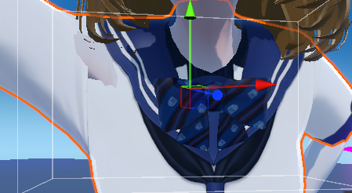

# 记录VRoid导入Unity实现换装系统

VRoid生成的模型可以商用，但VRoid导出格式为VRM，一般情况下需要转化为unity可读的FBX（可控性更强），但出于方便也可以直接使用UniVRM插件，使unity可以识别VRM格式。

VRM 是由日本提出的、专门针对 3D Avatar（虚拟角色） 封装的格式，本质上是 glTF 的扩展。
特点：
- 标准化骨骼：强制要求 Humanoid 骨架。
- 内置逻辑：文件里自带了表情控制（BlendShape Proxy）、物理飘带（SpringBone）、视角跟随（LookAt）等逻辑。
- 自带模型较为简单：好多衣服是对其他mesh的复用，一些衣服外饰直接在贴图上、版型不同的地方直接用透明贴图。

基于 VRM 我将在Unity中实现一个支持以下特性的捏人系统：
- 支持小、中、大三种体模选择，附加细节调整
    - 目前通过3个mesh实现
- 支持裸足、袜子、中鞋跟三种额外状态（他们在mesh或T-Pose下的骨骼有区别）
    - 【WIP】目前通过在体模基础上叠加mesh实现，共3*3=9个mesh。这里有优化空间，如通过BlendShapes处理Mesh变化
- 支持6、7套VRoid中的衣服
    - 【WIP】`MagicCloth` or `UniVRM-for-Unity` 实现模拟
- 支持6、7个VRoid中不同的发型
    - 【WIP】`MagicCloth` or `UniVRM-for-Unity` 实现模拟
- 继承 VRM 定义的表情 BlendShapes 和 BobEngine

以下主要记录过程中遇到的问题和解决方法。

## 模型导入

装上 [UniVRM](https://github.com/vrm-c) 直接拖入VRM模型就好

导入遇到以下问题：
1. 脸部贴图不好更换shader
    - 其alpha通道+cutout的设计比较抽象，看看能不能让ai拓展一下shader功能


## 基于VRoid的捏人系统

目的是基于VRoid生成的人物体模完成捏人系统的设计，目前遇到以下问题
1. 体模导入
    - 使用`UniVRM-for-Unity`，安装后直接拖入vrm体模，好处是可以直接用自带的面部表情
2. 衣服编辑和导入
    - 衣服、头发
    - 袜子，由于长筒袜`VRoid`是把贴图绘制在体模上的，所以需要拆分开来
    - 相比[记一次人物模型的运行时配置](../HumanModelRuntimeConfig.md)中记载的情况更加复杂，要编辑+转换两个不同的humanoid配置
3. 衣服如何套上去
    - 参考[换装系统](../../CodeImplement/ClothChangeSys/ClothChangeSys)，使用共享骨骼
4. 预计使用`VRoid`生成小中大三种体模，捏人系统中的细节调整如何实现
5. 脸型使用预设，需要拆分脸部，看在`UniVRM`插件体系下好不好做

### 衣服的编辑和导入

工具链：vrm模型 -> blender -> fbx -> unity
- vrm模型导入blender使用`UniVRM-Blender`插件
- 在blender中修改，保留衣服和骨骼
    - 长筒袜的特殊处理
        - `VRoid`穿袜子的时候会调整腿部、脚部Mesh，尤其是脚趾会变成穿袜子的表现。这里只能再额外导出一份袜子体模了
    - 头发、裙子直接挂上去，然后挂magic cloth
        - 需要考虑骨骼合并的问题
    - 衣服
        - `VRoid`好多衣服是基于某个模板做的，不改mesh，导致有些版型通过透明贴图实现。我这里的处理方式是用Blender手动删面
        - T-Pose导致手臂大幅动作时出现穿模
    - 衣服的额外骨骼？根节点转化时需要对子节点也应用变化
- blender导出fbx使用`blender-to-unity-fbx-exporter`插件
    - 这里规避左右手坐标系的转换造成的奇怪旋转（但还不够，导入unity时还会出现180度旋转）
- fbx导入unity
    - 会出现骨骼格式不对的问题（骨骼Transform、 Mesh（主要指BindPose 矩阵）任意一项不匹配），无法匹配vrm导入产生的humanoid，这里写一个[脚本](./SkeletonBindingFixer.cs)矫正
        - 衣服基于什么样的骨骼导出的，就需要用什么样的骨骼在unity里作为参考在导出一遍。（如穿鞋的人物模型会较高）
    - 进一步的，可以通过 AssetPostprocessor 在模型后处理中自动化这一过程【目前项目由于包含非开源资源处于private状态，晚点补上链接】


## 穿模问题

VRoid 导出 VRM 时使用 T-Pose 导致手臂大幅动作时出现穿模

对策：给身体做一个“瘦身”的 BlendShape，或使用clipMask不渲染被衣服遮盖的身体



::: details ai解释
为什么“前伸”会导致穿模？
在 T-Pose 下，手臂骨骼（UpperArm）的初始角度是 0°。
- 前伸动作： 手臂向前方旋转约 90°。
- 挤压效应： 此时，大臂根部的顶点会向胸前挤压，而肩胛骨部位的顶点被大幅度拉伸。
- 权重差异： 
    - 身体： 拥有平滑的胸大肌权重。
    - 衣服： 如果衣服（比如紧身衣或厚外套）的顶点权重没有完美同步身体，或者衣服的网格比身体稍微稀疏一点，就会出现：身体的肉已经挤出来了，但衣服的顶点还没跟上。
:::

### 细节调整

准备在Unity中动态调整

::: details 相关资料-AI

```
// 获取大腿骨骼并缩放
Transform thighBone = animator.GetBoneTransform(HumanBodyBones.LeftUpperLeg);
thighBone.localScale = new Vector3(1.2f, 1f, 1.2f); // 加粗大腿

Blend Shape法（如果Blender中已创建）：
SkinnedMeshRenderer skinnedMesh = GetComponent<SkinnedMeshRenderer>();
skinnedMesh.SetBlendShapeWeight(0, 50f); // 调整形态键权重
```
推荐插件：
- https://assetstore.unity.com/packages/tools/animation/magica-clothes-2-242307 - 包含身体变形功能
- https://vrm.dev/ - 官方SDK支持Blend Shape

:::

## 选型考虑

小、中、大三种体模选择：
- 为了避免衣服穿模，需要限制细节调整的参数范围。作为替代，额外提供三种体模。

通过mesh支持裸足、袜子、中鞋跟三种额外状态：
- 为了避免高跟鞋足部和地平面对齐逻辑和抬高足底逻辑的冲突，目前只能想到这么做
- 袜子和裸足mesh略有不同，袜子也可以套平底鞋
- 这里优化空间很大，例如通过BlendShape搞定裸足到袜子的形变

## 参考
1. [【UE5】捏脸+换装的角色方案！-bilibili](https://www.bilibili.com/video/BV1rZYvzKEXV)
2. [DanbaidongRP Documents](https://my.feishu.cn/docx/EXPtdrNmnox8hkx4mnCcy8QNn2b)
    - 目前主要用的渲染平台