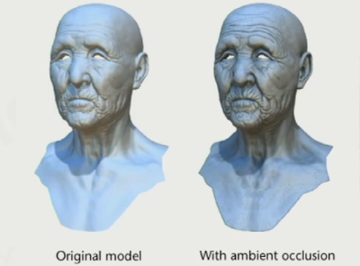

# 环境光遮蔽

环境光遮蔽 (Ambient Occlusion, AO)。因为环境光这一比较粗暴概念的存在，AO可以根据几何自遮挡，提供暗处细节的表达，起到对阴影的补充作用。方法的理论来自于GAMES104课程[1]，光追方向的实践可以参考ue的Lumen[2]。

## 实现方法

- AO贴图：早期采用AO烘培的方式，使用光追离线烘焙一张贴图，只考虑自阴影，一般是静态的
- SSAO (Screen Space Ambient Occlusion)：通过多次采样是否能照到光线，得出光照强度
- SSAO+：基于SSAO，根据法线过滤，采样点减半
- HBAO (Horizon-based Ambient Occlusion)：使用depth buffer，遮挡物体距离远则减少AO，解决深度差距大的AO计算错误的问题。
- GTAO (Ground Truth-Based Ambient Occlusion)：认为前面的方法的AO错误是未考虑反射光的实际强度，该方法考虑了反射后光线和视角的角度，将角度转化为贡献度，得到single-bounce强度，并通过多项式拟合出光的multi-bounce
- 基于光追的AO：逐像素的raycast，会用分时做优化（类抗锯齿的那个TAA）

## 参考
1. [GAMES104- 王希 Bilibili](https://www.bilibili.com/video/BV1kY411P7QM)
    - 07.游戏中渲染管线、后处理和其他的一切 09:08 AO
2. [虚幻引擎5通过Lumen全力发展动态全局光照 - ue blog](https://www.unrealengine.com/zh-CN/tech-blog/unreal-engine-5-goes-all-in-on-dynamic-global-illumination-with-lumen)