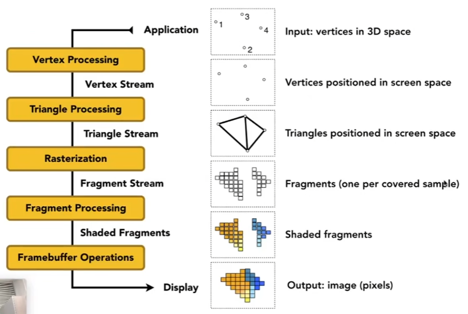
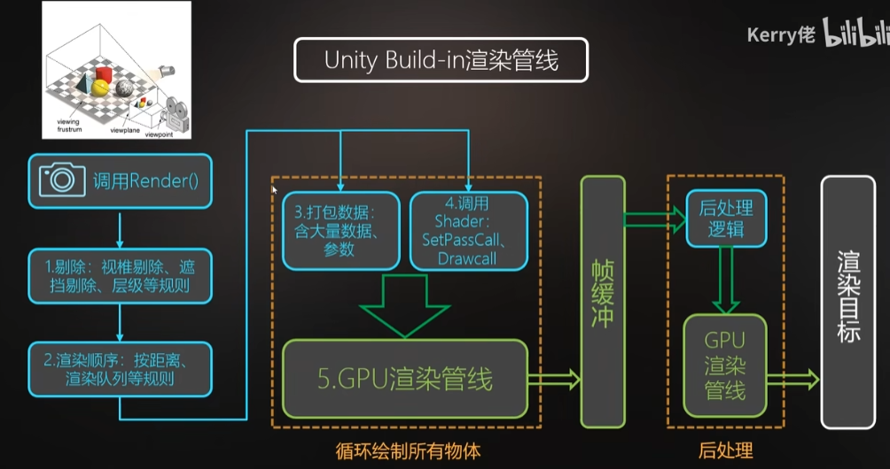

# 计算机图形学

学习计算机图形学可以指导客户端工作的优化，如果从事游戏客户端岗位，可以需要学习下列知识：

> 以下知识点由 gpt 生成

- 基本图形学概念：了解2D和3D图形学的基本原理、坐标系统、坐标变换、着色器等基础知识。
- 图形渲染管线：熟悉图形渲染管线的各个阶段，包括顶点处理、几何处理、光栅化等过程。
- 纹理映射：掌握纹理映射的原理和常见的纹理映射技术，如UV映射、法线贴图等。
- 三维几何：了解三维模型的表示方法、变换操作、裁剪算法等。
- 光照与材质：了解光照模型、阴影算法、材质属性等，能够实现基本的光照效果。
- 图形优化：了解图形性能优化的方法和技巧，包括批处理、GPU优化、渲染技巧等。
- 着色器编程：掌握OpenGL或者DirectX等图形API的着色器编程，理解顶点着色器和片段着色器的功能和应用。

## 渲染管线介绍

图：渲染管线的定义

图：结合Unity内置渲染管线API和优化流程

 
## 参考
- [GAMES101-闫令琪 Bilibili](https://www.bilibili.com/video/BV1X7411F744)
- [技术美术入门：渲染管线概述-Kerry佬 Bilibili](https://www.bilibili.com/video/BV1Q54y1G7v3)
    - p1对Unity渲染管线有一个总体介绍