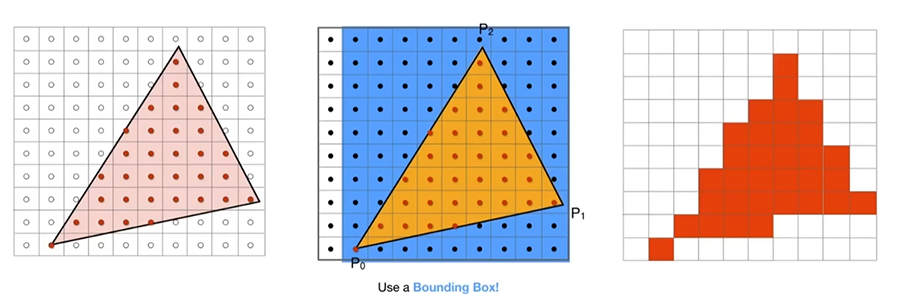
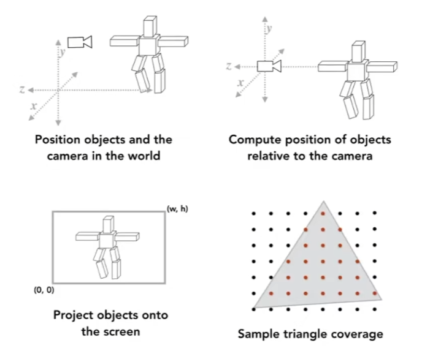
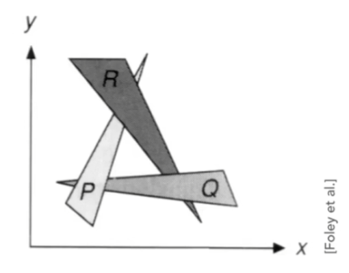
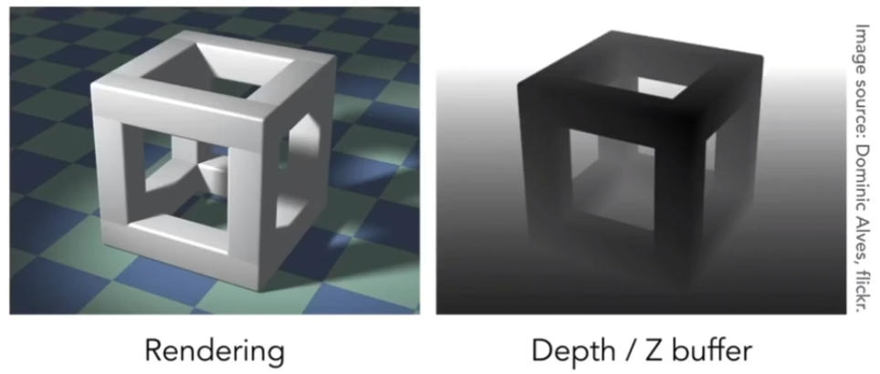

# 光栅化 Rasterization



光栅化指将图形对象转换为图像的过程，一个狭义点的例子是在屏幕坐标上根据信息绘制三角形。

是将模型映射到屏幕上的过程之一
> 坐标变换 -> (三角面)顶点映射 -> 光栅化

图：光栅化之前的步骤




## 光栅化的过程和问题

光栅化是将图形对象（映射到视锥体空间的三角面[1]和渲染参数）在屏幕空间采样[2]。其主要问题是如何处理离散采样发生的Aliasing[3]和如何正确的绘制三角面的遮挡关系[4]。


1. 为什么是三角形？
> （1）可以方便的表示几何图形。（2）可以方便判断内外关系（通过向量的叉积判断一个点是否在三角形内，要叉积三次）。（3）三个不同颜色的点可以插值出过渡颜色。

2. 采样
    - 从如16\*9的连续空间映射到如1920\*1080的屏幕空间(离散空间)
    - 确定每个栅格（像素）的颜色

代码：一种简单的采样过程
```cpp
void fresh_screen(){
    for(int i = 0; i < max_x; i++){
        for(int j = 0; j < max_y; j++){
            screen[i][j] = sample(i+0.5, j+0.5); // 采样像素对应的中心点
        }
    }
}
```

3. Aliasing（走样，锯齿）
    - 摩尔纹，边缘锯齿
    - 原理涉及数字图像处理（信号处理），关键词：混叠
    - Anti-Aliasing（反走样，抗锯齿），是一个信号处理问题
        - 简单的出发点：先对原象进行“模糊”，再光栅化。（模糊这一过程很困难，根据如何定义采样点的模糊值，延伸出了不同的方法）
        - MSAA（Multi Sample Anti-Aliasing）：靠模糊解决走样问题，计算量增加k倍，k为每个像素计算模糊的采样次数（没有考虑可复用的采样点）
        - FXAA（Fast Approximate AA）：基于后处理的AA，检测边缘，替换成平滑的边缘
        - TAA（Temporal AA）：保留上一帧的值，使其参与这一帧的采样。计算量⬇ 空间占用⬆，对于快速运动需要特殊处理
    > 顺便一提 Aliasing 也有"别名"的意思，如`int &r = a`，就可以说`r`是`a`的 Aliasing（别名）。
代码：一种 MSAA 2*2 的计算方法
```cpp
void fresh_screen(){
    for(int i = 0; i < max_x; i++){
        for(int j = 0; j < max_y; j++){
            screen[i][j] = sample(i+0.25, j+0.25) / 4;
            screen[i][j] += sample(i+0.75, j+0.25) / 4;
            screen[i][j] += sample(i+0.25, j+0.75) / 4;
            screen[i][j] += sample(i+0.75, j+0.75) / 4;
        }
    }
}
```

4. 遮挡关系
    - 考虑“画家算法”（按照三角面中心的深度渲染），但因为可能存在特殊的遮挡关系，故只能从每个像素的深度下手
    - 依赖于图形对象的深度参数生成`Z-Buffer`，和采样的颜色值同步生成，下方有代码样例。
    - 延伸：`Z-Test`，`Z-Fighting`

图：一种特殊的遮挡关系



图：`Z-Buffer`长啥样



代码：一种简单的采样过程，结合**逐三角面渲染**和`Z-Buffer`
```cpp
float** z_buffer;
color** screen;
void fresh_screen(){
    // ... 别问我triangles怎么来的
    for(tri : triangles){ 
        for(int i = 0; i < max_x; i++){ // 因为没有设置包围盒，所以每次遍历整个屏幕
            for(int j = 0; j < max_y; j++){
                auto depth = get_depth(tri, i+0.5, j+0.5);
                if(depth < z_buffer[i][j]){
                    screen[i][j] = sample(tri, i+0.5, j+0.5); // 采样像素对应的中心点
                    z_buffer[i][j] = depth;
                }else{
                    // do nothing
                }
            }
        }
    }
}
```


## 参考
- [GAMES101-闫令琪-Rasterization Bilibili](https://www.bilibili.com/video/BV1X7411F744?p=5)

