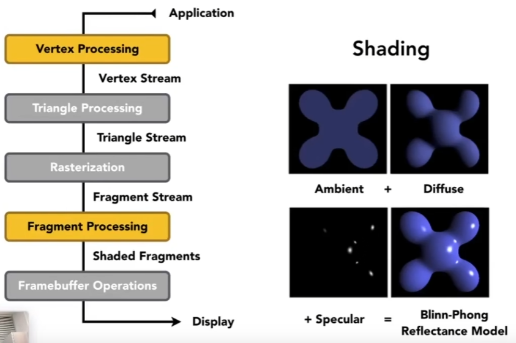

# 着色 Shading

> The process of **applying a material** to an object

本文介绍简单的着色过程需要考虑什么：
- 着色模型
- 着色频率

## 着色模型

一个简单的着色模型需要考虑以下特征
> 下面介绍 Blinn-Phong Reflectance Model，是一种经验模型（不满足真实的物理情况）
- 漫反射
- 镜面高光
- 环境光

图：着色需要考虑的几个特征（不包括间接光照等复杂的特征）

### 漫反射的计算

需要考虑：
- 接受光线的数量（背光和正对着光的亮度肯定是不同的）
- 光线随距离的衰减

### 镜面高光的计算

需要考虑：
- 接受反射光线的数量
    - 这里没有直接比较反射光线和观察方向的相似度，而是比较了半程向量和法线的相似度，是一种优化方式
- 不同数量光线的衰减函数

### 环境光的计算

假设任何地方的环境光强度都是相同的
- 很激进的假设，保证没有地方完全是黑的

### 总结-涉及的向量运算

::: tip 通过点乘判断向量是否接近

a·b = sinθ|a||b|  // sin(0) = 1

:::

### 总结-可视化

## 着色频率

有三种着色频率：
> 当面数很多时，前两种也能达到较好的效果。还有一些风格化着色也可以考虑使用前两种（如低多边形）。
- Flat shading，频率是每个三角面，效果如下图第一个所示。
- Gouraud Shading，频率是每个三角面的顶点，三角面内像素做颜色插值，效果如下图第二个所示。
- Phong Shading，频率是每个三角面的顶点，三角面内像素做**法线**插值，效果如下图第三个所示。

图：三种着色频率在一个球体上的效果

### 总结-涉及的向量运算

::: tip 如何计算顶点的法线

对周围面的法线做加权（面积）平均

:::

::: tip 如何插值每个像素的法线

引入中心坐标（Barycentric interpolation）

:::

## 未分类

图：渲染发生在渲染管线的哪个step和可编程渲染管线（Shader）

## 参考
- [GAMES101-闫令琪-Shading Bilibili](https://www.bilibili.com/video/BV1X7411F744/?p=7)