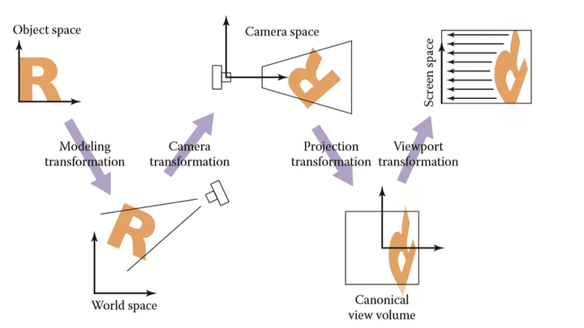
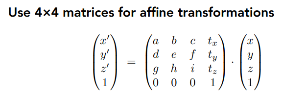
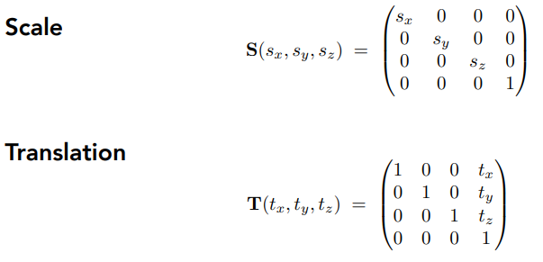
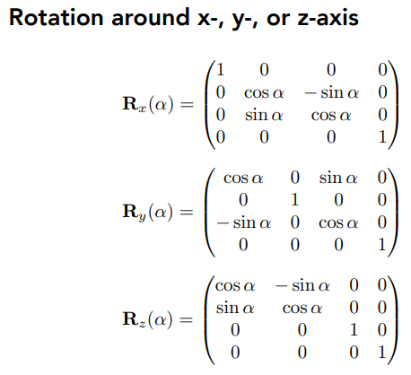
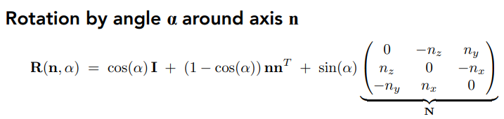
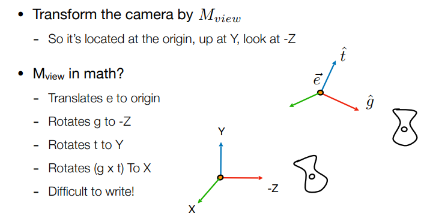
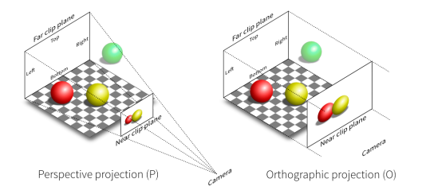
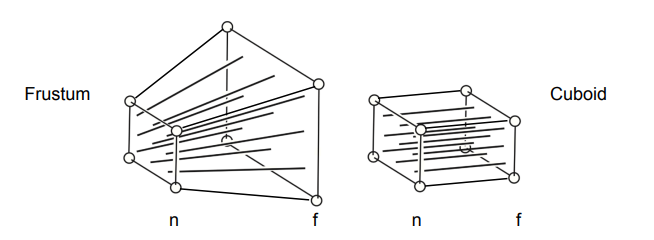

# 坐标变换 Transformation

渲染管线的第一步，将物体进行坐标变换，以便下一步渲染。

> 解释上图中的流程： 
 (1) 模型变换(modeling tranformation)：这一步的目的是将虚拟世界中或者更具体点，游戏场景中的物体调整至他们应该在的位置 
 (2) 摄像机变换(camera tranformation)：在游戏中我们真正在乎的是摄像机(或者说眼睛)所看到的东西，也就是需要得到物体与摄像机的相对位置 
 (3) 投影变换(projection tranformation)：在摄像机变换之后，我们得到了所有可视范围内的物体相对于摄像机的相对位置坐标(x,y,z)，之后根据具体情况选择平行投影或是透视投影，将三维空间投影至标准二维平面([-1,1]^2)之上 （tips：这里的z并没有丢掉，为了之后的遮挡关系检测） 
 (4) 视口变换(viewport transformation)：将处于标准平面映射到屏幕分辨率范围之内，即[-1,1]^2->
[0,width]*[0,height], 其中width和height指屏幕分辨率大小 

工作大致可以分为两步：
- 坐标变换（模型视图变换）：将物体从世界坐标系变换到相机坐标系。
- 投影：将物体根据投影模式投影到正确的屏幕位置上。

都是做矩阵运算

## 坐标变换

坐标变换依赖于仿射变换，通过定义`ModelView`变换矩阵，使每个物体都乘上这个矩阵。

::: details 一些仿射变换知识

使用4*4矩阵表示仿射变换（线性变化+平移）

缩放和平移

旋转

利用矩阵的性质: 由于矩阵的乘法满足结合律，可以预计算变换矩阵，提高计算效率。

:::

`ModelView`变换矩阵的求解方法可以具体看[GAMES101视频](https://www.bilibili.com/video/BV1X7411F744/?p=4)，视频中给出了一种反向推导的方法。

## 投影

有两种常用的投影：正交投影和透视投影，透视投影比较符合我们人眼观察世界的方式。

图：透视投影(左)和正交投影(右)

由于透视投影遵从近大远小，其变换矩阵会更复杂一些。

## 参考
- [GAMES101-闫令琪-Transformation Bilibili](https://www.bilibili.com/video/BV1X7411F744/?p=4)
- [计算机图形学二：视图变换(坐标系转化，正交投影，透视投影，视口变换)  孙小磊 - 知乎](https://zhuanlan.zhihu.com/p/144329075)