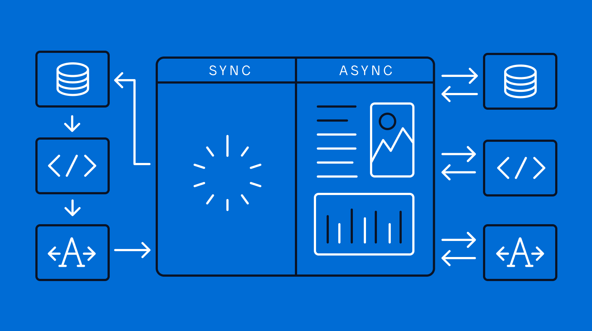
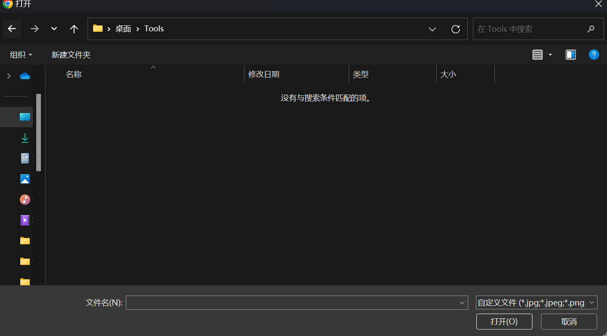

# 异步编程



在Unity中，异步编程的思想可以应用到很多方面，通常用于处理需要一段时间才能完成的任务，例如加载资源、网络请求或动画效果等。通过异步，可以避免阻塞主线程，保持游戏或应用程序的流畅性。

本文主要介绍异步编程需要的组件和他们的区别：
- `Coroutine`是异步编程
- `async` / `await` 是异步编程（注：Task不等于异步编程）
- *回调函数配合生命周期也可以是异步编程（混沌邪恶

## 三种方案的优缺点

1. `Coroutine`
    - 优点：unity原生，很多api都是用协程实现（例如`LoadSceneAsync`）
    - 缺点：`IEnumarable`没有返回值，不方便复杂的逻辑。
2. `async` / `await`: 利用 Task 和被称为 异步函数 的C#语言功能的一种[编程模型](../Language/OtherFeatures.md#c-异步编程)
    - 优点：
        - 有返回值
        - 写起来逻辑更清晰
        - 提供比协程更多的逻辑控制（`cancellationToken`）
        - 同步异步都能用
        - 考虑多线程，由 `SynchronizationContext` 处理“线程处理模型”产生的额外影响
    - 缺点：
        - 比协程复杂一点，要了解它的工作方式，不了解的话，可能会引起：[一个不恰当使用导致try catch没用的例子](https://stackoverflow.com/questions/5383310/catch-an-exception-thrown-by-an-async-void-method)
        - 在WebGL中不能使用[这个视频中提到](https://youtu.be/WY-mk-ZGAq8?si=Do5vRtqHYq3gwhwX&t=919)
        - 有些使用协程的api使用起来不方便
    - *`Unity 2023.1`中引入`Awaitable` class，提供`WaitForSecondsAsync`, `NextFrameAsync`等api。
3. 响应式编程配合生命周期
    - 参考DOTween和UI事件，特定的使用场景

## C#异步编程模型 `async` / `await`

方法使用`async`修饰，方法内部内容会被C#编译器转化为`异步状态机类`，用于实现异步执行的功能。并使用异步特性修饰方法，以便能够在metadata中查看。在使用时，有下列需要注意的事项：

1. 逻辑仍(默认)在unity主线程“运行”，但不再受生命周期函数的上下文影响（如`FixedUpdate`中的deltaTime(默认)是0.02秒）
    - 这里的“运行”指的是一种特殊的Task调度模式，为了避免多线程产生的脏读写，异步方法中的代码会被调度到主线程运行。如果想修改这一调度方式，可以重新配置环境的同步上下文`System.Threading.SynchronizationContext.Current` 或通过Task的 `ConfigureAwait(false)` 方法。
2. 小心异常逃逸！该异步模型是基于 `Task` 的，`Task` 中的异常会被“收集”起来。使用 `await` 等待异步函数时会将异常抛出。
3. `async void`是一类特殊的异步方法，通常用作异步开始的“入口”。
    - 特点是异常不可`try catch`，但可以正常抛到同步上下文（而非task那样塞到自己的属性里）
    - 为了正常使用，不应在其中出现`ConfigureAwait(false)`等将线程调至线程池的做法。
    - 对`async void`不应该滥用，有一种解释是它只应该用于“某个事件处理程序的订阅者”，如unity中的按钮、生命周期函数、各种触发函数(如OnCollision)等。

\*可以参考：[一个关于 async / await 的很长的理论文章](https://devblogs.microsoft.com/dotnet/how-async-await-really-works/)，[CLR Via C# 第四版](https://book.douban.com/subject/26285940/)中描述的简单一些。

### 异常捕获问题

直接上示例代码

```cs
如果不Await异常就捕获不了();
// await 如果不Await异常就捕获不了(); // 如果用注释中的，则能捕获到异常
await Task.Delay(200);

async Task 如果不Await异常就捕获不了()
{
    await Task.Delay(20);
    throw new Exception(); // 这个异常不会触发断点调试(可以试着在console app中执行一下)
}
```

### 以不同的方式执行异步代码

测试运行线程，我想看看`async`方法在这里是怎么调度的。这里使用了一个“引理”，那就是unity在dev模式下的非主线程中调用unity api函数会抛出异常。

> 参考[CLR Via C# 第四版](https://book.douban.com/subject/26285940/)在WinForm中描述的`调度上下文`，应该会被调度到Unity的主线程中进行，方便对主线程数据的修改，实际上也确实如此。

> `await`之后的代码保证在游戏主线程中调用（因为Unity中一些属性只能游戏主线程访问，参考[UnityEngine.UnitySynchronizationContext](https://github.com/Unity-Technologies/UnityCsReference/blob/master/Runtime/Export/Scripting/UnitySynchronizationContext.cs)），也可以看看[如何对控件进行线程安全的调用（Windows 窗体 .NET）](https://learn.microsoft.com/zh-cn/dotnet/desktop/winforms/controls/how-to-make-thread-safe-calls?view=netdesktop-7.0)
```cs
class TestMono : MonoBehaviour{
    public async void Start(){ // 顶层异步入口 "async void"
        Debug.Log(System.Threading.SynchronizationContext.Current); //  --> UnityEngine.UnitySynchronizationContext
        var t = new Task(() => dosomething().Wait()); // --> null(无SynchronizationContext), exception, Thread Pool Worker, 没报错
        t.Start();
        _ = dosomething(); // --> UnityEngine.UnitySynchronizationContext, 没报错, 0.0019407, 没报错
        await dosomething(); // --> UnityEngine.UnitySynchronizationContext, 没报错, 0.0019407, Test EX
        // dosomething().GetAwaiter().GetResult(); 
        // 上述代码cause deadlock, more detail: https://stackoverflow.com/questions/39007006/is-getawaiter-getresult-safe-for-general-use 
        // 如果想看看什么是死锁，在尝试这个用例的时候除了取消注释外，还要把代码放在上面，
        // 不然就因为 await dosomething() 抛出的异常提前终止了，根本执行不到这里。
    }
    public async Task dosomething()
    {
        // 打印同步上下文
        Debug.Log(System.Threading.SynchronizationContext.Current);

        // 一个await测试
        await Task.Delay(500);

        // 测试访问只有游戏主线程能访问的
        try
        {
            Debug.Log(Time.deltaTime); // 注意，如果在Worker中调用且遇到空引用异常，unity会忽略它
        }
        catch(Exception ex)
        {
            Debug.Log("can not get time " + ex.ToString());
        }
        
        // 打印线程名字
        Debug.Log(Thread.CurrentThread.Name);

        // 抛出异常，看是否可以被程序捕获
        throw new Exception("Test EX");
    }
}
```

## 例子-使用`async` / `await`实现选择窗口

选择窗口可以理解为上传、打开文件时，弹出的文件选择窗口。


<center> 一个示意图，我做的肯定简单得多 </center>

目的是可以向网络API一样，异步的方式获取所需资源（某个类）
> 用代码的方式就是`var data = await xxxxxRequest(xxxx)`，之后就可以对data各种操作。

代码是`My-TDS`中实现`Operator`选择的逻辑，这样写可以复用到同样需要选择`Operator`的UI上。
> [在这个提交里添加了这个功能](https://github.com/Unarimit/my-topdown-shooting-game/commit/9f0a51cc8f6550cfa6aa7a230e984af4c927d3d0#diff-24a12e61770d7ee56b1dac79d23d6bd05a1c045df723ea7537a786450a2bc23c)

```cs
internal class OperatorChooseUI : MonoBehaviour
{
    public static async Task<Operator> ChooseOperator(IEnumerable<Operator> operators)
    {
        await Task.Delay(20);
        var comp = Instantiate(ResourceManager.Load<GameObject>("UIs/OperatorChooseCanvas"))
            .transform.GetChild(0)
            .GetComponent<OperatorChooseUI>();
        return await comp.ChooseOperatorInner(operators);
    }

    Operator choseOp = null;

    public async Task<Operator> ChooseOperatorInner(IEnumerable<Operator> operators)
    {
        // 1.创建子UI
        transform.Find("Scroll View").GetComponent<OperatorChooseScrollViewUI>().Inject(this, operators);

        // 2.等待finish
        while (choseOp is null) await Task.Delay(20);

        // 3.过渡消失
        GetComponent<CanvasGroup>().DOFade(0, 0.5f).OnComplete(() => Destroy(transform.parent.gameObject));
        return choseOp;
    }

    public void Choose(Operator op) // 子UI的button会调用这个方法
    {
        choseOp = op;
    }
}
```

代码的逻辑是，调用时弹出一个`Operator`选择窗口，用户点击了某个选择按钮时，就返回一个`Operator`给调用方。
> 调用函数在用户选择期间处于挂起状态。

```cs
// 简单调用测试一下
var op = await OperatorChooseUI.ChooseOperator(MyServices.Database.Operators);
Debug.Log(op.Name);
```


## 参考
- 头图：[Asynchronous vs. Synchronous Programming: Key Similarities and Differences - mendix](https://www.mendix.com/blog/asynchronous-vs-synchronous-programming/)
- 简单介绍async / await 以及在unity中的使用：[Unity async / await: Coroutine's Hot Sister - Youtube](https://youtu.be/WY-mk-ZGAq8?si=Do5vRtqHYq3gwhwX)
- [Unity async / await: Awaitable - Youtube](https://www.youtube.com/watch?v=X9Dtb_4os1o)
- [一个不恰当使用导致try catch没用的例子 - Stackoverflow](https://stackoverflow.com/questions/5383310/catch-an-exception-thrown-by-an-async-void-method)
- 《CLR Via C# 第四版》28章节中的28.2-28.5介绍了await/async的工作原理，28.9介绍了线程上下文：[CLR Via C# -  Jeffrey Richter](https://book.douban.com/subject/26285940/)
- [C#/Unity中的异步编程 - wudaijun's blog](https://wudaijun.com/2021/11/c-sharp-unity-async-programing/)
- [《Essential C# 7.0》](https://book.douban.com/subject/27009371/)
    - 19.5 基于任务的异步模式