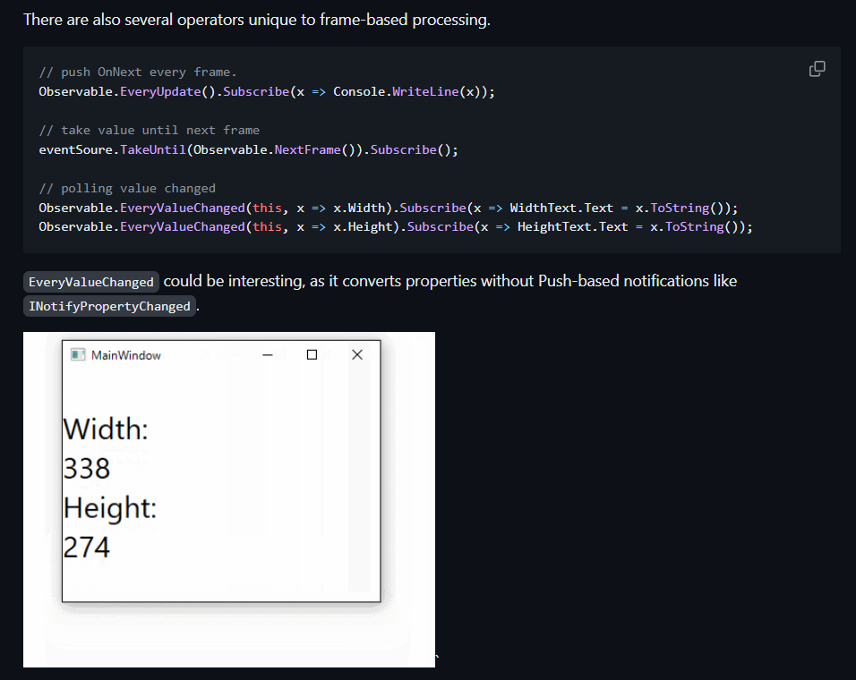

# 响应式编程

> 前几天在公司看到项目里有用`UniRx`的库，于是准备学习一下响应式编程

响应式编程这一概念在后端开发中很常见，是和异步、并发属于一类的编程设计方法。
> "是一种更有效率的异步方案。" - 《Java编程方法论：响应式RxJava与代码设计实战》

在`UniRx`的新继承者`R3`的[仓库](https://github.com/Cysharp/R3)里，看到了一个很有趣[frame-based-operations](https://github.com/Cysharp/R3?tab=readme-ov-file#frame-based-operations)特性（如下图所示），于是带着好奇去学习一下他是怎么做到的。

## 什么是响应式编程

## 参考
- [《Java编程方法论：响应式RxJava与代码设计实战》- 知秋](https://book.douban.com/subject/33462999/)
    - 第一章，响应式编程总览