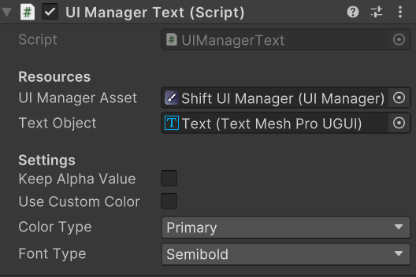

# UI系统

UI系统的设计需要考虑下列因素：

- 基础元素配置统一（如字体，大小，颜色等）
- 层级控制（ESC和UI栈）
- 本地化（可以结合第一点一起做）
- 动画和对生命周期的影响
- 优化：动静分离（详见[UGUI部分](../UnityComponent/UGUI.html#canvas-动静分离)）
- 特殊行为：元素拖拽移动（背包系统）
- 等等

那么一个简单的UI系统的结构可能是这样的：
> 可以参考如[shift UI](https://assetstore.unity.com/packages/2d/gui/shift-complete-sci-fi-ui-157943)之类的UI实现。


关于层级控制，还有一点要补充：有些UI功能可能会允许多个窗口交互，或是点击底层UI会关闭顶层UI，这在mmorpg中比较常见：
- 对于多个窗口交互（例如把物品从背包拖到仓库）
- 对于不同层次UI的管理，可以简单粗暴的捕获raycast处理，也可以记录事件状态做额外的交互（如果不想设置额外的事件响应，就要为UI设计统一的管理类，可以参考GameFramework等框架的实现）。


## UIConfig-全局配置

全局配置的存在主要是为了减少一些组件可能的反复修改，以及约束开发时使用统一的配置。

这里主要介绍`Shift UI`中的全局配置和其相关的类，从一个实际例子出发了解全局配置的重要性。在`Shift UI`的Demo Scene中，通过3个组件配置UI的显示：
- UIManager(Scriptable Object): 全局配置信息，主题的颜色，字体，背景，音效等。相当于上文的`UIConfig`
- UIManager(Component)：具体的UI组件配置信息，如文字采取主题中的哪个颜色
- Main(Component)：Component显示的动画配置信息，如Button的名字，按下时的文字等。

如下图所示：

<center> 


UIManager(Scriptable Object)
</center>
</br>
<center> 


Main(Component), Component = Button
</center>
</br>
<center> 


UIManager(Component), Component = Text
</center>

这些组件的存在可以使主题的变更变得很轻松，在Main(Component)中，可以方便的做本地化，不觉得这很cool吗？

## UIManager-分页管理和特殊功能

`UIManager`应该考虑实现以下功能

- **分页管理**：如果场景涉及多个独立的UI页面（如抽卡和角色配置页面）应该使用状态机做分页管理，可以通过方便的注册UI层，使转换变得更简单并复用一些逻辑。
- **特殊功能**：对于像是“暂时隐藏UI（不涉及生命周期）”，“布局设置”这些需求，也应该从`UIManager`中出发。
- **设计约束**：`UIManager`中应该只包含涉及层级时的UI逻辑，例如开启任务菜单，打开地图等逻辑。至于层级内的UI逻辑，如查看装备属性，编辑背包物品逻辑则应该由装备UI，背包UI完成。

### 分页管理-UI状态机

参考状态机的实现，实现它需要按照以下步骤：
1. 为被管理的`子UI`设计统一的接口或基类
2. 在`UIManager`中存储`子UI`
3. 在`UIManager`中公开切换UI方法

### 其他功能-WIP

### 例子

在[My-TDS中的Home场景的UI管理](https://github.com/Unarimit/my-topdown-shooting-game/blob/dev/Assets/Scripts/HomeLogic/UILogic/UIManager.cs)中，在UIManager中做了分页管理，和UI栈的功能。

他的核心代码如下：

```cs
// 简化过的代码
internal enum HomePage
{
    Nothing,MainView,TopView, //...
}
internal class UIManager : MonoBehaviour
{
    public static UIManager Instance;
    public HomePage CurHomePage { get; private set; }
    Dictionary<HomePage, List<ISwitchUI>> switchUIs;
    private void Awake(){
        // 注册单例和UI状态，如：
        switchUIs[HomePage.CoreView].Add(m_canvas.Find("GachaPanel").GetComponent<GachaPanelUI>());
        switchUIs[HomePage.MainView].Add(m_canvas.Find("OverlayPanel").GetComponent<OverlayPanelUI>());
    }
    public void SwitchPage(HomePage page){
        // 页面切换逻辑
        // 如：背景相机过渡
    }
}
```

## 数据交互

可以借鉴MVVM(Model, View, ViewModel)+数据绑定的思想实现，即一个ViewModel类对应一个UI，当其中的数据发生变化时，UI也会变化。数据绑定可以通过Model类的OOP设计+C# event实现。
> 这个ViewModel类我会放在一个`context`类里面，`context`类还定义了一组当前场景下全局可用的方法。

当然，可以用方便的单例模式实现数据交互，但一堆单例会带来代码上的高耦合，不利于后续维护。
> 具体而言，一个数据存储结构修改后（从List改为Dictionary）依赖他的所有逻辑都需要修改。这也是MVC、MVVM之类设计模式存在的原因。

### 由UI直接修改，读取Model产生的问题

> 一个角色有一把枪，UI为了显示枪械状态，要从枪Model获取数据

- 造成Model逻辑和UI逻辑的耦合
- Model使用事件做数据绑定，也会产生延迟加载导致UI事件绑定失效

但像是仓库，背包系统逻辑和UI紧密的功能使用UI直接控制Model是没有问题的。


### 例子

WIP


## 参考
- [SHFIT UI - Unity Asset](https://assetstore.unity.com/packages/2d/gui/shift-complete-sci-fi-ui-157943)

- 某网课比较基础的实现
::: details 达内Unity培训课：
核心类
1. Ul 窗口类 UIWindow 
    - 所有 UI 窗口的基类，用于以层次化的方式管理具体窗口类。
    - 定义所有窗口共有行为(显隐、获取事件监听器)。
2. UI 管理类 UIManager
    - 管理(记录、禁用、查找)所有窗口。
3. UI 事件监听器 UIEventListener
    - 提供当前 UI 所有事件(具有事件参数类)。

使用方式
1. 定义 UIXXXWindow 类，继承自 UIWindow，负责处理该窗口逻辑。
2. 通过窗口基类的 GetUIEventListener 方法获取需要交瓦的 UI 元素事件监听器。
3. 通过事件监听器 UIEventListener 提供的各种事件，实现交互行为。
4. 通过 UIManager 访问各个窗口成员。
    - `UIManagerInstance.GetWindow<窗口类型>().成员`:
:::

- 头图：[What’s a Design Pattern in Software Engineering? - Netsolutions](https://www.netsolutions.com/insights/software-design-pattern/)