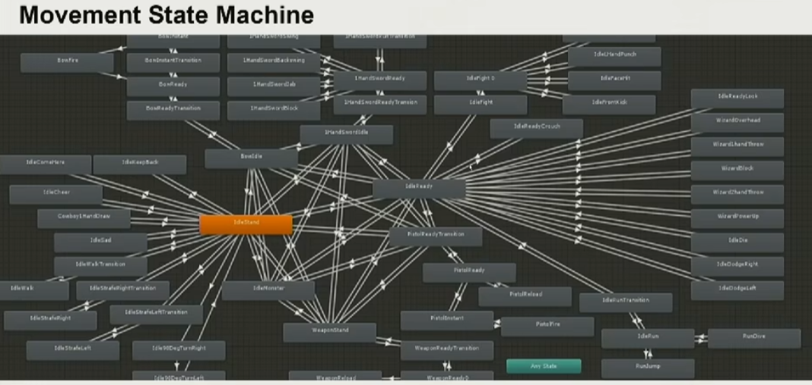

# 3C

3C（Character、Control、Camera），是Gameplay中最重要的一部分，它们重点描述了玩家在玩法中的**体验**是如何的，是游戏体验的**核心**。

这部分内容和游戏设计关系较大，更多经验层面的东西要去学习已有的方案。

## Character

角色的细节是非常多的，某些feature的表现并不突出（不像Control的辅助瞄准、Camera的抖动等）。一个体现细节之多的样例：移动的多场景适配（上坡下坡、遇到障碍物、...）。下图是一个很简单的样例

- 动画
- 环境互动
- 与物理系统的交互，如：在飞行时的反馈

## Control
- 多设备适配
- 对于手柄，需要考虑延迟处理和辅助瞄准
- 反馈，如手柄的震动
- 按键序列，对动作游戏很重要

## Camera
- 第三人称时的相机遮挡
- Camera Track运镜
- 相机特效：震动、残血遮罩
- 相机切换Tween
- 表达主观感受：速度快（motion blur+抖动）、活人感（相机单独惯性，和人物形成速度差）

## 参考
1. [GAMES104-现代游戏引擎：从入门到实践，第十五讲](https://www.bilibili.com/video/BV1u34y1H7jd)